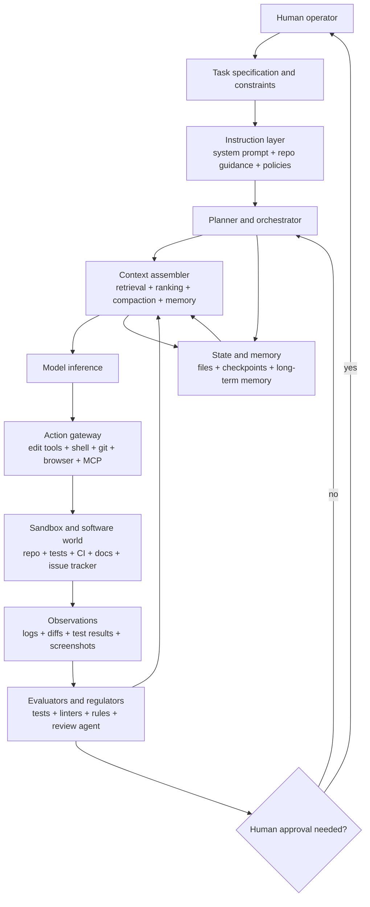

# Harness-Building for Coding Agents

## Executive summary


Recent writing by Martin Fowler, LangChain, OpenAI, GitHub, Anthropic, and open-source coding-agent projects converges on the same broad intuition: a coding agent is not just a model. It is a model embedded in a system of prompts, tools, files, plans, approvals, execution environments, and feedback loops.[^1][^2][^3]

A useful definition is therefore not the negative definition, "everything except the model," but a functional one:

> **The harness of a coding agent is the configurable control substrate that mediates perception of the software environment, curates context for inference, executes and constrains actions, preserves state, and closes the loop with evaluation, policy, and human oversight so that model outputs become reliable software work.**

This formulation fits three related but distinct usages:

1. **LangChain's broad usage:** agent = model + harness; the harness includes code, configuration, orchestration, tools, memory, and execution logic.
2. **Fowler's bounded usage:** the "outer harness" that coding-agent users build around vendor-provided agents for their own codebase and workflow.
3. **OpenAI's Codex usage:** the harness as the core loop, prompt/tool wiring, execution logic, and context-window management around a coding model.

The key analytical distinction is between **access** and **selection**.[^5][^6][^7] In classical AI, sensors and percepts are not the same as working memory or control state. Likewise, in coding agents:

- **Perception/access** is how the agent inspects repositories, terminals, issues, browsers, logs, CI systems, and external tools.
- **Context management** is how the harness decides what to load, compress, retain, offload, or discard before the next model call.

That distinction becomes more important in coding than in many classical toy domains because the "world" varies sharply across cases. A one-file bug fix, a multi-repo migration, a browser-driven frontend repair, a CI failure triage task, and a vague product-code request expose very different observable states and require different salience policies.

Classical AI offers direct analogues.[^5][^8][^9][^10][^11] PEAS gives a framework for specifying performance measures, environment, actuators, and sensors. BDI captures beliefs, desires, intentions, and commitment. Blackboard systems anticipate shared workspaces, opportunistic reasoning, and dynamic control. MAPE-K formalizes monitor-analyze-plan-execute loops over shared knowledge. Cognitive architectures such as Soar show how memory, control, and learning can be structured across time.

Modern LLM-agent work re-instantiates these ideas under newer names:[^12][^13][^14][^15][^16][^17][^18] ReAct, Toolformer, Reflexion, Self-Refine, Tree of Thoughts, LATS, Voyager, SWE-agent, AutoCodeRover, Agentless, CodeAct, OpenHands, Deep Agents, Codex, Claude Code, GitHub Copilot, Aider, and Continue.[^19][^20][^21][^22][^23][^24][^27][^30][^31][^34][^36]

## 1. Defining harness precisely


The broad industry definition is:[^2]

> **Agent = Model + Harness**

In this formulation, the harness is every piece of code, configuration, execution logic, tool wiring, memory, state, and orchestration that is not the model itself.[^2][^4]

That definition has two advantages:

- It rejects the mistaken view that a coding agent is just a better prompt.
- It foregrounds the fact that agency requires state, tools, feedback, and constraints outside the model weights.

But as a design definition, it is too residual. It defines harness by what it is *not*, rather than by what it *does*. It does not distinguish:

- builder-side harness from user-side harness;
- generic infrastructure from agent-specific control logic;
- perception from context management;
- evaluation from orchestration;
- safety policy from task execution.

A more precise definition for coding agents is:

> **Harness = the layered control substrate that turns model competence into dependable software-engineering behavior by managing access, interpretation, salience, action, memory, orchestration, evaluation, and human oversight.**

This definition is positive rather than residual. It defines a harness by function.

### Boundary test


A component belongs to the harness if removing it materially changes how the agent:

- observes the environment,
- chooses what to do,
- acts on the software world,
- remembers state,
- is evaluated,
- is constrained,
- or hands control back to a human.

Examples of harness components include:

- system prompts and repository instructions;
- file and code-search tools;
- shell execution;
- edit tools;
- browser tools;
- retrieval and ranking;
- context compaction;
- memory stores;
- task plans and todo files;
- sandboxing;
- test and lint loops;
- review agents;
- approval policies;
- trace logging;
- human-in-the-loop controls.

The model contributes latent competence. The harness determines the operating regime in which that competence is expressed.

## 2. Perception, context, and why coding-agent "worlds" differ


The distinction between perception and context management is central.

### 2.1 Classical perception


In classical AI, perception usually means the transformation of sensor input into percepts or beliefs about the environment.

A simplified classical loop is:[^5]

```text
environment → sensors → percepts → internal state → decision/action
```


For a robot, perception might be camera frames, lidar, audio, or force sensors converted into object locations and scene state.

### 2.2 Coding-agent perception


For a coding agent, perception is not usually visual or physical. It is symbolic, tool-mediated, and often textual.

Examples include:

- reading files;
- searching code;
- inspecting symbols;
- running tests;
- reading compiler output;
- reading CI logs;
- querying issue trackers;
- inspecting git history;
- using a browser;
- reading API documentation;
- observing runtime traces;
- viewing screenshots;
- receiving human review comments.

A coding agent's "world" is therefore not just a filesystem. It is a layered software-technical-social environment.

### 2.3 Context management


Context management is the process that turns available observations, memories, constraints, and goals into the bounded working state supplied to the model.[^2][^3][^7]

It includes:

- retrieval;
- ranking;
- chunking;
- summarization;
- compaction;
- offloading to files;
- long-term memory updates;
- subagent context isolation;
- prompt assembly;
- instruction precedence;
- preserving task invariants.

A useful distinction:

> **Perception changes what the agent can know about the environment. Context management changes what the model keeps active for reasoning.**

Search, retrieval, and summarization often do both. That is why the boundary is blurry in coding agents.

### 2.4 Why coding-agent worlds make the distinction harder


The "world" changes radically across task types.

| Task world | What perception means | What context management means |
|---|---|---|
| Small bug fix | Read one file, run one test, inspect error | Keep failing assertion and relevant function active |
| Large monorepo migration | Find relevant services, symbols, owners, generated code | Compress many files into a small set of invariants and edit targets |
| Production debugging | Inspect logs, traces, deploy history, metrics | Preserve timeline, rank hypotheses, separate signal from noise |
| Frontend/browser repair | Inspect DOM, screenshots, console logs, visual state | Keep UI intent, screenshot evidence, and relevant component code aligned |
| Architecture task | Read docs, conventions, prior patterns, non-goals | Preserve constraints, tradeoffs, and future-maintainability criteria |
| Agent in mature harness | Receive preprocessed observations from harness | Decide or inherit salience policy from harness machinery |

The harder the world is to observe directly, the more perception and context management become entangled.

## 3. Functional taxonomy of coding-agent harnesses


| Function | Role | Question answered | Classical analogue | Typical mechanisms |
|---|---|---|---|---|
| Perception and access | Acquire observations from the software world | What can the agent inspect? | PEAS sensors | File tools, grep, AST search, terminal output, browser, logs, screenshots, MCP tools |
| Interpretation | Convert request and observations into task state | What problem is being solved? | BDI beliefs/desires | Task parsing, issue analysis, repo instructions, design constraints |
| Salience and context management | Select and compress the working set | What matters now? | Working memory, blackboard focus control | Retrieval, summarization, compaction, context ranking, subagent isolation |
| Action interface | Expose effectors to the model | What can the agent do? | PEAS actuators | Shell, edit tools, git, browser actions, PR creation, CI triggers |
| Memory and state | Preserve useful state across steps or sessions | What must persist? | Soar memory, blackboard state, MAPE-K knowledge | Conversation history, todo files, worktrees, checkpoints, long-term memory |
| Control and orchestration | Determine loop structure and delegation | How does the process unfold? | BDI intentions, blackboard control, MAPE-K | ReAct loops, planning, retries, subagents, model routing, durable execution |
| Evaluation and regulation | Check outputs and steer correction | Is this acceptable? | Performance measure, monitor/analyze | Tests, lint, type checks, code review, policy checks, trace-based evals |
| Human in the loop | Allocate irreversible or ambiguous decisions | When should control return to a person? | Supervisory control | Approval modes, review gates, editable diffs, checkpoint/resume |

This taxonomy clarifies Fowler's "guides" and "sensors" distinction:

- **Guides** mostly live in interpretation, salience, and regulation.
- **Sensors** mostly live in perception, evaluation, and human supervision.
- **Computational vs. inferential** tools cut across many functions rather than forming a separate layer.

Context engineering is therefore a major part of harness engineering, but not the whole of it.

## 4. Classical AI analogues

### 4.1 PEAS and intelligent-agent specification


Russell and Norvig's PEAS framework asks designers to specify:[^5]

- **Performance measure**
- **Environment**
- **Actuators**
- **Sensors**

For coding agents, this maps cleanly:

| PEAS element | Coding-agent equivalent |
|---|---|
| Performance measure | tests pass, issue resolved, no regressions, style compliance, human acceptance, cost and latency budget |
| Environment | repo, issue tracker, CI, local sandbox, docs, browser, package ecosystem, production logs |
| Actuators | edit files, run shell, create branch, open PR, trigger tests, use browser, call APIs |
| Sensors | read files, grep, inspect logs, read test output, observe screenshots, read review comments |

PEAS is a useful antidote to vague agent design. It forces the harness builder to state what success means and what the agent is allowed to observe or change.

### 4.2 BDI: beliefs, desires, intentions


BDI architectures model agents in terms of:[^8]

- **beliefs**: what the agent takes to be true;
- **desires**: goals or states it would like to bring about;
- **intentions**: commitments to particular courses of action.

Coding tasks are commitment-heavy. An agent must maintain:

- beliefs about how the codebase works;
- goals implied by the user request;
- constraints such as "do not change public API";
- intentions such as "fix failing parser test by modifying tokenizer logic only."

Planning artifacts, todo lists, branch notes, and task summaries are not mere UX. They function as externalized intention-management machinery.

### 4.3 Blackboard systems


Blackboard architectures coordinate multiple knowledge sources through a shared workspace.[^9] Different modules contribute partial results, and a control mechanism decides what to do next.

The analogy to coding agents is strong:

| Blackboard concept | Coding-agent analogue |
|---|---|
| Shared blackboard | repo workspace, scratch files, issue notes, retrieved context, task state |
| Knowledge sources | model, retriever, test runner, linter, reviewer, subagents |
| Control policy | orchestrator, planner, ReAct loop, task scheduler |
| Incremental solution | evolving patch, todo list, diagnosis, test evidence |

Subagent systems are often blackboard systems in modern form: specialized agents work with scoped context and coordinate through shared artifacts.

### 4.4 MAPE-K


Autonomic computing's MAPE-K loop consists of:[^10]

```text
Monitor → Analyze → Plan → Execute
             ↑          ↓
             Knowledge
```


Coding agents often follow this same loop:

```text
inspect repo/tests/logs → diagnose → plan edit → apply edit/run command → update state
```


The shared knowledge substrate is crucial. It includes codebase rules, retrieved files, task memory, test results, traces, and user constraints.

### 4.5 Cognitive architectures


Cognitive architectures such as Soar show that intelligent behavior often depends on persistent structures for:[^11]

- working memory;
- long-term memory;
- production rules;
- goals and subgoals;
- learning from impasses;
- action selection.

Modern LLM agents reintroduce similar concerns through prompt context, retrieval, memory, tool state, plans, and external files. The difference is that much of the "working memory" is serialized into text.

## 5. Modern LLM-agent research analogues


Many LLM-agent papers study harness components without using the word "harness."[^12][^13][^14][^15][^16][^17][^18]

| Work | Main idea | Harness lesson |
|---|---|---|
| ReAct | Interleaves reasoning and actions[^12] | The agent loop should alternate interpretation and environment interaction |
| Toolformer | Learns when and how to use tools[^13] | Tool choice is a policy problem, not just a prompt feature |
| Reflexion | Uses verbal feedback and episodic memory[^14] | Improvement can occur through harness memory, not model retraining |
| Self-Refine | Iterative feedback and refinement[^15] | Critique/refine loops can be implemented at harness time |
| Tree of Thoughts | Searches over multiple reasoning branches[^16] | Hard tasks may need explicit search rather than greedy next-step generation |
| LATS | Combines reasoning, acting, tree search, and reflection[^17] | Search, feedback, and self-evaluation can be composed into the decision layer |
| Voyager | Builds a reusable skill library and curriculum[^18] | Skills and accumulated executable artifacts are first-class harness assets |
| SWE-agent | Designs an agent-computer interface for software tasks[^19] | Interface design to repo/tools can be as important as model quality |
| AutoCodeRover | Uses AST-aware search and fault localization[^20] | Strong retrieval and localization can substitute for open-ended autonomy |
| Agentless | Uses staged localization, repair, and validation[^21] | Less-agentic pipelines can be better for some software tasks |
| CodeAct | Uses executable code as an action space[^22] | Action-interface design is a major harness lever |
| OpenHands | Provides a reusable coding-agent platform[^23] | Harnesses can be platforms, not just product shells |

Two conclusions follow.

First, much of the performance of modern agents comes from the loop around the model: tools, memory, search, validation, context selection, and control.

Second, coding-agent research shows that better harnesses often mean better interfaces to the software world, not merely better prompting.

## 6. Industry and open-source harnesses


The current ecosystem can be compared by which harness functions each system treats as first-class.[^24][^27][^30][^31][^33]

| Tool or framework | Harness center of gravity | Notable components | Trade-off |
|---|---|---|---|
| LangChain Deep Agents | Open, batteries-included harness for long-running agents[^24][^25][^45] | planning, virtual filesystem, shell, subagents, context management, memory, human-in-the-loop | flexible but requires builder discipline around security and tool design |
| Codex CLI / Codex app / Codex web | Shared core harness across local, IDE, app, and cloud surfaces[^3][^27][^28][^51][^52][^53] | core agent loop, prompt/tool schema, approval modes, worktrees, subagents, web search, cloud environments | coherent product harness but more vendor-managed |
| Claude Code | Productized coding harness with workflow customization[^30] | CLAUDE.md, skills, hooks, MCP, memory, permission modes, multi-agent workflows | highly customizable but core internals are not fully open |
| GitHub Copilot CLI and cloud agent | Workflow-embedded harness inside IDE/GitHub/GitHub Actions[^7][^31][^32] | plan mode, repository instructions, auto-compaction, fresh VM runners, guardrails | strong GitHub integration but platform-coupled |
| OpenHands | Open software-agent platform[^23][^33][^47] | sandboxed runtime, terminal/browser/filesystem, SDK/CLI, benchmark integration | transparent and flexible, but more operational burden |
| SWE-agent | Research-first harness for issue resolution[^19][^48] | custom agent-computer interface, YAML configuration, repository tools | strong for issue-solving benchmarks, less general as daily dev shell |
| Aider | Lightweight terminal pairing harness[^34][^35] | diff/edit formats, automatic lint/test loops, multi-provider support | narrower autonomy, strong supervised patching |
| Continue | IDE-centric context and rules layer[^36][^37] | context providers, rules, custom providers, local configuration | strong in-editor control, less full-stack autonomy |
| AutoGPT | Modular automation platform[^38][^49] | agent blocks, workflows, hosted/self-hosted modes | broad automation focus, less repository-native |
| BabyAGI | Minimal historical task-loop agent[^39][^50] | task creation, reprioritization, execution loop | conceptually important but not production coding harness |

A major trend is that "memory" is becoming inseparable from harness design. If the harness controls what is persisted, compacted, retrieved, or forgotten, then harness ownership also implies memory ownership.

## 7. Evaluating harness effectiveness


A harness should be evaluated as a system under a controlled model.[^2][^26][^40][^42] The basic question is:

> What additional capability, reliability, or governance does this harness create for a given model on a defined coding-task family?

The right experimental logic is ablation:

- same model, different harness;
- same harness, one component removed;
- same task suite, varied context policy;
- same model and tools, different action interface;
- same agent loop, different evaluators or approval gates.

### 7.1 Evaluation dimensions


| Dimension | What to measure | Why it matters |
|---|---|---|
| Task success | issue resolved, tests pass, patch accepted | core correctness |
| Regression safety | no collateral test failures, no API breakage | production viability |
| Long-horizon completion | success over many steps/tools | orchestration quality |
| Retrieval/localization | relevant files and symbols found | separates access failure from reasoning failure |
| Context quality | overflow rate, compaction regret, repeated search | tests salience policy |
| Policy compliance | unsafe command rate, secret exposure, forbidden access | deployability |
| Human burden | review time, interventions, rework | practical usefulness |
| Cost and latency | tokens, tool calls, wall-clock time, dollars | economic viability |
| Traceability | ability to debug decisions | harness improvement loop |

### 7.2 Useful benchmark families


- **SWE-bench / SWE-bench Verified:** repository issue resolution.[^40][^41]
- **Terminal-Bench:** long-horizon terminal tasks.[^42][^43]
- **HumanEvalFix-style tasks:** repair-focused code tasks.
- **τ-bench-style evaluations:** tool-use and rule-following under policy constraints.[^44]
- **Internal CI suites:** real codebase behavior.
- **Replay-based harness ablations:** evaluate alternative context/action/eval policies from the same checkpoint.

### 7.3 Six-number deployment scorecard


A practical harness scorecard should include:

1. resolved-task rate;
2. regression-free rate;
3. median wall-clock time;
4. cost per successful task;
5. human minutes per successful task;
6. policy-violation rate.

A single benchmark score is insufficient. Harnesses often trade correctness, autonomy, cost, latency, and governance against one another.

## 8. Reference architecture


A coding-agent harness should be treated as a closed-loop engineering system, not as a chat wrapper.[^1][^3][^10][^24]



## 9. Design patterns

### 9.1 Repository knowledge as stable steering layer


Keep durable instructions in repo-controlled files such as:[^29][^30][^31]

- `AGENTS.md`;
- `CLAUDE.md`;
- `.github/copilot-instructions.md`;
- tool-specific skills or rule files.

Treat these as operational policy, not prompt decoration.

Good repository instructions specify:

- architecture constraints;
- build/test commands;
- style and formatting rules;
- public API constraints;
- security constraints;
- common pitfalls;
- review expectations;
- non-goals.

### 9.2 Context is budgeted, not merely added


Strong harnesses treat context as a scarce resource.[^2][^3][^7][^25]

Patterns:

- keep stable instructions separate from volatile evidence;
- retrieve minimally;
- prefer symbol-level slices over whole files;
- offload bulky artifacts to files;
- compact old conversation aggressively;
- isolate subagents so local exploration does not pollute the main thread;
- preserve invariants explicitly.

### 9.3 Executable feedback beats passive advice


Prefer machine-checkable feedback:[^1][^26][^32][^35]

- tests;
- lint;
- type checking;
- formatting;
- static analysis;
- browser assertions;
- screenshot comparisons;
- diff review;
- policy checks.

A harness that says "be careful" is weaker than a harness that runs the relevant test and returns the failure.

### 9.4 Scoped subagents, not one giant context


Subagents are most useful as context-isolation devices.[^24][^27][^30]

Good subagent design:

- narrow task;
- limited tool scope;
- explicit output contract;
- handoff through files or structured summaries;
- main agent retains global intent and final responsibility.

### 9.5 Security at the environment boundary


Do not rely on model self-policing.[^24][^32]

Use:

- ephemeral sandboxes;
- filesystem restrictions;
- network restrictions;
- secret isolation;
- approval gates;
- command allow/deny lists;
- review before commit or deploy.

### 9.6 Observe everything, then improve the harness


Many agent failures are harness-level failures:[^3][^26]

- wrong context loaded;
- too much irrelevant context loaded;
- relevant file not found;
- dangerous tool exposed;
- poor stop condition;
- missing evaluator;
- ambiguous approval default;
- bad retry loop;
- inadequate task decomposition.

Trace logging, replay, checkpoints, and evaluation dashboards are therefore core harness infrastructure.

## 10. Prompt and context strategy


A compact layered context strategy:

| Layer | Content | Rule of thumb |
|---|---|---|
| Stable policy | coding standards, architecture constraints, safety rules | store in repo-controlled instruction files |
| Task spec | user request, acceptance criteria, non-goals | keep explicit and short |
| Retrieved evidence | relevant files, docs, logs, issues | retrieve minimally and locally |
| Working state | plan, todo list, current hypothesis, prior findings | persist outside main prompt when possible |
| Evaluator outputs | tests, lint, review comments, policy alerts | feed back after consequential actions |

The central principle:

> The harness should make the correct behavior easier than the incorrect behavior.

## 11. Open research questions

### 11.1 How much of the harness should be open and portable?


Integrated products often produce better surface coherence because they control the runtime, memory, permissions, and UI. Open harnesses offer inspectability and portability. The trade-off remains unresolved.

### 11.2 How can harness quality be evaluated independently of model quality?[^1][^40][^42]


Benchmarks still confound model ability with harness design. The field needs harness-specific diagnostics:

- context-selection quality;
- retrieval-localization precision;
- evaluator coverage;
- approval-policy calibration;
- tool-action safety;
- interruption and recovery quality;
- trace explainability;
- compaction regret.

### 11.3 When is less agency better?


Agentless and AutoCodeRover-style approaches suggest that some software tasks are better handled by staged pipelines than by fully open-ended agents.[^20][^21] The frontier is adaptive autonomy:

- tight pipeline for well-scoped repairs;
- ReAct-style exploration for uncertain debugging;
- tree search for hard reasoning tasks;
- human escalation for ambiguous product or architecture decisions.

### 11.4 How should memory and instructions be standardized?


Current ecosystems expose different formats and semantics:[^4][^24][^30][^31]

- `AGENTS.md`;
- `CLAUDE.md`;
- Copilot instructions;
- skills;
- hooks;
- MCP servers;
- proprietary memories.

If memory is part of the harness, portability will require better interfaces for working memory, long-term memory, skills, and policy metadata.

### 11.5 Can harnesses self-improve?


Future harnesses may use traces to repair themselves:[^26][^46]

- identify recurrent context failures;
- add new tests or sensors;
- refine repository instructions;
- generate task-specific skills;
- tune retrieval policy;
- adjust approval thresholds;
- synthesize new evals from observed failures.

That shifts human work upward: from writing every patch to designing the environment and feedback loops in which agents write patches.

## 12. Bottom line


"Harness" is a useful term, but it should not remain a vague synonym for "everything around the model."

For coding agents, the clearest formulation is:

> **A harness is the layered control, context, tool, memory, evaluation, and supervision system that turns a model into a situated software-engineering actor.**

The closest classical term is not one thing, but a bundle:

- agent architecture;
- task-environment interface;
- sensors and actuators;
- working memory;
- blackboard control;
- BDI commitment;
- MAPE-K loop;
- cognitive architecture.

The most important practical insight is this:

> Better coding agents are not produced only by better models. They are produced by better operating environments for models: better perception, better context, better tools, better feedback, better constraints, and better handoff to humans.

## Footnotes


[^1]: Martin Fowler, "Harness engineering for coding agent users." https://martinfowler.com/articles/harness-engineering.html

[^2]: LangChain, "The Anatomy of an Agent Harness." https://www.langchain.com/blog/the-anatomy-of-an-agent-harness

[^3]: OpenAI, "Unrolling the Codex agent loop." https://openai.com/index/unrolling-the-codex-agent-loop/

[^4]: LangChain, "Your harness, your memory." https://www.langchain.com/blog/your-harness-your-memory

[^5]: Russell and Norvig, AIMA, Chapter 2: Intelligent Agents. https://aima.cs.berkeley.edu/4th-ed/pdfs/newchap02.pdf

[^6]: NASA NTRS, Hayes-Roth adaptive intelligent systems PDF. https://ntrs.nasa.gov/api/citations/19970037819/downloads/19970037819.pdf

[^7]: GitHub Docs, "About Copilot CLI." https://docs.github.com/copilot/concepts/agents/about-copilot-cli

[^8]: Rao and Georgeff, "BDI Agents: From Theory to Practice." https://cdn.aaai.org/ICMAS/1995/ICMAS95-042.pdf

[^9]: Johnson and Hayes-Roth, "Integrating Diverse Reasoning Methods in the BB1 Blackboard Control Architecture." https://cdn.aaai.org/AAAI/1987/AAAI87-006.pdf

[^10]: IBM, "An architectural blueprint for autonomic computing." https://users.cs.fiu.edu/~sadjadi/Teaching/Autonomic%20Grid%20Computing/CIS-6612-Summer-2006/AC-Blueprint-WhitePaper-V7.pdf

[^11]: Soar cognitive architecture homepage. https://soar.eecs.umich.edu/

[^12]: Yao et al., "ReAct: Synergizing Reasoning and Acting in Language Models." https://arxiv.org/abs/2210.03629

[^13]: Schick et al., "Toolformer: Language Models Can Teach Themselves to Use Tools." https://arxiv.org/abs/2302.04761

[^14]: Shinn et al., "Reflexion: Language Agents with Verbal Reinforcement Learning." https://arxiv.org/abs/2303.11366

[^15]: Madaan et al., "Self-Refine." https://arxiv.org/abs/2303.17651

[^16]: Yao et al., "Tree of Thoughts." https://arxiv.org/abs/2305.10601

[^17]: Zhou et al., "Language Agent Tree Search." https://arxiv.org/abs/2310.04406

[^18]: Wang et al., "Voyager." https://arxiv.org/abs/2305.16291

[^19]: Yang et al., "SWE-agent: Agent-Computer Interfaces Enable Automated Software Engineering." https://arxiv.org/abs/2405.15793

[^20]: Zhang et al., "AutoCodeRover: Autonomous Program Improvement." https://arxiv.org/abs/2404.05427

[^21]: Xia et al., "Agentless: Demystifying LLM-based Software Engineering Agents." https://arxiv.org/abs/2407.01489

[^22]: Wang et al., "Executable Code Actions Elicit Better LLM Agents" / CodeAct. https://arxiv.org/abs/2402.01030

[^23]: OpenHands paper on OpenReview. https://openreview.net/forum?id=OJd3ayDDoF

[^24]: LangChain Docs, Deep Agents harness capabilities. https://docs.langchain.com/oss/python/deepagents/harness

[^25]: LangChain, Deep Agents overview. https://www.langchain.com/deep-agents

[^26]: LangChain, "The Runtime Behind Production Deep Agents." https://www.langchain.com/blog/runtime-behind-production-deep-agents

[^27]: OpenAI Codex CLI documentation. https://developers.openai.com/codex/cli

[^28]: OpenAI, "Unlocking the Codex harness." https://openai.com/index/unlocking-the-codex-harness/

[^29]: OpenAI, "Harness engineering: leveraging Codex in an agent-first world." https://openai.com/index/harness-engineering/

[^30]: Anthropic, Claude Code documentation. https://code.claude.com/docs/en/overview

[^31]: GitHub Docs, custom instructions for GitHub Copilot. https://docs.github.com/copilot/customizing-copilot/adding-custom-instructions-for-github-copilot

[^32]: GitHub Docs, build guardrails for Copilot coding agent. https://docs.github.com/en/copilot/tutorials/cloud-agent/build-guardrails

[^33]: OpenHands runtime README. https://github.com/OpenHands/OpenHands/blob/main/openhands/runtime/README.md

[^34]: Aider documentation. https://aider.chat/docs/

[^35]: Aider, lint and test integration. https://aider.chat/docs/usage/lint-test.html

[^36]: Continue documentation: custom providers. https://docs.continue.dev/customize/custom-providers

[^37]: Continue documentation: rules. https://docs.continue.dev/customize/deep-dives/rules

[^38]: AutoGPT repository. https://github.com/significant-gravitas/autogpt

[^39]: BabyAGI repository. https://github.com/yoheinakajima/babyagi

[^40]: SWE-bench paper. https://arxiv.org/abs/2310.06770

[^41]: SWE-bench Verified. https://www.swebench.com/verified.html

[^42]: Terminal-Bench project. https://www.tbench.ai/

[^43]: Terminal-Bench repository. https://github.com/harbor-framework/terminal-bench

[^44]: τ-bench paper. https://arxiv.org/abs/2406.12045

[^45]: Deep Agents GitHub repository. https://github.com/langchain-ai/deepagents

[^46]: LangGraph repository. https://github.com/langchain-ai/langgraph

[^47]: OpenHands project site. https://openhands.dev/

[^48]: SWE-agent repository. https://github.com/swe-agent/swe-agent

[^49]: AutoGPT Agent Blocks announcement. https://agpt.co/blog/introducing-agent-blocks

[^50]: BabyAGI project site. https://babyagi.org/

[^51]: OpenAI Codex CLI features. https://developers.openai.com/codex/cli/features

[^52]: OpenAI Codex Cloud documentation. https://developers.openai.com/codex/cloud

[^53]: OpenAI Codex app documentation. https://developers.openai.com/codex/app
