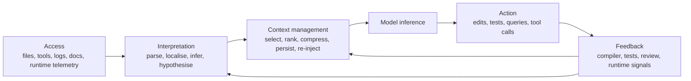
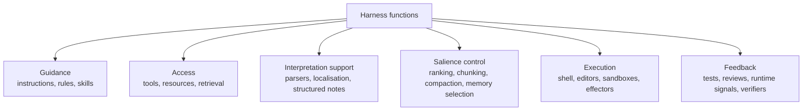

# Perception and Context Management in Coding Agents

## Executive summary

In the language of Martin Fowler and recent writing from LangChain, a harness is often treated as "everything around the model": state, tool execution, feedback loops, constraints, memory, and orchestration.[^fowler-harness][^langchain-harness] That is operationally useful, but analytically too coarse for coding agents. Classical AI kept several of these functions separate: sensing and acting in a task environment, maintaining an estimated state under partial observability, controlling what remains in working memory, and closing the loop with monitoring and replanning.[^aima-agents][^pomdp][^mape-k]

The cleanest distinction for coding agents is this:

- **Perception** is the process by which an agent obtains observations from its world and turns them into a task-relevant state estimate.
- **Context management** is the meta-process that decides what information should occupy the model's scarce working set: what to include, exclude, rank, compress, cache, persist, re-inject, or isolate across turns and subagents.[^anthropic-context][^langchain-context][^claude-context]

In coding work, perception means reading files, listing directories, querying symbols, running tests, inspecting compiler errors, checking logs, or retrieving docs, then forming hypotheses such as "the failing invariant is enforced in module X" or "the regression is probably in the cache invalidation path." Retrieval, chunking, summarisation, memory files, compaction, and subagent isolation are therefore mostly context-management mechanisms, even when they operate over perceptual material.[^anthropic-context][^langchain-context][^claude-memory]

The fact that coding-agent "worlds" differ radically across cases does **not** dissolve this distinction; it explains why the boundary often feels blurry. In a small repository, access and context selection can nearly coincide because the world is small enough to fit into working memory. In a monorepo, or in production debugging, raw access is abundant but usable salience is scarce, so context management dominates.[^repobench][^swebench][^anthropic-context]

What changes across worlds is not the conceptual difference, but which stage is hardest: acquisition, interpretation, or salience control.

## Definitions and the central distinction

A precise vocabulary helps. In classical agent theory, the agent is situated in a task environment specified by performance measure, environment, actuators, and sensors. Percepts arrive through sensors, and actions go out through actuators.[^aima-agents] In partially observable settings, the agent does not merely store raw percepts; it maintains a **belief state** or other state estimate summarising what those percepts imply about the world.[^pomdp]

In coding agents, the corresponding environment is not just "the codebase." It is the codebase **plus** its harness-mediated affordances: shell, search, tests, documentation, runtime telemetry, permissions, memory artefacts, and tool interfaces.[^fowler-harness][^mcp][^mcp-resources]

That yields a useful three-part distinction:

1. **Access**: what the agent can obtain from the world at all.
2. **Interpretation**: what those observations mean for the current task.
3. **Salience management**: which interpreted items deserve space in the active context, in what order and representation.

The practical mistake is to call all three "perception." Once that happens, retrieval failures, localisation errors, prompt overflow, stale memory, and poor summarisation are all lumped together. But they are different failure classes, and they need different fixes.

- Retrieval and file access improve **access**.
- Better parsers, localisation heuristics, and verification improve **interpretation**.
- Ranking, compression, pinning, persistence, and subagent isolation improve **salience management**.[^coderag][^lost-middle][^llmlingua][^anthropic-context]

The pipeline below captures the distinction:

## Classical terms and LLM-agent analogues

| Classical construct | Classical role | LLM-agent analogue | Why it is not identical to "perception" |
|---|---|---|---|
| Sensors / percepts | Acquire observations from the environment | File reads, `grep`, AST queries, test outputs, logs, web/docs retrieval, MCP resources | These provide raw access only; they do not decide what remains in the working set.[^aima-agents][^mcp-resources] |
| Belief state / state estimator | Summarise history into a sufficient statistic under partial observability | Issue-localisation hypotheses, scratchpads, structured notes, repo/runtime state summaries | Interpretation sits between raw observations and prompt inclusion.[^pomdp] |
| Working memory | Hold currently active, task-relevant state | The context window plus state objects exposed to the model | This is the managed **result** of selection, not sensing itself.[^soar][^anthropic-context][^claude-context] |
| BDI beliefs / desires / intentions | Separate information about the world, motivations, and commitments | Retrieved facts, task specs, TODO lists, plans, current subgoals | Intentional commitments and planning are downstream of perception.[^bdi] |
| Blackboard + agenda control | Shared workspace plus control over which hypotheses to pursue | Shared scratchpads, tool-result stores, retrieval/reranking policies, planner queues | The control policy over the workspace is context management, not sensing.[^blackboard] |
| Cognitive architecture modules | Couple perception, memory, reasoning, and action under fixed interfaces | Tool APIs, memory stores, runtime state, subagents, sandboxes | Architectures separate modules precisely because perception alone is insufficient.[^soar][^actr][^coala] |
| MAPE-K | Monitor, analyse, plan, execute over shared knowledge | Tool observations, diagnosis, patch planning, execution, persistent agent memory | "Monitor" is closest to perception; Analyse, Plan, and Knowledge belong to interpretation and context control.[^mape-k] |

## Classical lineage in AI

Classical AI did not treat perception as "everything before action." In *Artificial Intelligence: A Modern Approach*, the PEAS framing explicitly separates sensors and actuators from the rest of the agent design; percepts are what the architecture makes available to the program, while rational behaviour depends on the whole task environment and the agent's internal programme.[^aima-agents] That is already enough to show why "context" is not just perception: task specification, success criteria, and internal control are distinct from sensing.

The sharper classical analogue is the POMDP. Kaelbling, Littman, and Cassandra argue that in partially observable domains an agent must use memory of previous actions and observations to disambiguate the world; the agent maintains a **belief state** that summarises prior experience, and this belief state is a sufficient statistic for acting optimally.[^pomdp] For coding agents, this is the right abstraction: the repo's latent state is not directly visible from any single file read or log line, so the agent must infer and update a working hypothesis of where the problem is and what constraints matter. Perception, then, is not the belief state itself, but the observation-update process that produces it.

The BDI tradition makes another useful cut. Rao and Georgeff characterise **beliefs** as the informative component of system state and distinguish them from **desires** and **intentions**.[^bdi] That maps naturally onto coding agents: retrieved facts and inferred repo state correspond to beliefs; user requests and acceptance criteria correspond to desires; the current patch plan, selected subtask, or active TODO corresponds to intention. Context management is what keeps these categories coherent and available; perception is how the belief component gets updated.

The blackboard architecture sharpens the control point. Hayes-Roth's blackboard architecture distinguishes domain and control problems, shared knowledge, and solutions; the point is not merely to collect inputs, but to control which hypotheses and knowledge sources fire when.[^blackboard] This is close to modern agent harnesses: the hard problem is not only reading files, but deciding which snippets, hypotheses, and tools deserve another turn of reasoning.

Cognitive architectures make the same separation in a different vocabulary. Soar presents intelligence as a task-independent infrastructure with working memory, long-term memory, processing modules, and interfaces to perception and action; its working memory maintains situational awareness, including perceptual inputs and intermediate reasoning results.[^soar] Broader cognitive-architecture reviews describe architectures as theories of the representations and mechanisms underlying cognition.[^actr] Again, perception supplies inputs, but the architecture must decide what remains active, how it is transformed, and how it supports action.

Finally, MAPE-K from IBM offers a clean engineering decomposition. **Monitor** collects details from managed resources and turns them into analysable symptoms; **Analyse** determines whether change is needed; **Plan** selects a procedure; **Execute** applies effectors; **Knowledge** stores shared policies, logs, symptoms, and topology.[^mape-k] For coding agents, perception is closest to Monitor plus the formation of symptoms. Context management sits mainly in Knowledge and in the policies governing Analyse and Plan.

## Modern LLM-agent literature

Modern LLM-agent work largely reproduces these older distinctions, though under new names. **ReAct** explicitly interleaves reasoning traces and actions so that external observations can update the next reasoning step.[^react] **Toolformer** learns when to call tools and how to incorporate the results.[^toolformer] These are active-perception systems: they do not just wait for input, they take **epistemic actions** to obtain new information. But once the observation comes back, the system still faces a separate problem: what to keep from the tool output, and how to weave it into subsequent inference.

Retrieval-augmented models make the access/context split even clearer. **REALM** and **RAG** augment parametric memory with explicit non-parametric memory accessed during inference.[^realm][^rag] In those systems, retrieval is a mechanism of **access** to external knowledge; it is not identical to interpretation, and still less to context management. Retrieved passages must still be ranked, filtered, and integrated into generation.

Chain-of-thought belongs on the interpretation side, not the perception side. Wei et al. show that intermediate reasoning traces can improve performance on complex reasoning tasks, and ReAct shows that such reasoning can be interleaved with actions.[^cot][^react] But chain-of-thought is an internal computational trace, not an environmental observation. In agents, it often becomes part of the future context, which means it can later be **managed as context** even though it did not originate as perception.

Memory papers move squarely into context management. **Reflexion** stores verbal feedback in an episodic memory buffer for later trials.[^reflexion] **Voyager** grows a skill library and uses execution feedback plus self-verification to refine code.[^voyager] **MemoryBank**, **Generative Agents**, **LongMem**, and **MemGPT** all address the deficit created by finite context windows by adding persistence, retrieval, updating, or multi-tier storage.[^memorybank][^generative-agents][^longmem][^memgpt] None of these works primarily solves perception in the classical sense; they solve how to write, store, recall, and compress information across turns and sessions.

The most explicit bridge to classical AI is **CoALA**. It proposes a language-agent framework with modular memory components, structured action spaces for external environments and internal memory, and a generalised decision process.[^coala] This is essentially the old cognitive-architecture insight translated into LLM terms: agents need distinct mechanisms for memory, action, and control, not just a larger prompt.

A crucial caution from the literature is that self-critique is not a substitute for external grounding. Some work shows gains from iterative self-feedback and self-refinement, and separate work shows that LLMs can perform self-verification in some settings.[^self-refine][^self-verification] But Stechly, Valmeekam, and Kambhampati find substantial collapse for self-critique on reasoning and planning tasks, whereas sound **external verification** produces much stronger improvements.[^self-critique-collapse] For coding agents, this strongly suggests that tests, compilers, linters, and execution traces are not optional extras; they are central feedback channels in the harness.

## Selected core papers and official sources

| Title | Year | Short summary | Why relevant here |
|---|---:|---|---|
| [*Intelligent Agents* in *Artificial Intelligence: A Modern Approach*][^aima-agents] | 2021 | Defines PEAS, sensors, actuators, rational agents, and task environments | Baseline classical definition of perception and environment |
| [*BDI Agents: From Theory to Practice*][^bdi] | 1995 | Separates beliefs, desires, and intentions and gives an abstract interpreter loop | Useful map from observation to commitment and plan |
| [*A Blackboard Architecture for Control*][^blackboard] | 1985 | Treats control over shared knowledge as a first-class AI problem | Direct analogue of context-selection and agenda control |
| [*An Architectural Blueprint for Autonomic Computing*][^mape-k] | 2005 | Formalises Monitor-Analyse-Plan-Execute over shared knowledge | Strong engineering analogue of perception vs control vs memory |
| [*Introduction to the Soar Cognitive Architecture*][^soar] | 2022 | Describes working memory, long-term memory, learning, perception interfaces, and action | Good cognitive-architecture lens on coding agents |
| [*Chain-of-Thought Prompting Elicits Reasoning in Large Language Models*][^cot] | 2022 | Shows intermediate reasoning traces improve complex reasoning | Clarifies that reasoning traces are internal interpretation, not perception |
| [*ReAct: Synergizing Reasoning and Acting in Language Models*][^react] | 2022 | Interleaves reasoning with actions and observations | Canonical active-perception loop for LLM agents |
| [*Toolformer*][^toolformer] | 2023 | Trains models to decide when and how to call external tools | Makes access to external functions part of the policy |
| [*Retrieval-Augmented Generation for Knowledge-Intensive NLP Tasks*][^rag] | 2020 | Combines parametric and non-parametric memory for generation | Key source for access-via-retrieval vs generation distinction |
| [*Reflexion*][^reflexion] | 2023 | Uses verbal reinforcement and episodic memory buffers across trials | Memory/feedback as context management rather than perception |
| [*Voyager*][^voyager] | 2023 | Uses curriculum, skill library, environment feedback, and self-verification | Strong example of memory plus verification in an agent loop |
| [*Cognitive Architectures for Language Agents*][^coala] | 2024 | Proposes modular memory and structured action spaces for language agents | Best explicit bridge from classical AI to LLM agents |
| [*Lost in the Middle*][^lost-middle] | 2024 | Shows long-context models strongly depend on evidence position | Core evidence that salience and ordering matter |
| [*LongBench*][^longbench] | 2024 | Multitask benchmark for long-context understanding | Shows long context remains difficult and retrieval sometimes helps |
| [*RULER*][^ruler] | 2024 | More demanding synthetic benchmark for long-context models | Shows claimed context size often overstates usable context |
| [*NoLiMa*][^nolima] | 2025 | Reduces literal-overlap shortcuts in long-context retrieval tests | Important caution against overestimating retrieval ability |
| [*LLMLingua*][^llmlingua] | 2023 | Prompt-compression method with high compression and little loss | Important evidence that compression can be useful but must be engineered |
| [*RepoCoder*][^repocoder] | 2023 | Iterative retrieval-generation for repository-level completion | Direct coding-agent evidence that retrieval helps but must be iterative |
| [*RepoBench*][^repobench] | 2024 | Separates repository-level retrieval, completion, and end-to-end pipeline tasks | Excellent benchmark for disentangling access from integration |
| [*CodeRAG-Bench*][^coderag] | 2024 | Large-scale analysis of retrieval for code generation across sources | Shows retrieval helps, but lexical mismatch and integration remain hard |
| [*SWE-bench*][^swebench] | 2023 | Real GitHub issues requiring repo understanding and edits | High-value end-to-end benchmark for coding agents |
| [*EvalPlus*][^evalplus] | 2023 | Strengthens code-generation tests and shows weak tests inflate scores | Important caution for evaluating coding agents and harnesses |

For engineering practice rather than academic theory, the most useful official sources are the Fowler/Thoughtworks article on harness engineering, Anthropic's essays on context engineering and contextual retrieval, OpenAI's prompt-caching documentation, the official Model Context Protocol specification, and recent LangChain essays on harness and context engineering.[^fowler-harness][^anthropic-context][^anthropic-contextual-retrieval][^openai-prompt-caching][^mcp][^langchain-harness][^langchain-context]

## Engineering implications for coding agents

The most useful engineering interpretation of the classical distinction is that a coding-agent harness should be decomposed into at least six functions:

1. **Guidance**
2. **Access**
3. **Interpretation support**
4. **Salience control**
5. **Execution**
6. **Feedback**

Fowler's coding-agent article frames the user harness in terms of feedforward and feedback guides and sensors.[^fowler-harness] LangChain defines a harness as the code, configuration, and execution logic that add state, tools, and constraints around a raw model.[^langchain-harness] Anthropic defines context engineering as the iterative curation of the full token state during inference, including system instructions, tools, data, and message history.[^anthropic-context]

Put together, these sources imply that "harness" is best treated as an umbrella over several conceptually separable subsystems.

This taxonomy is a synthesis of current harness and context-engineering practice rather than a single paper's formalism, but it fits the evidence well.[^fowler-harness][^anthropic-context][^langchain-context]

Several concrete techniques belong specifically to **context management**, not perception.

### Chunking

Chunking breaks material into retrieval units sized for relevance and latency trade-offs. Good chunking increases the chance that retrieved units are both semantically meaningful and small enough for efficient downstream use.[^pinecone-chunking]

### Contextual retrieval

Contextual retrieval tries to preserve enough local context around chunks to reduce failed retrievals. Anthropic reports large reductions in failed retrievals, especially when combined with reranking.[^anthropic-contextual-retrieval] This is still not perception proper: it is a salience-improving transform over retrievable memory.

### Compaction

Compaction summarises prior dialogue or tool history into a smaller continuation state. Anthropic recommends tuning compaction first for recall and only then for precision; Claude Code uses compression plus recently accessed files; LangChain groups this under "compress."[^anthropic-context][^claude-context][^langchain-context] Again, this is management of working memory under a budget, not sensing.

### Persistent memory

Persistent memory stores facts or rules outside the immediate context window. Claude Code documents always-loaded instruction files and auto memory loaded at session start, with some artefacts re-injected after compaction.[^claude-memory][^claude-context] MemGPT makes the same design explicit via storage tiers.[^memgpt] What practitioners often call **pinning** is best understood as forcing certain artefacts to remain in the active or re-injected working set by policy: system prompts, root-level instruction files, or durable summaries.

### Caching

Caching should be distinguished from pinning. Prompt caching in OpenAI and Anthropic documentation reduces latency and cost for repeated prompt prefixes, especially when static content is front-loaded, but caching does not decide relevance; it merely amortises repeated use of already chosen context.[^openai-prompt-caching][^anthropic-prompt-caching] It is therefore an optimisation over stable context, not a replacement for good selection or compression.

### Tool and resource interfaces

Tool interfaces matter because they define what counts as "the world" for the agent. The official Model Context Protocol specification separates **resources** as context/data from **tools** as executable functions and places user consent and tool safety at the protocol level.[^mcp][^mcp-resources] That separation is conceptually valuable: resources are closer to perception and memory access, tools to actuation, while the harness must still decide what to read, call, and expose to the model.

## Cases, failure modes, and evaluation

### Small repository

In a small repo, perception and context management are easier to conflate because most of the relevant code can often be read cheaply. The main bottleneck is usually **interpretation**: localising the bug, understanding conventions, and mapping the issue description to the right symbols and files.

In this regime, richer retrieval systems may help only marginally; strong tests and lightweight persistent project guidance often matter more. RepoCoder's gains over in-file baselines and Claude Code's documented memory mechanisms support this: useful cross-file information matters even in simpler settings, but the integration burden is manageable.[^repocoder][^claude-memory]

### Monorepo and large codebase work

In monorepos, access is no longer the main issue; **salience** is. The system can list millions of candidate tokens, but the model cannot hold them all in useful working memory. Here, hierarchical retrieval, chunking, selector tools, scratchpads, and subagents become central.

Anthropic's just-in-time retrieval strategy, LangChain's write/select/compress/isolate framework, and repo-level benchmarks like RepoBench all point in the same direction: large-codebase success depends on controlling the working set, not simply expanding raw access.[^anthropic-context][^langchain-context][^repobench]

### Production debugging

Production debugging is the most clearly **partially observable** coding-agent world. The true causal state is latent; logs, metrics, traces, alerts, and failing tests are noisy proxies. The classical POMDP intuition applies directly: the agent should maintain and revise hypotheses, and it should sometimes take epistemic actions that gather information rather than immediately patching code.[^pomdp]

MAPE-K is also a strong analogue here: monitoring creates symptoms, analysis forms diagnoses, planning selects interventions, and execution applies them.[^mape-k] In this setting, thinking of context management as equivalent to perception is especially misleading, because the hard problem is not getting more bytes but maintaining a faithful causal picture under uncertainty.

### Architecture and design tasks

Architecture tasks are often perception-light but context-heavy. There may be no failing stack trace or narrow bug location. Instead, the agent must infer constraints from existing conventions, dependency structure, performance goals, and team norms, then preserve those high-level constraints over a long horizon.

Persistent design memory, project rules, feedforward guidance, and architecture-specific verifiers matter more than raw retrieval volume. Fowler's feedforward/feedback framing is most useful here: architecture work needs guides that encode desired structure and feedback that checks boundary violations.[^fowler-harness]

### Harness-mediated worlds

The earlier intuition that "the world of coding agents is extremely different across cases" is fundamentally right. A coding agent's world is not a fixed physical environment; it is partly **constructed by the harness**.

One harness may expose raw files, shell, logs, and runtime dashboards. Another may expose only summarised resources. One may allow ephemeral web search; another may prohibit it but provide managed memory files. One may return long tool payloads; another may aggressively truncate.

Because of that, what appears as perception in one system may appear as pre-curated context in another. The conceptual distinction still holds, but the implementation boundary moves with the harness.[^mcp][^anthropic-context][^langchain-harness][^claude-context]

## Failure modes and mitigation

### Access failures

Access failures include missing tools, stale or incomplete indexes, lexical-mismatch retrieval, permissions gaps, and absent runtime observability. CodeRAG-Bench shows that retrievers struggle especially when lexical overlap is weak.[^coderag]

Mitigations include hybrid sparse+dense retrieval, contextual retrieval, better chunking, just-in-time file navigation, and richer resource interfaces.[^anthropic-contextual-retrieval][^pinecone-chunking][^anthropic-context][^mcp]

### Interpretation failures

Interpretation failures include wrong issue localisation, confusion between symptom and cause, brittle parsing of logs or stack traces, and overconfidence in a single hypothesis.

POMDP-style belief maintenance, structured notes, multiple candidate hypotheses, and external verifiers all help.[^pomdp][^anthropic-context] The self-verification literature suggests that external, sound checks are more reliable than self-critique alone.[^self-critique-collapse]

### Salience failures

Salience failures include position bias, context overflow, context poisoning, contradiction between memories, compaction loss, and stale persistent rules.

*Lost in the Middle*, LongBench, RULER, and NoLiMa all show different facets of this problem: long context is not automatically usable context.[^lost-middle][^longbench][^ruler][^nolima] Mitigations include stronger reranking, explicit pinning of durable policies, compaction tuned for recall before precision, subagent isolation, and selective clearing of bulky tool results.[^anthropic-context][^claude-context]

## Evaluation

A rigorous evaluation stack should measure stages separately as well as end to end.

For **access/retrieval**, standard IR metrics such as recall@k, MRR, and nDCG remain appropriate, and benchmark suites such as DPR, BEIR, and MTEB show why heterogeneous evaluation matters.[^dpr][^beir][^mteb]

For **context use**, long-context benchmarks such as LongBench, RULER, and NoLiMa are more informative than raw context-window claims.[^longbench][^ruler][^nolima]

For **coding outcomes**, use task-level measures such as pass@k on HumanEval-style tasks, stricter functional correctness via EvalPlus, repository-level retrieval/completion/pipeline measures via RepoBench, and issue-resolution rates via SWE-bench and SWE-bench Verified.[^humaneval][^evalplus][^repobench][^swebench][^swebench-verified] The Verified subset is especially useful because it sharpens solvability and test quality.

The most important benchmark-design lesson is to **separate stage errors**. RepoBench does this explicitly with retrieval, completion, and pipeline tasks.[^repobench] Without such decomposition, a system that fails because it cannot retrieve the right file is indistinguishable from one that retrieved perfectly but then compressed away the critical detail, or one that preserved the right detail but made a poor patch. For harness evaluation, that separation is indispensable.

## Open problems and research directions

### 1. Salience modelling

Current systems mostly use heuristic retrieval, ranking, or summarisation. We still lack a robust, task-general theory of which observations should survive into the model's active context, especially under long-horizon coding work. Existing long-context studies show that more tokens are not enough; what matters is whether the right tokens are made salient in the right representation and position.[^lost-middle][^longbench][^ruler][^nolima]

### 2. Faithful compression

Compaction and summarisation are necessary for long-running coding agents, but they are also lossy transformations. Anthropic's guidance to optimise recall first is sound, yet there is still no widely adopted benchmark for "compression fidelity for future software work," where a fact may look irrelevant now but become critical twenty turns later.[^anthropic-context][^langchain-context]

### 3. Benchmark contamination and realism

SWE-bench is valuable, but coding-agent evaluation remains vulnerable to weak tests, benchmark contamination, and mismatch between benchmark tasks and real IDE workflows.[^swebench][^swebench-verified] EvalPlus already shows how much weak tests can inflate apparent code correctness.[^evalplus] The broader lesson is that harness research needs stronger stage-wise and end-to-end benchmarks grounded in modern, contamination-aware repo settings.

### 4. Security and trust in tool-mediated worlds

As MCP and related systems standardise resources and tools, the attack surface grows: unsafe tools, misleading tool descriptions, and over-broad permissions make both perception and execution untrustworthy.[^mcp][^mcp-resources] Classical AI already warned that action and information gathering are tightly coupled; for coding agents, trustworthy perception increasingly depends on trustworthy interfaces.

## Conclusion

For coding agents, **perception** should mean observation plus state estimation. **Context management** should mean the control of scarce working memory: selection, ranking, compression, persistence, re-injection, and isolation.

The two are deeply coupled, and different coding worlds shift the practical boundary, but they are not the same thing. Treating them as separate layers yields better theory, better harness design, and better evaluation. Treating them as one undifferentiated "harness" obscures the real engineering trade-offs.[^fowler-harness][^langchain-harness][^anthropic-context][^repobench]

## Sources

[^fowler-harness]: Martin Fowler, "Harness Engineering," <https://martinfowler.com/articles/harness-engineering.html>

[^langchain-harness]: LangChain, "The Anatomy of an Agent Harness," <https://www.langchain.com/blog/the-anatomy-of-an-agent-harness>

[^langchain-context]: LangChain, "Context Engineering for Agents," <https://www.langchain.com/blog/context-engineering-for-agents>

[^anthropic-context]: Anthropic, "Effective Context Engineering for AI Agents," <https://www.anthropic.com/engineering/effective-context-engineering-for-ai-agents>

[^anthropic-contextual-retrieval]: Anthropic, "Contextual Retrieval," <https://www.anthropic.com/news/contextual-retrieval>

[^anthropic-prompt-caching]: Anthropic, "Prompt Caching," <https://platform.claude.com/docs/en/build-with-claude/prompt-caching>

[^openai-prompt-caching]: OpenAI, "Prompt Caching," <https://developers.openai.com/api/docs/guides/prompt-caching>

[^claude-memory]: Anthropic, "Claude Code: Memory," <https://code.claude.com/docs/en/memory>

[^claude-context]: Anthropic, "Claude Code: Context Window," <https://code.claude.com/docs/en/context-window>

[^mcp]: Model Context Protocol, "Specification," <https://modelcontextprotocol.io/specification/2025-11-25>

[^mcp-resources]: Model Context Protocol, "Server Resources," <https://modelcontextprotocol.io/specification/2025-06-18/server/resources>

[^aima-agents]: Russell and Norvig, *Artificial Intelligence: A Modern Approach*, Chapter 2, "Intelligent Agents," <https://aima.cs.berkeley.edu/4th-ed/pdfs/newchap02.pdf>

[^pomdp]: Kaelbling, Littman, and Cassandra, "Planning and Acting in Partially Observable Stochastic Domains," <https://people.csail.mit.edu/lpk/papers/aij98-pomdp.pdf>

[^bdi]: Rao and Georgeff, "BDI Agents: From Theory to Practice," <https://cdn.aaai.org/ICMAS/1995/ICMAS95-042.pdf>

[^blackboard]: Hayes-Roth, "A Blackboard Architecture for Control," <https://www.sciencedirect.com/science/article/pii/0004370285900633>

[^mape-k]: IBM, "An Architectural Blueprint for Autonomic Computing," <https://users.cs.fiu.edu/~sadjadi/Teaching/Autonomic%20Grid%20Computing/CIS-6612-Summer-2006/AC-Blueprint-WhitePaper-V7.pdf>

[^soar]: Laird, Gluck, Anderson, Forbus, Jenkins, Lebiere, Salvucci, Scheutz, Thomaz, Trafton, Wray, Mohan, and Kirk, "Introduction to the Soar Cognitive Architecture," <https://arxiv.org/pdf/2205.03854>

[^actr]: Taatgen and Anderson, "Why Do Children Learn to Say 'Broke'? A Model of Learning the Past Tense Without Feedback," ACT-R-related cognitive architecture source, <https://act-r.psy.cmu.edu/wordpress/wp-content/uploads/2012/12/849taatgen.pdf>

[^coala]: Sumers et al., "Cognitive Architectures for Language Agents," <https://arxiv.org/abs/2309.02427>

[^cot]: Wei et al., "Chain-of-Thought Prompting Elicits Reasoning in Large Language Models," <https://arxiv.org/abs/2201.11903>

[^react]: Yao et al., "ReAct: Synergizing Reasoning and Acting in Language Models," <https://arxiv.org/abs/2210.03629>

[^toolformer]: Schick et al., "Toolformer: Language Models Can Teach Themselves to Use Tools," <https://arxiv.org/abs/2302.04761>

[^realm]: Guu et al., "REALM: Retrieval-Augmented Language Model Pre-Training," <https://arxiv.org/abs/2002.08909>

[^rag]: Lewis et al., "Retrieval-Augmented Generation for Knowledge-Intensive NLP Tasks," <https://arxiv.org/abs/2005.11401>

[^reflexion]: Shinn et al., "Reflexion: Language Agents with Verbal Reinforcement Learning," <https://arxiv.org/abs/2303.11366>

[^voyager]: Wang et al., "Voyager: An Open-Ended Embodied Agent with Large Language Models," <https://arxiv.org/abs/2305.16291>

[^memorybank]: Zhong et al., "MemoryBank: Enhancing Large Language Models with Long-Term Memory," <https://arxiv.org/abs/2305.10250>

[^generative-agents]: Park et al., "Generative Agents: Interactive Simulacra of Human Behavior," <https://arxiv.org/abs/2304.03442>

[^longmem]: Wang et al., "Augmenting Language Models with Long-Term Memory," <https://arxiv.org/abs/2306.07174>

[^memgpt]: MemGPT / Letta Research, <https://research.memgpt.ai/>; paper PDF: <https://arxiv.org/pdf/2310.08560>

[^self-refine]: Madaan et al., "Self-Refine: Iterative Refinement with Self-Feedback," <https://arxiv.org/abs/2303.17651>

[^self-verification]: Weng et al., "Large Language Models Are Better Reasoners with Self-Verification," <https://arxiv.org/abs/2212.09561>

[^self-critique-collapse]: Stechly, Valmeekam, and Kambhampati, "On the Self-Verification Limitations of Large Language Models on Reasoning and Planning Tasks," <https://arxiv.org/abs/2402.08115>

[^lost-middle]: Liu et al., "Lost in the Middle: How Language Models Use Long Contexts," <https://arxiv.org/abs/2307.03172>

[^longbench]: Bai et al., "LongBench: A Bilingual, Multitask Benchmark for Long Context Understanding," <https://arxiv.org/abs/2308.14508>

[^ruler]: Hsieh et al., "RULER: What's the Real Context Size of Your Long-Context Language Models?" <https://arxiv.org/abs/2404.06654>

[^nolima]: "NoLiMa: Long-Context Evaluation Beyond Literal Matching," <https://arxiv.org/abs/2502.05167>

[^llmlingua]: Jiang et al., "LLMLingua: Compressing Prompts for Accelerated Inference of Large Language Models," <https://arxiv.org/abs/2310.05736>

[^pinecone-chunking]: Pinecone, "Chunking Strategies for LLM Applications," <https://www.pinecone.io/learn/chunking-strategies/>

[^repocoder]: Zhang et al., "RepoCoder: Repository-Level Code Completion Through Iterative Retrieval and Generation," <https://arxiv.org/abs/2303.12570>

[^repobench]: Liu et al., "RepoBench: Benchmarking Repository-Level Code Auto-Completion Systems," <https://proceedings.iclr.cc/paper_files/paper/2024/file/d191ba4c8923ed8fd8935b7c98658b5f-Paper-Conference.pdf>

[^coderag]: "CodeRAG-Bench: Can Retrieval Augment Code Generation?" <https://arxiv.org/abs/2406.14497>

[^swebench]: Jimenez et al., "SWE-bench: Can Language Models Resolve Real-World GitHub Issues?" <https://arxiv.org/abs/2310.06770>

[^swebench-verified]: SWE-bench Verified, <https://www.swebench.com/verified.html>

[^evalplus]: Liu et al., "Is Your Code Generated by ChatGPT Really Correct? Rigorous Evaluation of Large Language Models for Code Generation," <https://arxiv.org/abs/2305.01210>

[^dpr]: Karpukhin et al., "Dense Passage Retrieval for Open-Domain Question Answering," <https://arxiv.org/abs/2004.04906>

[^beir]: Thakur et al., "BEIR: A Heterogeneous Benchmark for Zero-shot Evaluation of Information Retrieval Models," <https://arxiv.org/abs/2104.08663>

[^mteb]: Muennighoff et al., "MTEB: Massive Text Embedding Benchmark," <https://arxiv.org/abs/2210.07316>

[^humaneval]: Chen et al., "Evaluating Large Language Models Trained on Code," <https://arxiv.org/abs/2107.03374>
