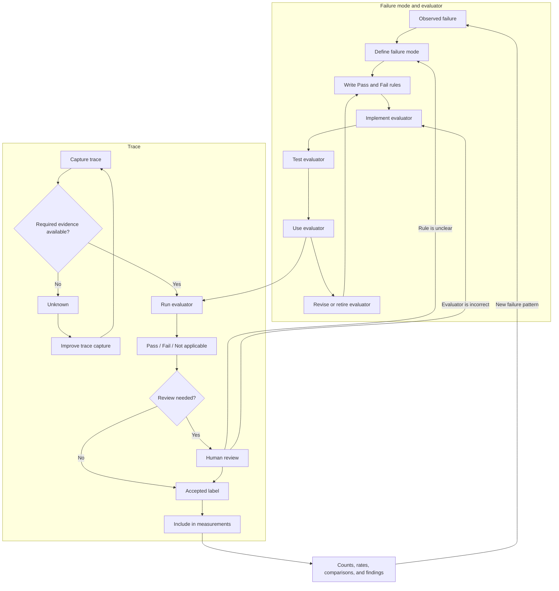

# Operationalising, Measuring, and Using an AI-System Failure Model


> **Note**
> The failure model is one evaluation lens within the broader product-improvement system. It describes unacceptable behaviour and provides evidence about where that behaviour occurs. It does not own the complete improvement cycle or provide a complete account of product quality.

An AI product is designed to help users accomplish particular jobs while preserving important guarantees and invariants. These intentions may be expressed through product framing that defines the minimum viable product, product promises, jobs to be done, guarantees, invariants, and primary and supporting business use cases.

The failure model provides a failure-specific view of this intended behaviour. It describes recurring ways in which observed executions fail to support a user job, break a guarantee, violate an invariant, or otherwise behave unacceptably.

Other evaluation lenses may examine successful task completion, user outcomes, latency, cost, usability, safety, or other product requirements. The failure model should therefore be interpreted as one component of a broader evaluation system.

**Failure evidence** is used as an umbrella term for the trace-linked material produced across these stages. When a specific artefact is intended, the more precise terms *criterion*, *label*, *measurement*, and *finding* should be used.

To measure these failures, we need to turn each selected failure mode into an evaluator. The evaluator checks executions and returns a label. We can then combine the labels to calculate failure rates, compare system versions, and identify patterns.

```text
product intent
      ↓
failure model
      ↓
evaluators
      ↓
labels for individual executions
      ↓
counts, rates, and comparisons
      ↓
findings
      ↓
Product Improvement Loop
```


Two feedback paths support the process:

```text
new, unclear, or poorly fitting behaviour
→ Evaluation Knowledge Loop
→ refine the failure model and operational criteria
```

```text
missing, incomplete, or inaccessible evidence
→ Evaluation Infrastructure Loop
→ improve evidence capture and evaluation tooling
```

### Trace and Evaluator Lifecycle


Two things move through the evaluation process:

- a **failure mode and its evaluator**;
- a **trace being evaluated**.

A failure mode is discovered, defined, and turned into an evaluator. The evaluator is tested and then used on traces. New or unclear traces may show that the failure definition or evaluator needs to change.

A trace is captured, checked for required evidence, evaluated, and assigned a label. Accepted labels are then used to calculate counts, rates, comparisons, and other measurements.

```text
FAILURE MODE AND EVALUATOR

observed failure
      ↓
failure mode defined
      ↓
Pass and Fail rules written
      ↓
evaluator implemented
      ↓
evaluator tested against trusted labels
      ↓
evaluator used on traces
      ↓
evaluator revised or retired
      ↺
```

```text
TRACE

trace captured
      ↓
required evidence available?
      ├── no  → Unknown → improve trace capture
      │
      └── yes
             ↓
       run evaluator
             ↓
   Pass / Fail / Not applicable
             ↓
      review if needed
             ↓
       accepted label
             ↓
 include in measurements
```


The two lifecycles are connected:

```text
failure mode and evaluator
             ↓
        evaluate trace
             ↓
       accepted label
             ↓
 measurements and findings
             ↓
 new cases, disagreements, or evidence gaps
        ↙                         ↘
revise failure mode         improve trace capture
or evaluator
```


The possible trace results are:

```text
Fail
The failure is present.

Pass
The failure is absent.

Not applicable
The trace contains no relevant opportunity for the failure.

Unknown
The trace does not contain enough evidence to decide.
```


`Unknown` describes a limitation of the evaluation data. It should not be treated as either Pass or Fail.

When a failure definition or evaluator changes, affected traces may need to be evaluated again. When required trace data is missing, the logging or review tools should be improved before the evaluator is rerun.### 11. Define and Run Evaluators for Failure Modes

An evaluator checks whether a specific failure mode appears in an execution.

Each evaluator should focus on one failure mode. It should clearly define what counts as Pass and what counts as Fail.

The central question is:

> Does this execution show this failure mode?



#### 11.1 Define What the Evaluator Checks


For each failure mode, define:

```text
failure-mode name
product rule or guarantee being checked
what counts as Fail
what counts as Pass
trace data the evaluator needs
examples of Pass and Fail
evaluator output
```


For example:

```text
Failure mode:
Missing user constraint

Product guarantee:
Recommendations respect explicit user constraints.

Fail:
The user states a relevant constraint, but the system omits or
contradicts it in a tool call, recommendation, action, or final response.

Pass:
The system keeps the relevant constraint throughout the execution.

Evidence to inspect:
User input, conversation context, tool calls, tool results,
intermediate actions, and final response.

Fail example:
The user asks for pet-friendly properties, but the property search
does not include the pet requirement.

Pass example:
The property search includes the pet requirement, and the returned
recommendations follow it.

Output:
Fail or Pass
```


The definition should describe behaviour that can be seen in the trace. It should not require the evaluator to guess what happened inside the model.

#### 11.2 Choose an Evaluator Type


The evaluator can be implemented in several ways.

**Code-based evaluator**

Use code when the rule can be checked directly.

Examples include:

- validating JSON or SQL syntax;
- checking whether a tool name exists;
- verifying that a required field is present;
- executing generated code or SQL;
- checking a value against known application state;
- comparing structured output with a reference.

Code-based evaluators are usually fast, cheap, deterministic, and easy to inspect.

**LLM-as-Judge evaluator**

Use an LLM judge when the check requires interpretation.

Examples include:

- whether the tone matches a user persona;
- whether a summary preserves the main point;
- whether a tool call is justified by the conversation;
- whether a response follows a complex product rule.

The judge prompt should define one narrow task, explain Pass and Fail, provide examples, and require a structured result.

**Human evaluator**

Use human review when:

- the failure definition is still changing;
- domain expertise is required;
- the case is highly sensitive;
- code cannot perform the check;
- an LLM judge has not yet been validated;
- the output of another evaluator needs to be checked.

Human labels can also serve as the reference used to test an automated evaluator.

#### 11.3 Decide Whether a Reference Is Needed


An evaluator may be reference-based or reference-free.

A **reference-based evaluator** compares the execution with a known correct result.

Examples include:

- comparing generated SQL with a golden SQL query;
- comparing an extracted location ID with a known region ID;
- comparing tool calls with an expected trace;
- running generated code against unit tests.

A **reference-free evaluator** checks a rule without requiring one complete correct answer.

Examples include:

- checking whether all tool names are valid;
- checking whether a required user constraint was preserved;
- checking whether an email includes required fields;
- asking an LLM judge whether the tone fits the user persona.

Some failure modes can use both approaches.

#### 11.4 Apply Evaluators to Complete Traces


Evaluators should inspect all trace data needed for the decision.

A final response may look correct even when an earlier step failed. For example:

- the system may call an invalid tool;
- a constraint may be missing from an intermediate query;
- an unauthorised action may be attempted;
- the system may recover from an earlier error before replying.

Each evaluator returns one result for each execution:

```text
Fail = failure present
Pass = failure absent
Not applicable = the execution had no opportunity for this failure
Unknown = the required trace data is missing or unclear
```


For example, `Missing user constraint` is:

- **Fail** when a relevant constraint was stated and then lost;
- **Pass** when the relevant constraint was preserved;
- **Not applicable** when no relevant constraint was stated;
- **Unknown** when the trace does not contain enough information.

A trace can fail several evaluators:

|Trace|Missing constraint|Invalid action|Persona mismatch|
|---|--:|--:|--:|
|Trace 1|Fail|Pass|Not applicable|
|Trace 2|Pass|Fail|Pass|
|Trace 3|Fail|Pass|Fail|
|Trace 4|Unknown|Pass|Pass|

Where useful, store a link to the relevant trace event and a short reason for the decision.

#### 11.5 Test Automated Evaluators


An automated evaluator should be tested before it is used at scale.

For a code-based evaluator:

- test known Pass and Fail cases;
- test edge cases;
- test missing and malformed inputs;
- confirm that the check matches the failure definition.

For an LLM judge:

- create trusted human labels;
- keep prompt examples separate from evaluation examples;
- compare judge results with human results;
- inspect false Pass and false Fail decisions;
- revise the prompt when the judge applies the rule incorrectly;
- evaluate the final judge on a held-out test set.

A judge should not be treated as correct simply because its output looks reasonable.

If the evaluator cannot reliably separate Pass from Fail, the team may need to:

- clarify the failure definition;
- split one broad failure mode into smaller checks;
- provide better examples;
- use a stronger judge;
- improve the available trace data;
- keep human review for that failure mode.

#### 11.6 Output of This Stage


The output of this stage is a labelled evaluation dataset containing:

- evaluator definitions;
- evaluator versions;
- Pass, Fail, Not applicable, or Unknown labels;
- links to supporting trace data;
- short decision notes where needed;
- human review or adjudication results;
- missing-data and evaluator-quality issues.

This stage produces labels for individual executions.

The next stage combines those labels to calculate rates, compare groups, and describe broader patterns.

### 12. Measure and Compare Failure Behaviour


Measurement combines evaluator results across a set of executions.

The main questions are:

> How often does the failure occur?

> Where does it occur?

> Did it change after we changed the system?

#### 12.1 Calculate Counts and Rates


For one failure mode:

```text
failure count =
number of eligible executions labelled Fail

failure rate =
failure count / number of eligible executions
```


The denominator should include only executions where the evaluator returned Pass or Fail.

`Not applicable` cases are excluded because the failure could not occur.

`Unknown` cases should be reported separately because the system could not be evaluated.

For example:

```text
120 total traces
90 eligible traces
18 Fail
72 Pass
20 Not applicable
10 Unknown

failure rate = 18 / 90 = 20%
```


Always report the count and denominator with the rate.

#### 12.2 Compare Important Groups


A single overall rate may hide important differences.

Calculate rates separately for groups such as:

- workflows;
- task types;
- tools;
- model versions;
- prompt versions;
- languages;
- user groups;
- context lengths;
- risk levels.

For example:

```text
single-turn search failure rate: 5%
multi-turn search failure rate: 22%
```


This shows where the problem is concentrated.

Small groups produce unstable results. Their sample sizes should always be shown.

#### 12.3 Compare System Versions


Apply the same evaluators to a baseline system and a candidate system.

Where possible, run both systems on the same cases.

For example:

```text
baseline failure rate: 18%
candidate failure rate: 11%

absolute change: -7 percentage points
relative reduction: 39%
```


The comparison only applies to:

- the selected failure mode;
- the evaluated cases;
- the tested system versions;
- the tested environment.

A better failure rate does not show that every part of the product improved. Other evaluations are still needed.

#### 12.4 Look for Related Failures


When several evaluators run on the same traces, the labels can show:

- which failures often appear together;
- which failure usually appears first;
- which failures lead to later problems;
- whether the system recovers;
- whether the failure reaches the final response.

For example:

```text
Missing constraint often occurs before an incorrect tool request.

The system recovers from invalid tool calls in 40% of affected traces.
```


These patterns can guide investigation. They do not prove the internal cause of the failure.

#### 12.5 Include Severity and Exposure When Needed


Failure rate alone may not determine importance.

A rare failure may have a serious effect. A frequent failure may have little impact.

The team may also track:

- severity;
- number of users affected;
- number of tasks affected;
- whether the user sees the failure;
- whether the failure can be reversed;
- financial, safety, legal, or compliance impact.

Keep severity separate from the Pass or Fail label.

For example:

```text
failure present: yes
severity: high
user-visible: yes
recovered: no
```

#### 12.6 Monitor Changes Over Time


Run evaluators on repeated samples to detect:

- regressions;
- improvements;
- changes after releases;
- changes in production traffic;
- new evaluator problems.

When a rate changes, also check whether any of the following changed:

- model;
- prompt;
- tools;
- workflow;
- traffic mix;
- failure definition;
- evaluator;
- logging system.

A changed rate may come from a system change, a data change, or an evaluator change.

#### 12.7 Match the Sample to the Question


The sample determines what the result means.

|Sample|What it can tell us|
|---|---|
|Discovery cases|Which failures can occur|
|Challenge cases|How the system behaves on selected difficult cases|
|Risk-based cases|How the system behaves in important high-risk scenarios|
|Random production sample|How often failures occur in the sampled production traffic|
|Stratified production sample|How rates differ across selected production groups|
|Same cases run on two systems|How the systems compare on those cases|
|Repeated samples over time|Whether measured behaviour is changing|
|Randomised experiment|Whether a controlled change caused a difference|

A failure rate from difficult discovery cases should not be reported as the normal production failure rate.

#### 12.8 Report Uncertainty and Evaluator Quality


A measured rate is based on a finite sample. Larger samples usually give more stable estimates.

When needed, report a confidence interval or another uncertainty range.

When an automated evaluator is imperfect, also report how well it agrees with trusted human labels. Useful measures include:

- true Pass detection rate;
- true Fail detection rate;
- false Pass rate;
- false Fail rate;
- overall agreement;
- number of human-labelled test cases.

If evaluator errors are large, raw failure rates may be misleading.

#### 12.9 Output of This Stage


The output of this stage may include:

- failure counts and rates;
- denominators;
- Unknown and Not applicable counts;
- results by workflow or scenario;
- comparisons between system versions;
- changes over time;
- related failure patterns;
- severity and exposure information;
- uncertainty ranges;
- evaluator accuracy results;
- clear limits on what the results mean.

These results are the failure findings used in the Product Improvement Loop.

### 13. Use Failure Findings to Improve the Product


Failure findings are one input into product decisions.

They should be considered together with:

- product goals;
- user research;
- business requirements;
- safety and compliance needs;
- engineering cost;
- latency and infrastructure limits;
- other evaluation results.

```text
failure findings and other product inputs
                    ↓
          choose what to investigate
                    ↓
             diagnose the problem
                    ↓
           propose a system change
                    ↓
          implement and test the change
                    ↓
            compare the new results
                    ↓
              deploy and monitor
```


Failure findings may show that:

- a failure occurs often;
- a rare failure has high impact;
- a failure is concentrated in one workflow;
- a candidate change reduces a known failure;
- one failure improves while another gets worse;
- the current evidence is too weak to support a decision.

The Product Improvement Loop decides:

- which problems to prioritise;
- what may be causing them;
- what changes to make;
- what tests are required;
- whether the change is safe to release.

#### Refine the Failure Model and Evaluators


Evaluation may reveal:

- a new failure mode;
- a failure definition that is too broad;
- two failure modes that overlap;
- an evaluator that applies the rule inconsistently;
- cases that do not fit the existing model.

In these cases:

```text
inspect the unclear cases
→ update the failure model
→ update the evaluator
→ relabel affected traces
```

#### Improve Evaluation Data and Tools


Evaluation may also reveal missing or unreliable trace data.

Examples include:

- missing conversation history;
- missing tool results;
- unknown system version;
- missing state changes;
- traces that cannot connect an action with its result.

In these cases:

```text
identify the missing evidence
→ improve logging or review tools
→ collect better traces
→ run the evaluator again
```


The three responsibilities remain separate:

```text
Failure model
Defines the failure modes that matter.

Evaluators
Check individual executions for those failure modes.

Product Improvement Loop
Uses the results to decide how to change the product.
```

# process model candidate


Yes. I'd model it as a set of **nested loops with stage gates**, rather than one pipeline that permanently moves from discovery to automation.

The source-derived backbone is:

```text
Analyze → Measure → Improve
```


Failure understanding expands `Analyze` into discovery, coding, category development, and a failure model. Operationalisation then converts selected failure modes into labels and measurements. New or unclear failures reopen discovery.

The gates, registries, lifecycle states, and separation of online sampling streams below are proposed structures for your system.

# Overall process

```text
1. Failure discovery
       ↓
2. Failure-mode triage
       ↓
3. Operational metric design
       ↓
4. Evaluator implementation
       ↓
5. Human alignment
       ↓
6. Held-out validation
       ↓
7. Evaluator-suite assembly
       ↓
8. Offline measurement
       ↓
9. Online measurement
       ↓
10. Aggregation and SUT views
       ↓
11. SUT improvement

At any point:
    new failure           → failure discovery
    ambiguous definition  → operational metric design
    evaluator drift       → human alignment
    missing coverage      → evaluation design
    SUT change            → offline measurement
```

# Step 1: Maintain the failure model


The input is the output of failure understanding:

```text
trace reviews
    ↓
concrete failure observations
    ↓
initial and focused coding
    ↓
failure modes
    ↓
failure model
```


At this stage, failure descriptions remain grounded in observed behavior. Experts identify what was wrong before claiming an internal cause, and they avoid prematurely forcing incidents into a fixed taxonomy.

A failure-mode record could contain:

```text
FailureMode

id
title
behavioral definition
representative incidents
contrasting successful incidents
known boundaries
affected product guarantees
required trace evidence
status
```


I'd give failure modes a lifecycle:

```text
provisional
    ↓
developed
    ↓
candidate-for-measurement
    ↓
operationalised
    ↓
monitored
    ↓
revised or retired
```


Not every discovered failure needs an evaluator.

# Step 2: Triage each failure mode


Before designing an evaluator, classify the failure mode.

```text
Failure mode
    ↓
┌──────────────────────────────────────────┐
│ Is the intended product behavior clear? │
└──────────────────────────────────────────┘
       │
       ├── no
       │     ↓
       │  clarify product or SUT specification
       │     ↓
       │  rerun and observe again
       │
       └── yes
             ↓
       Is repeated measurement useful?
             │
             ├── no → fix, defer, or retain for discovery
             └── yes → operationalise
```


The evaluator guidance explicitly recommends resolving specification ambiguity before building automated evaluation. Otherwise, the evaluator may measure whether the SUT inferred unstated intent rather than whether it generalized from a clear specification.

I'd use four triage outcomes:

|Outcome|Meaning|
|---|---|
|**Fix now**|The failure comes from a clear specification or implementation omission and does not yet justify permanent measurement.|
|**Operationalise**|The behavior is sufficiently understood and important enough to measure repeatedly.|
|**Continue discovery**|The failure boundary is still unclear or incidents do not yet form a coherent mode.|
|**Defer**|The mode is understood, but measurement cost currently exceeds its value.|

This is the first gate.

# Step 3: Choose the evaluation level


For every operationalisation candidate, define where the failure exists.

Multi-turn evaluation distinguishes three useful levels:

- **Session level:** did the whole interaction accomplish the user's goal?
- **Turn level:** was a particular response acceptable?
- **Cross-turn or coherence level:** did the SUT retain and use earlier context correctly?

So a failure mode should declare an evidence scope:

```text
failure_mode: loses user-stated constraint

evaluation_level: cross-turn
target: case execution
required_evidence:
  - earlier user constraint
  - later SUT response or action
```


Another could be:

```text
failure_mode: invalid tool identifier

evaluation_level: step
target: tool invocation
required_evidence:
  - available tool registry
  - emitted tool identifier
```


The broad SUT view and the failure-mode view should remain distinct:

```text
Holistic evaluator:
Did the session accomplish the user’s goal?

Specialized evaluator:
Did this particular known failure occur?
```


A successful session signal should not be defined only as "none of the known failure evaluators fired." The failure model will always have some incompleteness.

# Step 4: Define the operational metric


This is the bridge between an analytical failure mode and an automated evaluator.

```text
Failure mode
    ↓ operationalisation
Operational metric
    ↓ implementation
Evaluator
```


An operational metric should define:

```text
OperationalMetric

failure_mode_id
version

evaluation_level
target
applicability

PASS definition
FAIL definition

required evidence
allowed evidence
exclusions
boundary cases
insufficient-evidence behavior

reference strategy
cost or risk of false pass
cost or risk of false fail
```


Example:

```text
Metric: retention of user-stated constraints

Applicable when:
  the user states an active constraint
  and the SUT later recommends or acts on an option

PASS:
  the later behavior respects the active constraint,
  or explicitly asks to revise it

FAIL:
  the later behavior contradicts or ignores the active constraint

Required evidence:
  the original constraint
  relevant intervening updates
  the later response or action
```


This is where explicit criteria become necessary. They are required for repeatable automated measurement, even though they were not required for the expert's initial discovery review.

# Step 5: Choose the evaluator implementation


The broader concept should be **automated evaluator**. An LLM-as-Judge is one implementation type.

```text
Operational metric
    ↓
┌──────────────────────────────────────┐
│ Can the property be checked exactly? │
└──────────────────────────────────────┘
       │
       ├── yes → programmatic evaluator
       │
       └── no  → LLM evaluator or hybrid
```


Programmatic evaluators fit objective properties such as schema validity, valid tool names, required fields, executable SQL, or deterministic state checks. LLM evaluators fit behavior requiring semantic or domain interpretation. The sources recommend narrow, failure-specific evaluators and favor code where possible because it is cheaper, deterministic, and easier to interpret.

Possible implementations are:

```text
Programmatic
    deterministic rule or executable check

Reference-based
    compare against expected output, state, action, or trace

Reference-free
    assess an intrinsic behavioral property

LLM-as-Judge
    semantic binary classification

Hybrid
    deterministic evidence extraction
        + semantic judgment
```


One operational metric may have more than one implementation. For example, a deterministic check can detect missing fields while an LLM evaluator handles semantically equivalent formulations.

# Step 6: Build human reference data


The initial open-ended failure notes are not yet sufficient as evaluator validation data.

You now create a separate dataset asking a narrower question:

```text
Does failure mode F occur in this trace?

PASS: failure absent
FAIL: failure present
```


This dataset should include:

- clear passes;
- clear failures;
- boundary cases;
- cases from important product slices;
- varying conversation lengths;
- different failure positions;
- cases that superficially resemble the failure but should pass.

For multi-turn modes, include complete sessions, conversation prefixes, changed constraints, corrections, and other perturbations when relevant. The source recommends full-session review, reduced reproductions, `N-1` conversation prefixes, and targeted perturbations to expose context and memory failures.

For LLM evaluators, divide the human-labeled examples into disjoint sets:

```text
Training examples
    used as possible few-shot examples

Development set
    used repeatedly for evaluator refinement

Held-out test set
    used only after development is complete
```


The source suggests keeping most examples for development and test, with balanced pass/fail representation where feasible. Development and test examples must not appear in the evaluator prompt.

# Step 7: Run the evaluator-alignment loop


This is the first major repeated loop.

```text
Write baseline evaluator
       ↓
Run on development set
       ↓
Compare with human labels
       ↓
Calculate pass and failure recognition
       ↓
Inspect disagreements
       ↓
Revise evaluator or operational metric
       ↓
Run again
```


For an LLM evaluator:

```text
task definition
+ precise PASS/FAIL definitions
+ training-set examples
+ structured output
```


The recommended task is narrow and usually binary.

For every disagreement, I'd classify the cause:

```text
Evaluator problem
    prompt, model, parsing, rule, or implementation is wrong

Operational-definition problem
    PASS/FAIL boundary is ambiguous

Evidence problem
    trace lacks evidence needed for the metric

Human-label problem
    reference label is mistaken or inconsistent

Failure-model problem
    failure mode is too broad or combines distinct behaviors
```


That gives different feedback paths:

```text
evaluator problem
    → revise evaluator

definition problem
    → revise operational metric

evidence problem
    → revise trace capture or applicability rule

label problem
    → expert review of reference label

failure-model problem
    → reopen failure understanding
```


The sources explicitly recommend inspecting false passes and false fails, refining criteria and examples, and decomposing a metric when alignment stalls. They also note that prompt development can reveal that human labels or the failure definition should change.

# Step 8: Freeze and validate


Once development performance stabilizes:

```text
freeze:
  operational metric version
  evaluator code or prompt
  model and parameters
  training examples
  output parser
```


Then run the held-out test set.

The validation artifact should record:

```text
EvaluatorValidation

evaluator_version
metric_version
test_set_version

human pass count
human fail count

true pass rate
true fail rate
false-pass rate
false-fail rate

performance by important slice
known limitations
validation decision
```


I'd use three validation outcomes:

```text
validated
    suitable for declared scope

restricted
    suitable only for particular slices or uses

rejected
    not reliable enough for measurement
```


Thresholds should reflect risk. Missing an unauthorized financial action is different from falsely flagging a mild tone issue. The source uses 90% as an example, while explicitly saying the acceptable rates depend on application needs.

A process rule I'd add: once test-set errors influence evaluator redesign, that test set is no longer clean. The next formal validation should use a new held-out version.

# Step 9: Register evaluator versions


Validated evaluators need their own lifecycle.

```text
draft
  ↓
development-aligned
  ↓
test-validated
  ↓
active
  ↓
degraded
  ↓
retired
```


An evaluator registry could contain:

```text
EvaluatorVersion

id
operational_metric_id
implementation_type
code/prompt/model version
required inputs
supported scopes
validation report
known limitations
status
effective dates
```


This registry prevents a measurement from saying only:

```text
constraint retention = 94%
```


It should also establish:

```text
measured with evaluator E17
under metric definition M4
validated on reference set R3
```

# Step 10: Assemble an evaluator suite


An evaluator suite is a versioned measurement policy.

```text
EvaluatorSuite

holistic session evaluator
failure-mode evaluators
applicability routing
aggregation policy
suite version
```


Example:

```text
Wallet evaluator suite v3

holistic:
  task_completion_v2

failure modes:
  constraint_retention_v4
  unauthorized_action_v2
  unsupported_state_claim_v5
  invalid_tool_usage_v1
```


A suite may contain:

- one broad session-success evaluator;
- several specialized failure-mode evaluators;
- programmatic checks;
- LLM evaluators;
- evaluators that apply only to particular workflows or trace shapes.

The suite should not run every evaluator on every trace. Applicability is part of the metric.

# Step 11: Build the offline evaluation loop


Offline evaluation operates against declared SUT versions and controlled cohorts.

```text
SUT version
    +
execution configuration
    +
evaluation cohort
        ↓
execution run
        ↓
execution result
        ↓
evaluator suite
        ↓
judgments
        ↓
evaluation snapshot
```


Useful offline cohorts include:

```text
General evaluation cohort
    broad representative behavior

Regression cohort
    previously observed and fixed failures

Failure-targeted cohort
    cases designed to exercise one failure mode

Conversation-length cohort
    short, medium, and long interactions

Perturbation cohort
    changed goals, added constraints, corrections, ambiguity

Prefix cohort
    N-1 conversation state followed by repeated next-turn sampling
```


Multi-turn evaluation benefits from broad session-level judgment, while turn-level inspection is mainly useful for debugging particular failures.

The offline SUT improvement loop is:

```text
measure baseline
    ↓
change SUT
    ↓
execute comparable cohorts
    ↓
measure again
    ↓
compare by holistic success and failure mode
    ↓
inspect regressions and improvements
    ↓
change SUT again
```


An offline result should be a versioned **evaluation snapshot**, containing all execution, evaluator-suite, and aggregation versions.

# Step 12: Build the online evaluation loop


Online evaluation should use two different sampling streams.

This separation is my proposed structure.

## Measurement stream

```text
representative production sample
    ↓
evaluator suite
    ↓
prevalence estimates
    ↓
time-series and slice analytics
```


Its purpose is estimating how the SUT behaves in production. Sampling should be representative enough to support prevalence claims.

## Discovery and audit stream

```text
risk-based / uncertain / new-feature traces
    ↓
human review
    ↓
novel failures or evaluator disagreements
```


Its purpose is finding new problems and checking evaluator health.

These streams should remain separate because a risk-targeted sample cannot be interpreted as an unbiased production failure rate without an explicit weighting design.

The online maintenance loop is:

```text
automated online judgments
        ↓
periodic human audit
        ↓
compare evaluator with current human labels
        ↓
alignment stable?
    ┌───────────┴───────────┐
   yes                      no
    ↓                        ↓
continue             evaluator alignment loop
```


The evaluator source recommends ongoing human labeling and repeated alignment checks because production data, SUT behavior, models, and failure modes can drift.

# Step 13: Aggregate judgments into SUT views


The primitive outputs are evaluator judgments:

```text
trace T42

holistic task completion: PASS
constraint retention: FAIL
unauthorized action: PASS
unsupported state claim: PASS
```


Aggregation then produces several distinct views.

## 1. Holistic success

```text
session pass rate
task-completion rate
goal-achievement rate
```


This answers whether the SUT succeeds overall.

## 2. Failure prevalence

```text
constraint-loss rate
unauthorized-action rate
unsupported-claim rate
```


Each denominator should include only traces where the evaluator was applicable.

## 3. Failure profile

```text
Which known failure modes dominate?
Which occur together?
Which modes are rare but severe?
```

## 4. Slice views


Break measurements down by:

```text
workflow
feature
case type
model
tool
conversation length
turn position
interaction form
risk class
online/offline source
SUT version
```


Conversation length and turn position are especially relevant for multi-turn systems because degradation may appear only later in an interaction.

## 5. Change views

```text
SUT v12 vs v13
prompt A vs prompt B
model X vs model Y
before fix vs after fix
```


These should show both improvements and regressions by failure mode.

## 6. Evaluator-health views

```text
test-set true-pass rate
test-set true-fail rate
human-audit disagreement
insufficient-evidence rate
current evaluator version
validation age
performance by slice
drift indicators
```


This view distinguishes a SUT change from a measurement-system change.

# Step 14: Account for evaluator error


Automated evaluator predictions are measurements from an imperfect instrument.

For evaluator-backed prevalence, preserve:

```text
raw evaluator rate
estimated human rate
uncertainty interval
evaluator validation characteristics
```


The source proposes using held-out test-set performance to correct the raw rate and calculate a confidence interval.

Conceptually:

```text
raw automated judgments
        +
held-out human/evaluator comparison
        ↓
corrected prevalence estimate
        +
confidence interval
```


This should be applied per failure mode, because each evaluator has different error characteristics.

A single overall score would discard much of this information. I'd postpone any weighted SUT score until there is an explicit product policy describing severity, importance, and aggregation.

# The core loops


The complete system has five loops.

## 1. Failure-discovery loop

```text
observe traces
    ↓
record failures
    ↓
compare and code
    ↓
refine failure model
    ↓
sample more traces
```


Triggered by novel, unclear, or poorly represented behavior.

## 2. Evaluator-alignment loop

```text
operational metric
    ↓
evaluator
    ↓
development-set comparison
    ↓
disagreement analysis
    ↓
refinement
```


Triggered while building an evaluator or when evaluator performance degrades.

## 3. SUT-improvement loop

```text
offline measurement
    ↓
identify important failures
    ↓
change SUT
    ↓
rerun
    ↓
compare
```


Triggered by planned development work.

## 4. Online-maintenance loop

```text
production measurement
    ↓
human audit
    ↓
detect drift
    ↓
revalidate or revise evaluator
```


Triggered continuously or periodically after deployment.

## 5. Evaluation-design loop

```text
failure or missing evidence
    ↓
identify coverage/capture gap
    ↓
revise cases or execution evidence
    ↓
run again
```


Triggered when the issue is with what was exercised or captured, rather than with the SUT or evaluator.

# The resulting system structure

```text
Failure Model Registry
        ↓
Operational Metric Registry
        ↓
Evaluator Registry
        ↓
Evaluator Suite Registry
       / \
      /   \
Offline   Online
 Plane     Plane
      \   /
       \ /
Judgment and Measurement Store
        ↓
Analytics / SUT Views
```


The next concrete step is Step 2: apply the four-way triage--**fix now, operationalise, continue discovery, or defer**--to your current failure set. Paste or attach that set, and we can classify it one failure mode at a time.
