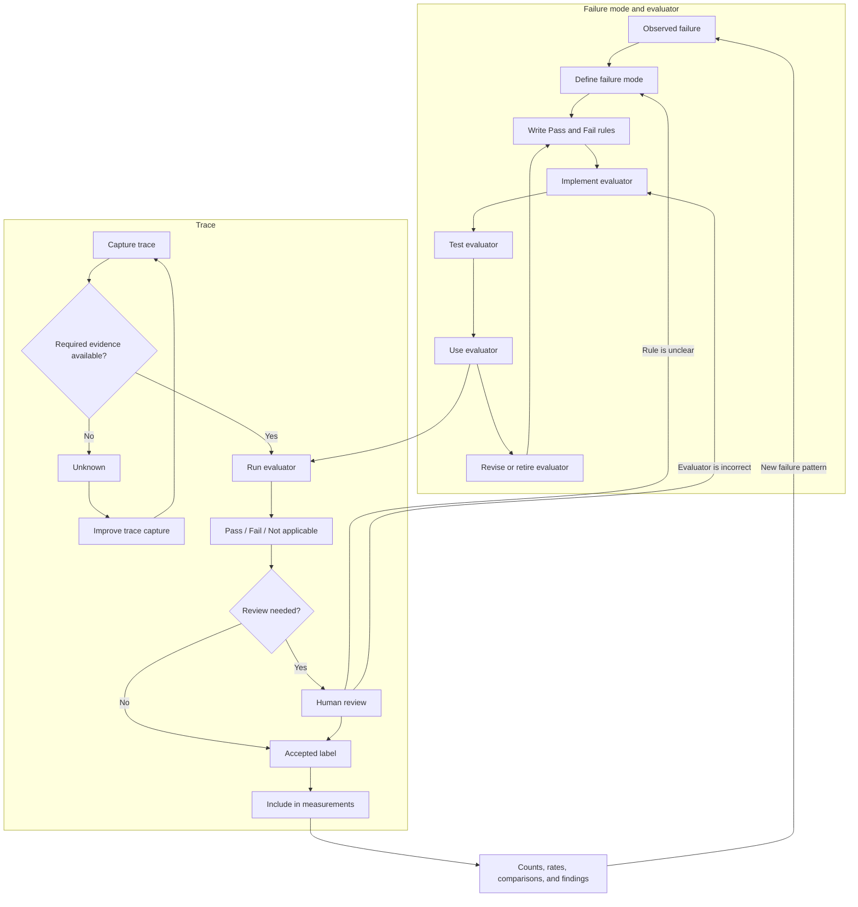

# Operationalising, Measuring, and Using an AI-System Failure Model


> **Note**
> The failure model is one evaluation lens within the broader product-improvement system. It describes unacceptable behaviour and provides evidence about where that behaviour occurs. It does not own the complete improvement cycle or provide a complete account of product quality.

An AI product is designed to help users accomplish particular jobs while preserving important guarantees and invariants. These intentions may be expressed through product framing that defines the minimum viable product, product promises, jobs to be done, guarantees, invariants, and primary and supporting business use cases.

The failure model provides a failure-specific view of this intended behaviour. It describes recurring ways in which observed executions fail to support a user job, break a guarantee, violate an invariant, or otherwise behave unacceptably.

Other evaluation lenses may examine successful task completion, user outcomes, latency, cost, usability, safety, or other product requirements. The failure model should therefore be interpreted as one component of a broader evaluation system.

**Failure evidence** is used as an umbrella term for the trace-linked material produced across these stages. When a specific artefact is intended, the more precise terms *criterion*, *label*, *measurement*, and *finding* should be used.

To measure these failures, we need to turn each selected failure mode into an evaluator. The evaluator checks executions and returns a label. We can then combine the labels to calculate failure rates, compare system versions, and identify patterns.

```text
product intent
      ↓
failure model
      ↓
evaluators
      ↓
labels for individual executions
      ↓
counts, rates, and comparisons
      ↓
findings
      ↓
Product Improvement Loop
```


Two feedback paths support the process:

```text
new, unclear, or poorly fitting behaviour
→ Evaluation Knowledge Loop
→ refine the failure model and operational criteria
```

```text
missing, incomplete, or inaccessible evidence
→ Evaluation Infrastructure Loop
→ improve evidence capture and evaluation tooling
```

### Trace and Evaluator Lifecycle


Two things move through the evaluation process:

- a **failure mode and its evaluator**;
- a **trace being evaluated**.

A failure mode is discovered, defined, and turned into an evaluator. The evaluator is tested and then used on traces. New or unclear traces may show that the failure definition or evaluator needs to change.

A trace is captured, checked for required evidence, evaluated, and assigned a label. Accepted labels are then used to calculate counts, rates, comparisons, and other measurements.

```text
FAILURE MODE AND EVALUATOR

observed failure
      ↓
failure mode defined
      ↓
Pass and Fail rules written
      ↓
evaluator implemented
      ↓
evaluator tested against trusted labels
      ↓
evaluator used on traces
      ↓
evaluator revised or retired
      ↺
```

```text
TRACE

trace captured
      ↓
required evidence available?
      ├── no  → Unknown → improve trace capture
      │
      └── yes
             ↓
       run evaluator
             ↓
   Pass / Fail / Not applicable
             ↓
      review if needed
             ↓
       accepted label
             ↓
 include in measurements
```


The two lifecycles are connected:

```text
failure mode and evaluator
             ↓
        evaluate trace
             ↓
       accepted label
             ↓
 measurements and findings
             ↓
 new cases, disagreements, or evidence gaps
        ↙                         ↘
revise failure mode         improve trace capture
or evaluator
```


The possible trace results are:

```text
Fail
The failure is present.

Pass
The failure is absent.

Not applicable
The trace contains no relevant opportunity for the failure.

Unknown
The trace does not contain enough evidence to decide.
```


`Unknown` describes a limitation of the evaluation data. It should not be treated as either Pass or Fail.

When a failure definition or evaluator changes, affected traces may need to be evaluated again. When required trace data is missing, the logging or review tools should be improved before the evaluator is rerun.### 11. Define and Run Evaluators for Failure Modes

An evaluator checks whether a specific failure mode appears in an execution.

Each evaluator should focus on one failure mode. It should clearly define what counts as Pass and what counts as Fail.

The central question is:

> Does this execution show this failure mode?



#### 11.1 Define What the Evaluator Checks


For each failure mode, define:

```text
failure-mode name
product rule or guarantee being checked
what counts as Fail
what counts as Pass
trace data the evaluator needs
examples of Pass and Fail
evaluator output
```


For example:

```text
Failure mode:
Missing user constraint

Product guarantee:
Recommendations respect explicit user constraints.

Fail:
The user states a relevant constraint, but the system omits or
contradicts it in a tool call, recommendation, action, or final response.

Pass:
The system keeps the relevant constraint throughout the execution.

Evidence to inspect:
User input, conversation context, tool calls, tool results,
intermediate actions, and final response.

Fail example:
The user asks for pet-friendly properties, but the property search
does not include the pet requirement.

Pass example:
The property search includes the pet requirement, and the returned
recommendations follow it.

Output:
Fail or Pass
```


The definition should describe behaviour that can be seen in the trace. It should not require the evaluator to guess what happened inside the model.

#### 11.2 Choose an Evaluator Type


The evaluator can be implemented in several ways.

**Code-based evaluator**

Use code when the rule can be checked directly.

Examples include:

- validating JSON or SQL syntax;
- checking whether a tool name exists;
- verifying that a required field is present;
- executing generated code or SQL;
- checking a value against known application state;
- comparing structured output with a reference.

Code-based evaluators are usually fast, cheap, deterministic, and easy to inspect.

**LLM-as-Judge evaluator**

Use an LLM judge when the check requires interpretation.

Examples include:

- whether the tone matches a user persona;
- whether a summary preserves the main point;
- whether a tool call is justified by the conversation;
- whether a response follows a complex product rule.

The judge prompt should define one narrow task, explain Pass and Fail, provide examples, and require a structured result.

**Human evaluator**

Use human review when:

- the failure definition is still changing;
- domain expertise is required;
- the case is highly sensitive;
- code cannot perform the check;
- an LLM judge has not yet been validated;
- the output of another evaluator needs to be checked.

Human labels can also serve as the reference used to test an automated evaluator.

#### 11.3 Decide Whether a Reference Is Needed


An evaluator may be reference-based or reference-free.

A **reference-based evaluator** compares the execution with a known correct result.

Examples include:

- comparing generated SQL with a golden SQL query;
- comparing an extracted location ID with a known region ID;
- comparing tool calls with an expected trace;
- running generated code against unit tests.

A **reference-free evaluator** checks a rule without requiring one complete correct answer.

Examples include:

- checking whether all tool names are valid;
- checking whether a required user constraint was preserved;
- checking whether an email includes required fields;
- asking an LLM judge whether the tone fits the user persona.

Some failure modes can use both approaches.

#### 11.4 Apply Evaluators to Complete Traces


Evaluators should inspect all trace data needed for the decision.

A final response may look correct even when an earlier step failed. For example:

- the system may call an invalid tool;
- a constraint may be missing from an intermediate query;
- an unauthorised action may be attempted;
- the system may recover from an earlier error before replying.

Each evaluator returns one result for each execution:

```text
Fail = failure present
Pass = failure absent
Not applicable = the execution had no opportunity for this failure
Unknown = the required trace data is missing or unclear
```


For example, `Missing user constraint` is:

- **Fail** when a relevant constraint was stated and then lost;
- **Pass** when the relevant constraint was preserved;
- **Not applicable** when no relevant constraint was stated;
- **Unknown** when the trace does not contain enough information.

A trace can fail several evaluators:

|Trace|Missing constraint|Invalid action|Persona mismatch|
|---|--:|--:|--:|
|Trace 1|Fail|Pass|Not applicable|
|Trace 2|Pass|Fail|Pass|
|Trace 3|Fail|Pass|Fail|
|Trace 4|Unknown|Pass|Pass|

Where useful, store a link to the relevant trace event and a short reason for the decision.

#### 11.5 Test Automated Evaluators


An automated evaluator should be tested before it is used at scale.

For a code-based evaluator:

- test known Pass and Fail cases;
- test edge cases;
- test missing and malformed inputs;
- confirm that the check matches the failure definition.

For an LLM judge:

- create trusted human labels;
- keep prompt examples separate from evaluation examples;
- compare judge results with human results;
- inspect false Pass and false Fail decisions;
- revise the prompt when the judge applies the rule incorrectly;
- evaluate the final judge on a held-out test set.

A judge should not be treated as correct simply because its output looks reasonable.

If the evaluator cannot reliably separate Pass from Fail, the team may need to:

- clarify the failure definition;
- split one broad failure mode into smaller checks;
- provide better examples;
- use a stronger judge;
- improve the available trace data;
- keep human review for that failure mode.

#### 11.6 Output of This Stage


The output of this stage is a labelled evaluation dataset containing:

- evaluator definitions;
- evaluator versions;
- Pass, Fail, Not applicable, or Unknown labels;
- links to supporting trace data;
- short decision notes where needed;
- human review or adjudication results;
- missing-data and evaluator-quality issues.

This stage produces labels for individual executions.

The next stage combines those labels to calculate rates, compare groups, and describe broader patterns.

### 12. Measure and Compare Failure Behaviour


Measurement combines evaluator results across a set of executions.

The main questions are:

> How often does the failure occur?

> Where does it occur?

> Did it change after we changed the system?

#### 12.1 Calculate Counts and Rates


For one failure mode:

```text
failure count =
number of eligible executions labelled Fail

failure rate =
failure count / number of eligible executions
```


The denominator should include only executions where the evaluator returned Pass or Fail.

`Not applicable` cases are excluded because the failure could not occur.

`Unknown` cases should be reported separately because the system could not be evaluated.

For example:

```text
120 total traces
90 eligible traces
18 Fail
72 Pass
20 Not applicable
10 Unknown

failure rate = 18 / 90 = 20%
```


Always report the count and denominator with the rate.

#### 12.2 Compare Important Groups


A single overall rate may hide important differences.

Calculate rates separately for groups such as:

- workflows;
- task types;
- tools;
- model versions;
- prompt versions;
- languages;
- user groups;
- context lengths;
- risk levels.

For example:

```text
single-turn search failure rate: 5%
multi-turn search failure rate: 22%
```


This shows where the problem is concentrated.

Small groups produce unstable results. Their sample sizes should always be shown.

#### 12.3 Compare System Versions


Apply the same evaluators to a baseline system and a candidate system.

Where possible, run both systems on the same cases.

For example:

```text
baseline failure rate: 18%
candidate failure rate: 11%

absolute change: -7 percentage points
relative reduction: 39%
```


The comparison only applies to:

- the selected failure mode;
- the evaluated cases;
- the tested system versions;
- the tested environment.

A better failure rate does not show that every part of the product improved. Other evaluations are still needed.

#### 12.4 Look for Related Failures


When several evaluators run on the same traces, the labels can show:

- which failures often appear together;
- which failure usually appears first;
- which failures lead to later problems;
- whether the system recovers;
- whether the failure reaches the final response.

For example:

```text
Missing constraint often occurs before an incorrect tool request.

The system recovers from invalid tool calls in 40% of affected traces.
```


These patterns can guide investigation. They do not prove the internal cause of the failure.

#### 12.5 Include Severity and Exposure When Needed


Failure rate alone may not determine importance.

A rare failure may have a serious effect. A frequent failure may have little impact.

The team may also track:

- severity;
- number of users affected;
- number of tasks affected;
- whether the user sees the failure;
- whether the failure can be reversed;
- financial, safety, legal, or compliance impact.

Keep severity separate from the Pass or Fail label.

For example:

```text
failure present: yes
severity: high
user-visible: yes
recovered: no
```

#### 12.6 Monitor Changes Over Time


Run evaluators on repeated samples to detect:

- regressions;
- improvements;
- changes after releases;
- changes in production traffic;
- new evaluator problems.

When a rate changes, also check whether any of the following changed:

- model;
- prompt;
- tools;
- workflow;
- traffic mix;
- failure definition;
- evaluator;
- logging system.

A changed rate may come from a system change, a data change, or an evaluator change.

#### 12.7 Match the Sample to the Question


The sample determines what the result means.

|Sample|What it can tell us|
|---|---|
|Discovery cases|Which failures can occur|
|Challenge cases|How the system behaves on selected difficult cases|
|Risk-based cases|How the system behaves in important high-risk scenarios|
|Random production sample|How often failures occur in the sampled production traffic|
|Stratified production sample|How rates differ across selected production groups|
|Same cases run on two systems|How the systems compare on those cases|
|Repeated samples over time|Whether measured behaviour is changing|
|Randomised experiment|Whether a controlled change caused a difference|

A failure rate from difficult discovery cases should not be reported as the normal production failure rate.

#### 12.8 Report Uncertainty and Evaluator Quality


A measured rate is based on a finite sample. Larger samples usually give more stable estimates.

When needed, report a confidence interval or another uncertainty range.

When an automated evaluator is imperfect, also report how well it agrees with trusted human labels. Useful measures include:

- true Pass detection rate;
- true Fail detection rate;
- false Pass rate;
- false Fail rate;
- overall agreement;
- number of human-labelled test cases.

If evaluator errors are large, raw failure rates may be misleading.

#### 12.9 Output of This Stage


The output of this stage may include:

- failure counts and rates;
- denominators;
- Unknown and Not applicable counts;
- results by workflow or scenario;
- comparisons between system versions;
- changes over time;
- related failure patterns;
- severity and exposure information;
- uncertainty ranges;
- evaluator accuracy results;
- clear limits on what the results mean.

These results are the failure findings used in the Product Improvement Loop.

### 13. Use Failure Findings to Improve the Product


Failure findings are one input into product decisions.

They should be considered together with:

- product goals;
- user research;
- business requirements;
- safety and compliance needs;
- engineering cost;
- latency and infrastructure limits;
- other evaluation results.

```text
failure findings and other product inputs
                    ↓
          choose what to investigate
                    ↓
             diagnose the problem
                    ↓
           propose a system change
                    ↓
          implement and test the change
                    ↓
            compare the new results
                    ↓
              deploy and monitor
```


Failure findings may show that:

- a failure occurs often;
- a rare failure has high impact;
- a failure is concentrated in one workflow;
- a candidate change reduces a known failure;
- one failure improves while another gets worse;
- the current evidence is too weak to support a decision.

The Product Improvement Loop decides:

- which problems to prioritise;
- what may be causing them;
- what changes to make;
- what tests are required;
- whether the change is safe to release.

#### Refine the Failure Model and Evaluators


Evaluation may reveal:

- a new failure mode;
- a failure definition that is too broad;
- two failure modes that overlap;
- an evaluator that applies the rule inconsistently;
- cases that do not fit the existing model.

In these cases:

```text
inspect the unclear cases
→ update the failure model
→ update the evaluator
→ relabel affected traces
```

#### Improve Evaluation Data and Tools


Evaluation may also reveal missing or unreliable trace data.

Examples include:

- missing conversation history;
- missing tool results;
- unknown system version;
- missing state changes;
- traces that cannot connect an action with its result.

In these cases:

```text
identify the missing evidence
→ improve logging or review tools
→ collect better traces
→ run the evaluator again
```


The three responsibilities remain separate:

```text
Failure model
Defines the failure modes that matter.

Evaluators
Check individual executions for those failure modes.

Product Improvement Loop
Uses the results to decide how to change the product.
```
