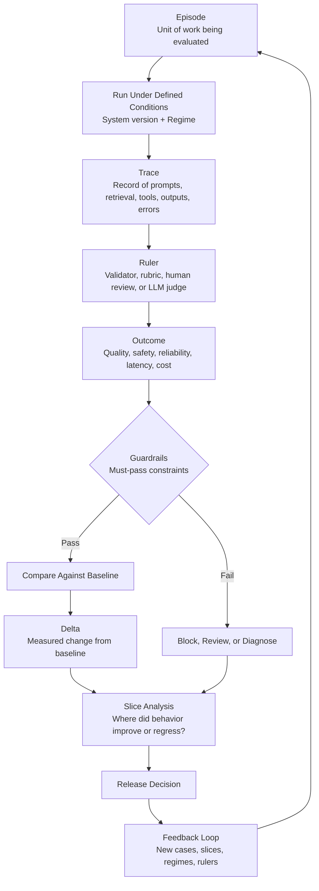

# How to Manage Behavioral Change in Production AI Systems


This guide is for engineering, product, and platform teams building AI systems that need to work reliably in production. It focuses on evaluation harnesses as practical infrastructure for managing behavioral change in systems shaped by models, prompts, retrieval, tools, policies, runtime context, and generated outputs.

This guide does not attempt to explain every way AI systems differ from conventional software. That belongs in the companion guide on AI-system features. Here, the focus is narrower: how teams turn expected AI behavior into repeatable evidence for testing, comparison, diagnosis, release decisions, and ongoing improvement.

## Why Evaluation Harnesses Exist


AI systems are hard to change safely because behavior depends on more than a single model. A prompt revision, model swap, retrieval update, tool change, policy tweak, or runtime dependency issue can improve one behavior and quietly break another.

Without an evaluation harness, teams usually rely on manual prompt checks, anecdotal examples, or demo performance. That may be enough for a prototype, but it is not enough once failures affect users, workflows, business decisions, compliance, or safety.


A good harness turns AI behavior into an engineering artifact: something that can be tested, reviewed, compared, gated, monitored, and improved over time.



An evaluation harness gives teams a repeatable way to define expected behavior, test actual behavior, compare versions, diagnose failures, and decide whether a change is safe to ship. Its main value is controlled change management: turning AI behavior into something that can be tested, reviewed, compared, gated, monitored, and improved over time.

The central question is:

> Can this team safely change the system without losing control of its behavior?

The harness does not define product success. It operationalizes the team's definition of success and turns it into repeatable evidence

## Signs You Need One


You need an evaluation harness when:

- you are moving beyond a demo or prototype;
- you are changing prompts, models, retrieval, tools, or policies;
- failures affect users, workflows, business decisions, compliance, or safety;
- quality is currently judged by manual spot checks or anecdotes;
- multiple teams need a shared definition of acceptable behavior;
- release decisions need evidence rather than subjective preference.

## The Core Problem


AI systems are probabilistic, behaviorally complex, and sensitive to change. A team can improve one behavior and break another by changing a prompt, model, retrieval strategy, tool definition, guardrail, post-processing rule, or runtime dependency.

Behavior can also change without an intentional release. Vendor-side model updates, changing retrieval corpora, dependency instability, tool availability, latency, and shifts in traffic can all move system quality.

## Minimum Viable Evaluation Harness


A first useful harness does not need to be elaborate. It should include:

1. A small but representative dataset of real or realistic tasks.
2. Clear expected behavior for each task.
3. Deterministic checks for anything mechanically verifiable.
4. Human or rubric-based review for subjective quality.
5. A baseline system version to compare against.
6. Per-case traces that show prompt, retrieved context, tool calls, output, latency, and errors.
7. Simple release criteria: approve, review, block, or investigate.

The goal of the first harness is not comprehensive coverage. The goal is to stop making AI delivery decisions based only on manual spot checks and subjective impressions.

## What an Evaluation Harness Is


An AI evaluation harness is a structured system for testing an AI product against defined scenarios, scoring its behavior consistently, and comparing results across versions, configurations, and operating conditions.

Its purpose is to help teams answer a critical question:

> Can this team safely change the system without losing control of its behavior?

### What the Harness Does


A harness gives the team a repeatable way to:

1. Define expected behavior.
2. Test the system against representative scenarios.
3. Measure quality, safety, cost, and performance.
4. Compare new behavior against prior baselines.
5. Diagnose regressions and failure modes.
6. Decide whether a change can ship.

## The Behavioral Contract


> Before choosing models, prompts, retrieval, tools, or metrics, the team needs to define the expected behavior of the system.

Defining what "working" means is a prerequisite for designing a useful evaluation harness because it determines what the harness should measure.

For conventional software, correctness is often mostly deterministic. For AI systems, the contract is more nuanced. A system may answer correctly in common cases but fail on edge cases, hallucinate unsupported claims, ignore instructions, misuse tools, leak sensitive information, or produce output that is technically valid but not useful.

A useful behavioral contract defines:

- what the system is supposed to do;
- what good behavior looks like;
- what unacceptable failure looks like;
- which scenarios matter most;
- which risks cannot be tolerated;
- what level of quality, safety, latency, and cost is acceptable.

> The harness tests whether the system behaves the way the team agreed it should.

Without a behavioral contract, evaluation becomes arbitrary. Teams end up measuring whatever is easy to measure instead of what matters for the product.

This converts vague quality expectations into testable criteria.

```text
Behavioral Contract
        ->
Evaluation Dataset
        ->
Scorers + Validators
        ->
Trace + Run Metadata
        ->
Baseline Comparison
        ->
Release Decision
        ->
Production Feedback
        ->
Updated Harness Coverage
```

## Evaluate The Delivered System, Not Just The Model


> Treat the AI product as a system, not only as a model.

An AI product is rarely just a model call. Its behavior is shaped by the interaction of many components:

- the foundation model or fine-tuned model;
- system, developer, and user prompts;
- retrieval pipelines and indexes;
- tools and APIs;
- memory or conversation state;
- guardrails and policy logic;
- decoding parameters;
- post-processing;
- runtime conditions;
- production traffic patterns;
- external dependencies.

This matters because quality failures can originate anywhere in the system. A hallucination may be caused by the model, but it may also be caused by stale retrieval data. A broken answer format may come from the prompt, post-processing, or schema enforcement. A tool-use failure may come from the model, the tool definition, the API, permissions, latency, or unavailable dependencies.

A serious evaluation strategy should evaluate the system as delivered, not only the model in isolation.

## Build The Harness As A Measurement System


An effective evaluation harness is not just a collection of test cases. It is a measurement system for observing how an AI product behaves under defined conditions.

This guide uses a small practical vocabulary for that measurement system. Broader methodology work can expand these concepts further, but the harness itself only needs the minimum set required to make evaluation interpretable, comparable, and useful for release decisions.

The concepts are easiest to understand as a measurement loop: the harness runs an episode under defined conditions, records a trace, applies rulers, checks guardrails, compares results against a baseline, and analyzes deltas across meaningful slices.

**The Evaluation Harness Measurement Loop**




- **Episode** is the unit of work being evaluated, and **Regime** defines the conditions under which the system is run.
- **Trace** is the structured evidence captured during execution, and **Ruler** is the scoring instrument applied to that evidence.
- **Outcome** is the measured result, while **Guardrail** marks the constraints that must pass before a candidate can be treated as releasable.
- **Delta** is the measured change from a baseline, and **Slice** is the lens used to see where behavior improved, regressed, or stayed unstable.

Read as a loop, these terms make results more interpretable. A score is only useful if the team knows what was tested, which system version was tested, which conditions were present, how behavior was scored, and how much uncertainty remains. The loop helps teams compare runs consistently, explain regressions, and make release decisions without treating the full methodology as required background.


The harness does not make the AI system deterministic. It makes variation observable, measurable, and bounded enough for engineering decision-making.


## The Operating Model: Integrating with Delivery


An evaluation harness is strongest when it is used as part of a larger delivery system, not as a standalone testing utility.



The harness measures how the system behaves against defined cases and criteria. But dependable AI delivery also needs other supporting structures that make those measurements interpretable, actionable, and sustainable over time.

- The **test pyramid** determines where checks belong. It pushes deterministic and interface-level checks earlier in delivery, reserves more expensive semantic evaluation for later stages, and reduces the cost of catching obvious failures.
- **Observability** captures the runtime evidence needed to explain behavior in production and feed important failures back into the harness.
- A **methodology or operating model** defines how results are interpreted and acted on. It gives the team rules for baselines, comparisons, slices, guardrails, release decisions, ownership, and follow-up actions. It should also help the team distinguish a true product regression from a measurement problem, scorer drift, missing data, or environmental instability.

The surrounding delivery system should also include feedback loops. Production incidents, sampled traces, user feedback, and recurring failure patterns should not remain isolated observations. They should feed back into the evaluation harness as new test cases, new slices, updated guardrails, stronger deterministic checks, or revised release criteria.

Used together, these elements turn evaluation from an isolated measurement activity into a controlled process for changing AI systems safely. The harness provides the measurement core, observability provides the evidence, the test pyramid structures assurance, and the operating model turns evidence into decisions and continuous improvement.

## Use Multiple Evaluation Methods


AI quality systems should not rely on one kind of evaluation. Different checks belong at different levels of the test pyramid. Deterministic failures should be caught earlier and more cheaply, while more realistic, more semantic, and more production-facing evaluation belongs later in the stack.

### Deterministic Tests And Validators


Some properties should be checked mechanically and as early as possible. These include JSON validity, schema compliance, required fields, citation presence, tool-call structure, refusal format, latency limits, cost limits, and business-rule enforcement.

These checks often belong in code-level tests, validator layers, or other deterministic gates around the model rather than only in the harness itself. They are fast, cheap, reliable, and well suited to release blocking. When a property can be enforced deterministically, teams should prefer that over subjective review.

### Replay And Integration Evaluations


Many important failures come from orchestration, retrieval, routing, or tool interfaces rather than from the model alone. Replay and integration evaluations exercise those seams under controlled conditions.

These evaluations are useful for checking retrieval packaging, tool contracts, interface fidelity, error handling, and multi-component regressions. They also produce replayable cases, which makes failures easier to diagnose and compare across versions.

### End-To-End Scenario Evaluations


Product teams also need tests that exercise the full system in realistic workflows. Controlled end-to-end scenario evaluations help verify that the system behaves acceptably across multi-step tasks, high-value user journeys, and release-critical interactions.

These tests are especially useful when the team needs confidence that the whole product still works together, not just that individual validators or components pass in isolation.

### Semantic Evaluations


Some important behaviors cannot be fully specified with deterministic rules. Task completion, groundedness, usefulness, instruction-following, judgment quality, and behavior in ambiguous cases usually need semantic evaluation.

This layer typically relies on curated evaluation datasets, reference answers, rubrics, or slice-based review. The quality of the dataset matters. A weak or unrepresentative evaluation set creates false confidence.

Human review and LLM judges belong mainly in this layer. They are measurement approaches, not separate levels of the evaluation stack.

Human review remains important for subjective, ambiguous, or high-risk behavior. It is slower and more expensive, but it provides a stronger reference point when clear rubrics are used.

LLM judges can scale evaluation for properties such as relevance, groundedness, helpfulness, rubric adherence, and instruction-following. They are useful, but they must be treated carefully. LLM judges can be biased, inconsistent, overconfident, or sensitive to rubric wording. They should be calibrated against human review and spot-checked regularly.

Regression evaluation also operates heavily at this layer. It compares current behavior against a baseline to determine whether a prompt change, model swap, retrieval update, tool change, or policy change made the system better, worse, or merely different. Because AI changes often have non-local effects, regression evaluation should preserve enough trace and run-context data to explain what changed.

### Adversarial And Safety Evaluations


Adversarial and safety evaluation is not a single method. It is a specialized class of evaluation that often spans deterministic guardrails, scenario tests, and semantic robustness checks.

These evaluations test whether the system behaves acceptably under jailbreak attempts, prompt injection, malicious input, sensitive data requests, unsafe instructions, or policy-boundary cases. For systems connected to tools, retrieval, private data, or workflow automation, this is not optional. It is part of the safety model.

### Production Evaluation And Monitoring


Offline evaluation is necessary but not sufficient. Real users will produce inputs that the test set did not anticipate, and behavior can change because of drift, dependency instability, or shifts in traffic.

Production evaluation depends on observability. Sampled traces, incident review, user feedback, drift monitoring, and replay of real-world cases reveal failures that curated suites missed, and those failures should become future regression coverage in the harness.

## Design Evaluation Data Around Product Risk


> The harness is only as good as the evaluation data behind it.

A useful evaluation dataset should reflect the actual risk profile of the product. A customer-support assistant, legal summarization tool, code-generation agent, medical triage assistant, and internal search agent all need different coverage. Weak, narrow, stale, or unrepresentative datasets create false confidence, even when the scoring system looks disciplined.

The dataset should be built from two sources that work together. The first is the product definition: the behavioral contract, MVP scope, core user journeys, high-value workflows, promised behaviors, and unacceptable failures. The second is observed or reconstructed evidence: production traces, sampled user interactions, production incidents, historical failures, support escalations, repeated user re-asks, and other signals that show where the system actually breaks.

This matters because product definition and trace evidence answer different questions. The product definition tells the team what should matter. Traces and incidents show what is actually fragile. A strong dataset needs both.

The first version of the dataset should not be assembled only from imagined examples. Start from the MVP and the behavioral contract, then review real or realistic traces, identify recurring and high-severity failures, and turn those failures into durable evaluation coverage.

Before user traffic exists, it is often useful to create a small Golden Dataset: a highly curated, human-verified set of representative inputs and expected outcomes used for initial baseline validation.

That set is not enough on its own, but it gives the team a stable starting point before broader synthetic traces and real production evidence become available. If production traces do not yet exist, bootstrap the wider dataset with representative synthetic traces and realistic scenarios derived from the product design, then replace or rebalance them with real data over time.

A strong dataset should include:

- common user paths and representative day-to-day tasks;
- high-value or high-risk workflows tied to the product's MVP promise;
- edge cases, ambiguous inputs, and negative examples;
- retrieval-heavy, tool-using, or long-context scenarios when those are part of the system;
- known failure modes from historical issues, production incidents, and trace review;
- adversarial, policy-boundary, or abuse cases where safety matters;
- examples that represent unacceptable failures the team explicitly wants to prevent.

The dataset itself should be representative of real usage, intentionally balanced across important workflows and risk tiers, small enough to review and maintain, and broad enough to catch meaningful regressions. It should be versioned, traceable, and refreshed as the product, traffic, and failure patterns change.

### The Evaluation Flywheel


The evaluation dataset is not a static benchmark. It is a living artifact that should evolve with the product and with production reality. Teams should avoid overfitting prompts or policies to a fixed test set, especially when the same examples are used repeatedly during iteration.

Production incidents, sampled user interactions, repeated unresolved queries, support escalations, and historical failures should feed back into the harness as future regression coverage. Teams should also review semantically similar requests and failures together so they can spot emergent topics, tail intents, and knowledge gaps that are easy to miss case by case.

The point of the flywheel is not only to grow the dataset, but to keep it aligned with the ways the system actually fails, the risks that matter most, the behaviors the team needs to preserve as the product changes.

## Mature Harness Capabilities


As the system and the delivery process mature, the harness usually grows to include:

- slices for high-risk workflows, user segments, or known failure patterns;
- regimes for conditions such as empty retrieval, degraded tool health, or long-context tasks;
- versioned datasets, rubrics, scorers, and validators;
- release gates tied to quality, safety, latency, cost, and critical failure modes;
- production replay and sampled review;
- drift detection over time;
- audit trails for what changed, what was tested, and what shipped;
- feedback loops that turn incidents and unresolved production behavior into future tests.

## How The Harness Supports Delivery


The harness is not only a measurement tool. It is part of delivery control for production AI systems.

### Planned Change Validation


For controlled changes such as prompt revisions, model swaps, retrieval changes, tool updates, guardrail changes, decoding changes, or post-processing changes, the harness helps the team compare behavior against a known baseline and decide whether the change should be approved, reviewed, or blocked.

### Drift Detection


Behavior can also change because of factors outside the intended release: vendor-side model updates, changing retrieval data, dependency changes, tool availability, API behavior changes, runtime conditions, or shifts in traffic.

The harness supports behavioral monitoring by rerunning comparable evaluations over time and surfacing movement that was not caused by an intentional release. That movement may appear not only as score changes, but also as shifts in intent mix, growth in unhandled request clusters, changes in refusal patterns, or changes in whether users appear to get resolution.

### Observability And Diagnosis


Delivery also needs a runtime evidence layer around the harness. The harness can show that behavior changed, but observability helps explain what changed, where it changed, and why it changed.

For AI systems, many important failures are semantic or system-level rather than hard crashes. The answer may be plausible but unsupported, the tool call may technically succeed but do the wrong thing, retrieval may return documents that do not actually help, users may keep re-asking because the task was not actually resolved, or an important topic may quietly grow in traffic without good coverage.

The useful unit of evidence is usually an **episode** or **run**, not just a single request. A meaningful record should capture enough trace detail to support diagnosis. This evidence makes it possible to attribute failures across prompt, model, retrieval, tool, policy, post-processing, and runtime layers instead of collapsing every issue into "the model was bad." It also helps the team identify which intents are growing, which requests remain unresolved, and which behaviors are outside the current coverage of the harness.

It also connects offline evaluation to production learning. The same evidence used to debug a failed eval case is often needed to investigate a live incident, review sampled traffic, spot repeated unresolved queries, or discover emerging clusters of demand. When a meaningful production failure or unhandled request pattern is discovered, that case should feed back into the harness as future regression coverage.

comment:

For this guide, **semantic observability** means observing not only whether the system is up, but what users are asking, how the system is responding, and whether the interaction appears to have resolved the need. Infrastructure observability can tell the team whether requests are succeeding mechanically. Semantic observability helps the team see whether the system is behaviorally working.

### Metadata And Interpretability


This is partly an observability problem, but the focus here is narrower: preserving the comparison context that makes drift and regressions interpretable.

At minimum, a run should record:

- system configuration, such as model version, prompt version, retrieval index version, tool version, guardrail version, decoding parameters, and post-processing version;
- evaluation configuration, such as dataset version, scorer version, test-case version, and rubric version;
- run context, such as timestamp, environment, latency, cost, retries, and errors.

Without this metadata, a drop in quality is difficult to interpret.

### Release Gates


Evaluation should be part of the delivery pipeline, not a one-off exercise before launch.

```text
Change prompt, model, retrieval, tool, or policy
        ->
Run evaluation suite
        ->
Compare against baseline
        ->
Check release thresholds
        ->
Approve, review, block, or roll back
```


Release gates may include:

- minimum pass rate;
- no critical safety failures;
- no regression above an agreed threshold;
- required schema compliance;
- maximum latency;
- maximum cost per task;
- no unacceptable rise in unhandled-intent, re-ask, or escalation signals;
- refusal correctness on safety-sensitive cases;
- no regression on high-priority scenarios;
- manual review for severe or ambiguous failures.

The goal is not to block all change. The goal is to make change deliberate, reviewable, and evidence-based.

### What The Harness Helps Teams Decide


The harness helps answer questions such as:

- does the system satisfy the intended use case;
- does it handle the scenarios that matter most;
- does it fail in acceptable or unacceptable ways;
- did this change improve or degrade behavior;
- which model, prompt, retrieval strategy, or tool configuration performs best;
- does the system meet quality, safety, latency, and cost thresholds;
- is it ready for release, or does it require further iteration.

## Evaluate Quality Across Multiple Dimensions


> Aggregate scores can hide critical failures

AI quality cannot be reduced to accuracy. A response may be factually correct but poorly grounded, too verbose, too terse, unsafe, slow, expensive, badly formatted, inconsistent with product expectations, or unsupported by retrieved evidence.

A mature harness should translate the behavioral contract into a multi-dimensional scorecard. Some dimensions are **objectives**: properties the team wants to improve. Others are **guardrails**: constraints the system must satisfy before it is eligible to ship.

Some important dimensions are only fully visible when offline evaluation is paired with semantic production signals such as unresolved queries, rising unhandled intents, or drift in refusal behavior.

Common quality objectives include:

- task completion;
- factuality;
- groundedness in retrieved context;
- instruction-following;
- usefulness to the user;
- reasoning quality;
- robustness to ambiguity;
- tool-use success;
- consistency across repeated runs.

Common guardrails include:

- safety and policy compliance;
- refusal correctness;
- structured-output validity;
- citation or evidence requirements;
- tool-call schema compliance;
- maximum latency;
- maximum cost;
- no unacceptable regression on critical slices.

This distinction matters. A team may accept a small increase in cost for a large improvement in task completion, but it should not trade away safety, schema validity, or critical workflow reliability.

## Compare Alternatives Explicitly


AI product development often involves choosing between imperfect alternatives:

- one foundation model versus another;
- one prompt version versus another;
- a fine-tuned model versus a general model;
- one retrieval strategy versus another;
- different chunking or ranking approaches;
- different tool-use policies;
- different decoding parameters;
- different guardrail configurations.

Without a harness, these decisions are often made using small examples, subjective preference, or demo performance.

With a harness, teams can compare alternatives under controlled conditions. Each candidate should be evaluated against the same behavioral contract, the same or comparable input set, the same scoring criteria, and the same guardrails.

A useful comparison should answer a precise question:

> Did variant B improve the target outcome, in the relevant slices and regimes, without violating constraints, and with enough evidence to support the decision?

## Common Mistakes


Common failure modes include:

- evaluating only the model instead of the delivered system;
- using weak, narrow, or stale datasets;
- relying on aggregate scores without checking critical slices and regimes;
- treating LLM judges as objective truth;
- failing to version datasets, scorers, validators, and rubrics;
- recording scores without enough trace and run-context data to debug failures;
- disconnecting production failures from future evaluation coverage;
- using evaluation as reporting theater instead of as a release control mechanism.

## Limitations


An evaluation harness reduces risk. It does not eliminate risk.

Important limitations include:

- it cannot prove the system is correct for all possible inputs;
- it can miss unknown failure modes;
- it can create false confidence if the dataset is too small or unrepresentative;
- metrics can be incomplete or misleading;
- LLM-as-judge scoring can be inconsistent or biased;
- teams can overfit prompts to the evaluation set;
- passing offline evals does not guarantee production reliability;
- evaluation suites require ongoing maintenance.

For this reason, an evaluation harness should be paired with production observability, monitoring, incident review, human feedback, and continuous dataset refresh.

## Conclusion


An AI evaluation harness is a structured control system for managing behavioral change in production AI systems.

Its role is to make model and system behavior observable, measurable, and comparable.

> The core value is controlled change management.
