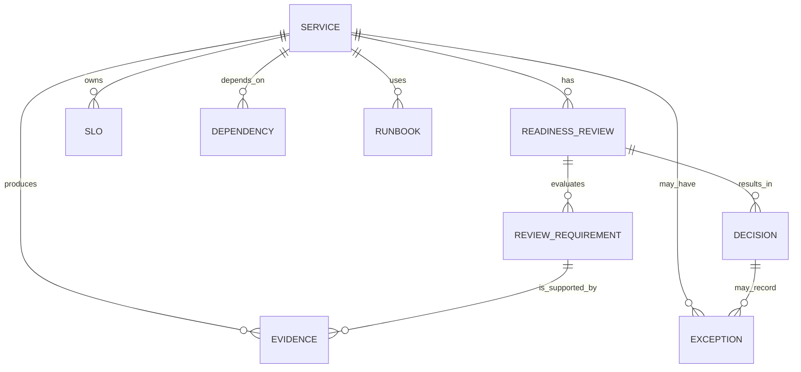

## Recommended hybrid framework

The most robust implementation is a **hybrid production-readiness system** with five layers:

First, define a **service context profile**. This captures business criticality, regulatory context, data sensitivity, dependency tier, expected traffic, recovery objectives, and cost expectations. CSF profiles, Azure's business-driven reliability framing, and GCP's governance focus areas all support this approach.

Second, define **mandatory release and production gates**. For any service above a defined criticality threshold, the gate should block promotion unless there is a named owner and on-call rotation, SLOs and SLIs, actionable alerting, rollback or forward-fix path, security baseline, backup and restore evidence for stateful components, dependency review, capacity evidence, and incident/runbook coverage. These requirements are directly supported across Google SRE, Azure, GCP, AWS, SSDF, ISO 27001, and ISO 22301.

Third, add a **maturity score** that does not block release but does guide backlog priority. This is where to place game days, deeper chaos experiments, cost optimisation, toil reduction, documentation completeness, and resilience exercises. DORA metrics and continual-improvement structures from ISO 9001 and ITIL 4 fit here well.

Fourth, split evidence into **machine-verifiable** and **human-attested** classes. Machine-verifiable evidence should be the default wherever possible: pipeline checks, IaC policy checks, vuln scans, SBOM presence, SLO status, alert coverage, backup-restore job results, load-test outcomes, dependency metadata, and drift checks. Human evidence remains necessary for architecture trade-offs, data classification, business-risk acceptance, and qualitative runbook adequacy. OSCAL, OpenSLO, Backstage, and OPA are the most useful machine-readable building blocks for this.

Fifth, make exceptions first-class. Each waiver should have an approver, business rationale, compensating controls, expiry date, linked backlog items, and an automatic re-review trigger. RMF is the strongest formal precedent for this style of governance, and it pairs well with a lightweight PRR decision record.

A practical domain model for the gate is:

| Domain | Hard gate | Typical machine evidence | Typical human evidence |
|---|---|---|---|
| Ownership and support | Yes | Service catalogue ownership, on-call schedule, escalation paths | Accountable owner confirmation |
| SLO/SLI and observability | Yes | OpenSLO spec, telemetry coverage, alert routing, dashboard links | SLO rationale and critical user flows |
| Change safety | Yes | Canary/staged rollout config, rollback path, immutable artefact chain | Release plan and approval |
| Capacity and performance | Yes for critical tiers | Load/stress test artefacts, headroom checks, quota checks | Traffic and growth assumptions |
| Security baseline | Yes | Branch protections, scans, SBOM, policy checks, secrets, dependency status | Threat model, data classification, exception rationale |
| Backup and recovery | Yes for stateful services | Backup schedules, restore drill results, RTO/RPO status | Recovery procedure review |
| Dependency resilience | Yes | Dependency inventory, retries/timeouts/rate limits, graceful degradation tests | External dependency risk assessment |
| Documentation and training | Usually scored | Docs presence, runbook links, ADR links | Operational usability review |
| Cost and efficiency | Usually scored | Unit economics, idle resource ratio, budget alarms | Business-value rationale |
| Compliance | Context-dependent hard gate | Control mappings, audit artefacts, policy checks | Compliance owner attestation |

This hybrid model fits your conceptual framing directly: the system makes readiness a claim-evidence-decision workflow, makes production context explicit, and treats learning and revision as part of the lifecycle rather than an afterthought.

## Roadmap, roles, metrics, and dashboards

### Implementation roadmap

A practical rollout works best in four phases.

| Phase | Objective | What to implement | Primary roles | Tooling integration |
|---|---|---|---|---|
| Foundation | Establish shared vocabulary and inventory | Service tiers, criticality matrix, standard domains, ownership model, readiness decision record | Platform lead, SRE lead, security lead, architecture lead | Backstage catalogue; source-control template; issue tracker |
| Gate minimum viable product | Introduce a real go/no-go gate for high-tier services | Hard gates for ownership, SLOs, observability, rollback, security baseline, backup/restore, capacity | Service owner, tech lead, SRE reviewer, security reviewer, release manager | CI/CD, observability, vuln scanners, on-call system |
| Automation expansion | Replace manual checks with durable evidence pipelines | Readiness manifest, policy-as-code, OpenSLO references, evidence collectors, waiver registry | Platform engineering, DevEx, security engineering, SRE | OPA, OpenSLO, OSCAL-backed control mappings, data warehouse |
| Continuous assurance | Move from point-in-time reviews to continuous readiness | Scheduled re-evaluation, drift checks, quarterly drills, DORA and SLO dashboards, postmortem feedback loop | SRE, incident management, compliance/risk, engineering managers | Observability platform, BI/dashboarding, GRC or control repository |

This roadmap matches the lifecycle direction in Google SRE's early-engagement model, Azure's DevOps-centred operational excellence, GCP's go-live and day-2 operational-readiness framing, and NIST's preference for continuous monitoring rather than one-off review.

### Required roles

The minimum viable role set is small. Each service needs a **service owner** accountable for risk acceptance and operational outcomes; a **technical lead** accountable for design and implementation; an **SRE or platform reviewer** accountable for operational readiness patterns; and a **security reviewer** accountable for secure-development and runtime security expectations. For regulated or high-tier services, add a **compliance or risk owner** and a **release/change manager**. Google's PRR model uses SRE reviewers plus development collaboration and training; RMF explicitly identifies risk-management roles; and GCP treats workforce, role clarity, and governance as part of operational readiness itself.

### Metrics that show whether the readiness process works

A readiness framework is credible only if it improves production outcomes. DORA's metrics are the external benchmark for this, especially change lead time, deployment frequency, failed deployment recovery time, change fail rate, and deployment rework rate. They should be measured per service or application, not blended across dissimilar systems.

Alongside DORA, track process-specific metrics in four groups.

| Dashboard family | Metrics | Why it matters |
|---|---|---|
| Readiness flow | Review lead time, review throughput, blocker age, waiver age, approval rate by service tier | Shows whether the process is usable and whether exceptions are accumulating |
| Evidence quality | % controls machine-verified, stale evidence count, failed evidence collection jobs, manual attestation count by domain | Shows whether the system is moving away from brittle manual review |
| Operational outcomes | SLO attainment, alert actionability rate, backup restore drill success rate, capacity headroom breaches, post-release incident rate within 7/30 days | Shows whether approved systems are actually safer to operate |
| Learning and improvement | Postmortem action closure rate, repeated incident rate, game-day coverage, drift re-open rate, DORA trend vs baseline | Shows whether the framework is reducing repeat failure and increasing operational capability |

The cloud frameworks strongly support SLOs, observability, load testing, capacity planning, recovery testing, and continuous optimisation as core operational measures. Azure explicitly recommends failure simulation, shared visibility, and learning from production incidents; Google Cloud explicitly recommends SLOs, observability, performance testing, capacity planning, and continuous optimisation; AWS emphasises automatic recovery, recovery testing, capacity management, and change management through automation.

A good executive dashboard usually needs three views rather than one. The first is a **portfolio view** showing services by readiness status, criticality, waiver load, and stale evidence. The second is a **service-operability view** showing SLOs, alert quality, dependency health, recovery posture, and recent changes. The third is a **process-effectiveness view** showing DORA trends, incident escape rates, approval lead time, and blocker recurrence. That structure keeps governance, operations, and improvement visible without collapsing everything into a single score.

### Concrete checklist for a phased adoption

A concise phased checklist for the hybrid model is:

- Define service tiers, production contexts, and minimum hard gates per tier.
- Register every production service in a central catalogue with accountable owner and on-call target.
- Require SLO/SLI definitions and actionable alert routes for tiered services.
- Require backup and restore evidence for all stateful systems.
- Require explicit dependency classification and graceful-degradation strategy where feasible.
- Require secure-development baseline evidence aligned to SSDF and a runtime/security baseline aligned to your chosen control set.
- Implement time-bound waivers with compensating controls and expiry.
- Add recurring drills, postmortem feedback, and DORA measurement to verify that the process improves outcomes over time.

The practical centre of gravity, after comparing the frameworks, is clear: use **Google-style PRR semantics** for the decision, **NIST/ISO** for control and governance depth, **cloud-provider well-architected guidance** for engineering checklists, and **DORA** for proving that the entire system produces better production results over time. That combination best matches both the external sources and the model expressed in your uploaded notes.

## References

1. Google SRE, "Production Readiness Review: Engagement Insight." https://sre.google/sre-book/evolving-sre-engagement-model/
2. Google SRE, "Google checklist: SRE pre-launch checklist." https://sre.google/sre-book/launch-checklist/
3. Google SRE, "Reliable Product Launches at Scale." https://sre.google/sre-book/reliable-product-launches/
4. Google SRE, "Production Services Best Practices." https://sre.google/sre-book/service-best-practices/
5. NIST, *Secure Software Development Framework (SSDF) Version 1.1*, SP 800-218. https://doi.org/10.6028/NIST.SP.800-218
6. NIST, *Risk Management Framework for Information Systems and Organizations*, SP 800-37 Rev. 2. https://doi.org/10.6028/NIST.SP.800-37r2
7. NIST, *Security and Privacy Controls for Information Systems and Organizations*, SP 800-53 Rev. 5. https://csrc.nist.gov/pubs/sp/800/53/r5/upd1/final
8. NIST, *Cybersecurity Framework 2.0*. https://doi.org/10.6028/NIST.CSWP.29
9. NIST, "Open Security Controls Assessment Language (OSCAL)." https://pages.nist.gov/OSCAL/
10. ISO, *ISO/IEC 27001:2022 -- Information security management systems*. https://www.iso.org/standard/82875.html
11. ISO, *ISO 22301:2019 -- Business continuity management systems*. https://www.iso.org/standard/75106.html
12. ISO, *ISO 9001:2015 -- Quality management systems -- Requirements*. https://www.iso.org/standard/62085.html
13. AWS, "Operational Excellence Pillar -- AWS Well-Architected Framework." https://docs.aws.amazon.com/wellarchitected/latest/operational-excellence-pillar/welcome.html
14. AWS, "Reliability Pillar -- AWS Well-Architected Framework." https://docs.aws.amazon.com/wellarchitected/latest/reliability-pillar/welcome.html
15. AWS, "Reliability design principles." https://docs.aws.amazon.com/wellarchitected/latest/reliability-pillar/design-principles.html
16. Microsoft, "Azure Well-Architected Framework -- Operational Excellence." https://learn.microsoft.com/en-us/azure/well-architected/operational-excellence/
17. Microsoft, "Operational Excellence design principles." https://learn.microsoft.com/en-us/azure/well-architected/operational-excellence/principles
18. Microsoft, "Azure Well-Architected Framework -- Reliability." https://learn.microsoft.com/en-us/azure/well-architected/reliability/
19. Microsoft, "Reliability design principles." https://learn.microsoft.com/en-us/azure/well-architected/reliability/principles
20. Google Cloud, "Ensure operational readiness and performance using CloudOps." https://cloud.google.com/architecture/framework/operational-excellence/operational-readiness-and-performance-using-cloudops
21. DORA, "Software delivery performance metrics." https://dora.dev/guides/dora-metrics/
22. Center for Internet Security, "CIS Controls." https://www.cisecurity.org/controls/cis-controls-list
23. Principles of Chaos Engineering. https://principlesofchaos.org/
24. ACM Queue, "Resilience Engineering: Learning to Embrace Failure." https://queue.acm.org/detail.cfm?id=2371297
25. ACM Queue, "Abstracting the Geniuses Away from Failure Testing." https://queue.acm.org/detail.cfm?id=3155114
26. OpenSLO specification. https://github.com/OpenSLO/OpenSLO
27. Backstage, "What is Backstage?" https://backstage.io/docs/overview/what-is-backstage
28. Open Policy Agent. https://www.openpolicyagent.org/
