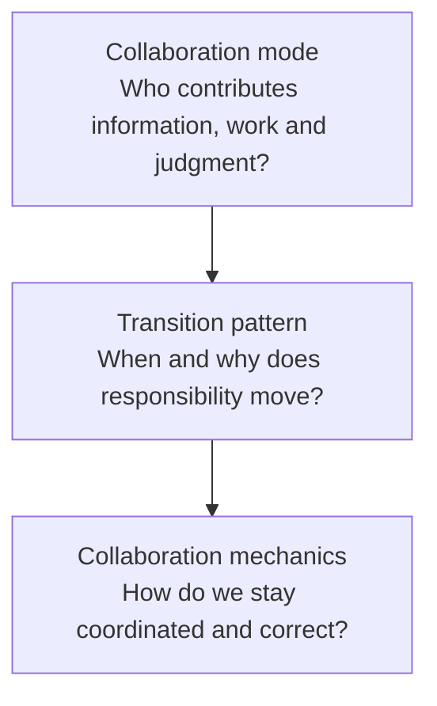
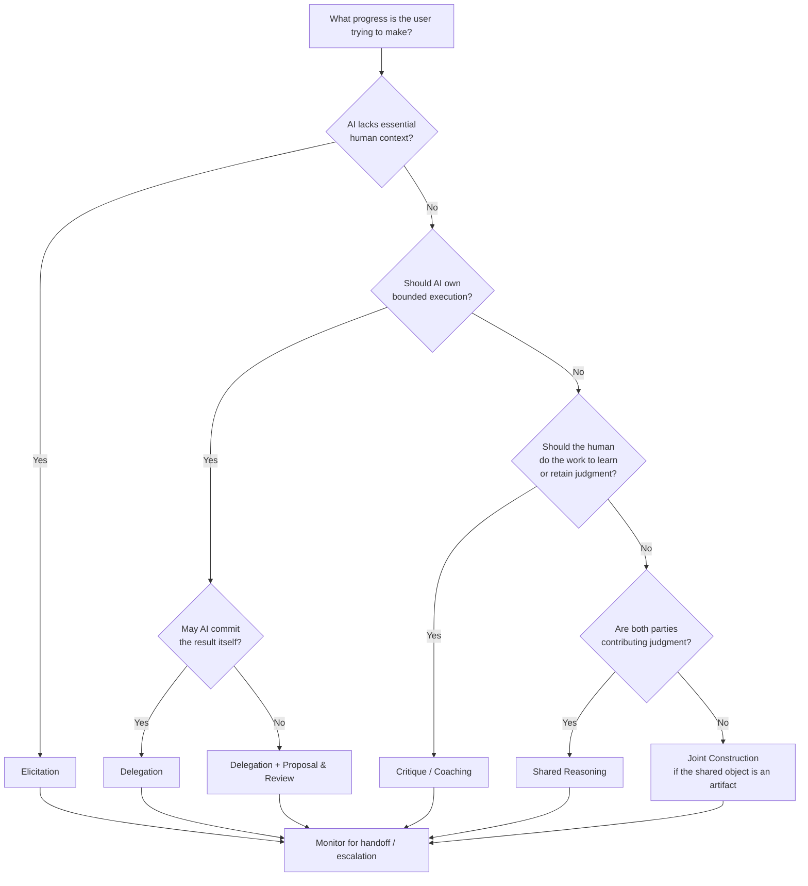
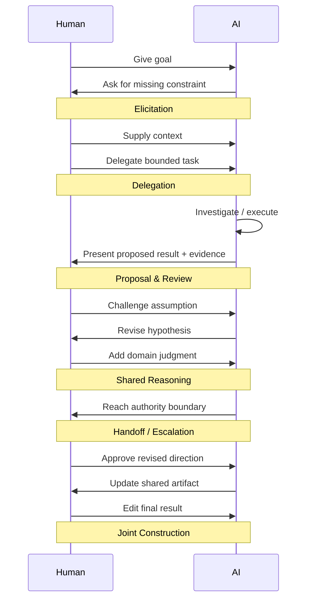

# Human-AI Collaboration Patterns: A Practitioner and Research Synthesis

## Executive summary


There is **no single, settled practitioner taxonomy of human-AI collaboration patterns**. The field is converging, but different traditions describe different layers of the problem. Google PAIR and Microsoft HAX mostly formulate **interaction mechanics**--feedback, correction, explanations, supervision, control, graceful failure, and automation levels. Modern agent products from OpenAI, Anthropic, and GitHub increasingly embody **work-allocation patterns** such as delegation, plan/review, monitoring/intervention, and explicit handoff. HCI papers, meanwhile, use terms such as *AI-first assistance*, *AI-follow assistance*, *dialogic engagement*, *mixed initiative*, *co-creation*, and *delegation*. Teamwork and joint-activity research supplies the deeper requirements: common ground, mutual predictability, mutual directability, performance monitoring, backup behavior, and adaptability. [^1][^2][^3][^4][^5]

Your first-principles taxonomy is therefore **substantially right**, but I would refactor it slightly. The research suggests **six primary collaboration modes**, plus **handoff/escalation as a transition pattern rather than a peer mode**:

> **Elicit → Delegate → Propose & review → Critique/coach → Reason together → Construct together**
> with **handoff/escalation** moving responsibility between those modes.

This distinction matters. *Delegation*, for example, specifies who performs the work. *Proposal & review* specifies who generates versus who commits. *Shared reasoning* specifies how judgment is distributed. *Handoff* specifies how that allocation changes over time. Those are different dimensions of collaboration rather than interchangeable UI patterns. This interpretation is consistent with systematic HCI taxonomies, mixed-initiative research, and human-automation research. [^3][^6][^5]

A second important conclusion is that **the pattern is not enough**. Any collaboration mode needs a common substrate:

**alignment → grounding → coordination → observability/directability → review/commitment → repair/adaptation**

Clark and Brennan's grounding research explains why collaborators continually establish sufficient shared understanding; Klein and colleagues add mutual predictability and directability; Salas and colleagues emphasize monitoring, backup behavior, adaptability, shared mental models, trust, and closed-loop communication. Modern AI guidelines translate these requirements into concrete UX mechanisms such as showing what the system is doing, enabling correction, explaining consequential outputs, preserving control, and providing takeover paths. [^7][^5][^4][^8]

The practical design question is therefore not:

> "Should this be a copilot, agent, or chatbot?"

It is:

> **Who has the information? Who should do the work? Who should exercise judgment? Who has authority to commit? Who needs to learn from doing the task? And when should responsibility move?**

Those answers determine the collaboration pattern.

The strongest finding for your earlier **proposal interface** is also clear: **"transparency" is too vague**. In collaborative work, the relevant design contract is more concrete:

`AI contribution → make it observable → make evidence available → allow challenge/edit → explicit commitment → retain reversibility`

That combines **inspectability, verifiability, directability, and commitment control**. Google calls related mechanics "supervise automation" and "review and approve"; Microsoft calls for efficient correction, explanations, consequence visibility, and controls; current coding agents expose plans, diffs, comments, approvals, and review gates. [^1][^2][^9][^10]

Finally, the best way to validate a collaborative AI is **not AI accuracy alone**. Test whether the *human-AI system* can establish common ground, detect and repair misunderstandings, appropriately allocate work, catch seeded AI errors, maintain calibrated reliance, transfer control without losing situational awareness, and outperform sensible human-only and AI-only baselines where complementarity is the goal. Research on AI-assisted decisions repeatedly finds that adding advice, confidence, or explanations does not automatically produce better joint performance; interaction order and cognitive biases matter. [^3][^11]

## A first-principles model and the vocabulary practitioners actually use


The cleanest synthesis is to separate **collaboration modes**, **transition patterns**, and **collaboration mechanics**. Existing literature often mixes these levels, which is one reason the vocabulary appears fragmented. Gomez and colleagues explicitly note the lack of common terminology; their systematic review of 105 empirical AI-assisted decision-making papers identified seven interaction sequences rather than one canonical collaboration model. [^3]

### Comparison of the first-principles taxonomy with practitioner terminology


| First-principles pattern | Fundamental condition | Terms found in research/practice | Relationship to your term | Representative sources |
|---|---|---|---|---|
| **Elicitation** | AI lacks information/context the human possesses | *AI-guided dialogic user engagement*, clarification, disambiguation, grounding, request for information | Strong match | Gomez et al.; Clark & Brennan; Microsoft HAX; Anthropic Claude Code [^3][^7][^2][^12] |
| **Delegation** | Human specifies a goal; AI can perform bounded work | delegation, automation, AI-led work, agent, background task | Direct match and established term | Gomez et al.; Lubars & Tan; OpenAI Deep Research; GitHub coding agent [^3][^13][^14][^15] |
| **Proposal & review** | AI can generate a candidate, but human judgment/authority should govern commitment | review and approve, supervision, plan/review, diff review, AI-first or AI-follow assistance | Strong design pattern; less consistently named academically | Google PAIR; Microsoft HAX; OpenAI Codex; Anthropic Claude Code [^1][^2][^9][^10] |
| **Critique / coaching** | Human performs or owns the work; AI evaluates it | AI-follow assistance, secondary assistance, reviewer, feedback, tutor/coach | Useful higher-level synthesis; literature often separates feedback, review, and tutoring | Gomez et al.; OpenAI Study Mode; GitHub Copilot review; Anthropic Code Review [^3][^16][^17][^18] |
| **Shared reasoning** | Information and/or judgment is distributed across both participants | mixed-initiative interaction, interactive adjustment, dialogic interaction, joint problem solving | Strong conceptual pattern, but no universally accepted label | Horvitz; Gomez et al.; Klein et al. [^6][^3][^5] |
| **Joint construction** | Both parties directly contribute to an evolving shared artifact | co-creation, co-creativity, mixed-initiative co-creation, collaborative editing | Direct match with co-creative HCI literature | COFI; OpenAI Canvas; Codex [^19][^20][^9] |
| **Handoff / escalation** | The correct owner of the next step changes during the task | transfer/take back control, escalation, intervention, clarification stop, human review gate | Better treated as a **transition between modes** | Google PAIR; Klein et al.; Anthropic autonomy study; GitHub coding agent [^1][^5][^12][^21] |

The academic taxonomy from Gomez et al. is particularly useful as an external check. It found **AI-first assistance, AI-follow assistance, secondary assistance, request-driven assistance, AI-guided dialogic engagement, user-guided interactive adjustments, and delegation**. In the 131 interaction sequences coded from 105 papers, simple AI-first and AI-follow interactions dominated, while richer interactive patterns were substantially less common. Their conclusion is close to the design problem here: systems described as "collaborative" often amount to one participant producing an answer and the other receiving it. [^3]

That taxonomy is narrower than ours because it specifically examines **decision-support interactions**. It does not need a full-fledged "joint construction" category because co-writing or co-designing artifacts is outside much of its scope. Conversely, the co-creativity literature explicitly treats human and AI as contributors to a shared creative product and studies initiative, contribution, and communication between them. [^19][^22]

The human-automation tradition gives another useful test. Klein, Woods, Bradshaw, Hoffman, and Feltovich argue that meaningful joint activity requires a basic commitment to coordinate, plus **mutual predictability, mutual directability, and maintenance of common ground**. These are not collaboration *patterns*; they are requirements that any pattern must satisfy to behave like real joint work. [^5][^23]

Clark and Brennan supply an even deeper communication layer. Collaborative communication requires participants to establish enough common ground for the current purpose; contributions effectively involve presenting something and obtaining evidence that it was understood sufficiently. Common ground is continually updated rather than established once at the start. [^7]

This leads to a useful three-layer model:




**Mode:** elicitation, delegation, proposal/review, critique/coaching, shared reasoning, joint construction.

**Transition:** handoff, escalation, takeover, delegation back, request for clarification.

**Mechanics:** common ground, role clarity, observability, directability, inspectability, evidence, verification, feedback, commitment controls, reversibility, memory, repair.

This hierarchy is more stable than treating every useful AI UX behavior as an equally sized "pattern."

## The collaboration pattern catalog


One product can move through several patterns in a single workflow. A coding agent, for example, may start with **elicitation**, move into **delegation**, present its plan using **proposal/review**, perform implementation, receive **critique**, and finally **handoff** a pull request to a human reviewer. Current agent products increasingly operate this way. [^10][^15]

**Elicitation -- get the missing information from the collaborator who has it.**

**Definition.** Elicitation applies when one participant cannot make progress reliably because another participant possesses relevant goals, constraints, observations, preferences, or domain knowledge. The collaboration therefore advances by actively reducing an information asymmetry:

`AI asks → human contributes context → AI updates → possibly asks again`

This is more than "asking clarifying questions." In Clark and Brennan's terms, it is part of **grounding**: determining whether the parties' shared understanding is sufficient for the present task and repairing it when necessary. [^7]

**Practitioner terminology.** Gomez et al. call a close variant **AI-guided dialogic user engagement**: the AI asks iteratively for information needed to reach a decision. Microsoft HAX's related guideline is to "scope services when in doubt" and disambiguate user intent rather than confidently act on an uncertain interpretation. Modern agent literature frequently uses *clarification*, *ask the user*, or *pause for clarification*. [^3][^2][^12]

**Product examples.** ChatGPT Study Mode starts by using guiding questions calibrated to the learner's goals and skill level rather than simply giving a finished answer. [^16] Anthropic's 2026 analysis of deployed Claude Code sessions found that on complex tasks Claude itself paused to seek clarification more frequently than users interrupted it, illustrating agent-initiated elicitation as an active oversight mechanism. [^12] Microsoft's early LookOut mixed-initiative system was designed to infer user intentions and decide when dialog or intervention was warranted rather than operating as a purely command-driven tool. [^6]

**Key mechanics.** Elicitation depends on common ground, explicit assumptions, visibility into what information is missing, economical questioning, memory of answers already supplied, and acknowledgment that the new information changed the system's understanding. Microsoft HAX recommends remembering recent interactions, while Google's PAIR guidance advises showing users how feedback affects subsequent system behavior. [^2][^1]

**Common failure modes.** The AI can over-question users, ask for facts it already has, force the user to translate their situation into the AI's ontology, collect unnecessary sensitive context, or use questions merely to confirm an early hypothesis. A superficially conversational interface can therefore increase interaction cost without improving common ground. The grounding criterion should be *sufficient understanding for the current purpose*, not maximal information collection. [^7][^8]

**How to verify it.** Seed tasks with information that is essential but unavailable to the model. Test whether the system notices the gap, asks for the *right* missing information, correctly incorporates the answer, and stops asking once sufficient common ground exists. Track clarification success, repeated-question rate, unnecessary-question rate, task recovery after misunderstanding, and whether users can correct the system's inferred assumptions. These tests operationalize HAX's correction/disambiguation guidance and the grounding model. [^2][^7]

**Delegation -- give a collaborator bounded responsibility for execution.**

**Definition.** Delegation applies when the human has an objective but does not need to personally perform some part of the work:

`human defines outcome/boundary → AI plans and executes → AI reports result`

Delegation therefore transfers **execution responsibility**, not necessarily final authority. The distinction is crucial: "the AI did the task" does not imply "the AI had authority to commit every consequential action." Human-AI delegation research explicitly distinguishes levels such as full automation, AI-leading with human assistance, human-leading with AI assistance, and no AI. [^13]

**Practitioner terminology.** *Delegation* is already an academic term and appears directly in the Gomez taxonomy. Product teams more often say *agent*, *background task*, *assign an issue*, *run autonomously*, or *deep research*. [^3][^14]

**Product examples.** OpenAI Deep Research is explicitly designed to independently search, reason across, and synthesize many sources after receiving a research task from the user. [^14] GitHub's Copilot coding agent can be assigned an issue, inspect the repository, develop a plan, make changes, test them, open a pull request, and subsequently respond to review feedback. [^15] Claude Code also supports more autonomous modes; Anthropic's Routines run as autonomous cloud sessions within resources and connectors explicitly scoped by the user or organization. [^24]

**Key mechanics.** Delegation requires explicit scope, success criteria, tool and data boundaries, progress observability, interruptibility, outcome verification, and clear authority limits. For consequential actions, permissions should ideally be based on capability and consequence rather than indiscriminate approval prompts. Anthropic's sandboxing work illustrates the principle of defining a boundary inside which the agent can work more freely, rather than asking for every action individually. [^25]

**Common failure modes.** Under-specified goals cause an agent to optimize the wrong thing; hidden intermediate actions can create side effects; long-running work can drift from intent; too many confirmations lead to approval fatigue; too few leave users unable to intervene. Anthropic reports that Claude Code users approved about 93% of permission prompts before the company introduced a more automated permission architecture--an illustration of why "human approval on every action" can degenerate into ritual rather than meaningful oversight. [^26] Anthropic has also documented a long-horizon agent failure mode in which implementation appeared complete even though end-to-end testing was insufficient. [^27]

**How to verify it.** Evaluate *end-to-end outcome completion*, not merely plausible intermediate output. Include hidden side-effect tests, permission-boundary tests, interruption tests, partial-failure recovery, and independent verification of completion. Compare not only AI-only success but also human time saved, review burden, intervention frequency, and undetected failure rate. Delegation studies suggest that information about both task conditions and AI capability is important for people to allocate work effectively. [^28][^13]

**Proposal & review -- let AI do substantial cognitive or production work without silently committing the result.**

**Definition.** Here the AI has enough capability to construct a candidate, but the human retains meaningful evaluative judgment or authority:

`current state → AI proposal → inspect/evaluate → accept/edit/reject → committed state`

This is the pattern closest to the **proposal interface** we discussed earlier. Its essence is not generic transparency. It is a **commitment protocol for collaborative work**.

**Practitioner terminology.** Google PAIR uses the language **"let users supervise automation"** and specifically recommends enabling users to review and approve options. Microsoft HAX calls for efficient correction, explanations of why the AI acted, visibility into consequences, and controls. Coding-agent teams use concrete terms such as *plan mode*, *diff*, *review changes*, and *pull request*. [^1][^2][^10]

**Product examples.** The Codex app exposes an agent's changes in a thread, lets users inspect and comment on the diff, and lets them open the work in an editor for manual changes. [^9] Claude Code's recommended workflow separates exploration and planning from implementation; users can open and directly edit a proposed plan before allowing implementation. [^10] GitHub's coding-agent workflow places generated changes in pull requests and requires independent human review rather than allowing the agent to approve and merge its own work. [^21] Google PAIR's supervision pattern similarly recommends review/approval and warns against automation that provides neither choice nor undo. [^1]

**Key mechanics.** The minimum viable set is:

`inspectability + editability + explicit acceptance`

For higher-consequence work, add:

`evidence/provenance + justification + verification + reversibility + authority boundary`

This distinction is important. **Inspectability** answers "what would change?" **Justification** answers "why is this proposed?" **Verifiability** answers "what evidence lets me determine whether it is correct?" **Controllability** answers "what can I do about it?" They should not be collapsed into one vague property called explainability. Google similarly distinguishes explanation, trust calibration, data-source visibility, control, and supervision. [^29][^1]

**Common failure modes.** Proposal interfaces can create *rubber-stamping*: a human sees an impressive-looking candidate and clicks approve without independently judging it. AI-first decision support is particularly susceptible to anchoring and overreliance; AI-follow designs can reduce initial anchoring but introduce confirmation effects and additional cognitive effort. [^3] A huge diff can technically be "inspectable" while functionally impossible to review. Approval is therefore not proof that meaningful human oversight occurred.

**How to verify it.** Deliberately inject plausible errors into proposals and measure whether users detect them. Test different proposal sizes and representations. Measure review time, detection rate, false acceptance, edit frequency, evidence opening, and ability to explain what will change before committing. The relevant success criterion is not "we provided an approval button," but **whether the interface enables appropriately calibrated acceptance and rejection**. Microsoft's appropriate-reliance research explicitly frames the design problem as avoiding both overreliance and underreliance. [^11]

**Critique / coaching -- keep performance with the human, give evaluation to AI.**

**Definition.** In this mode, the human remains the primary actor or author while AI plays an evaluative role:

`human attempts → AI observes/evaluates → feedback → human revises`

A **critic** optimizes the work product; a **coach** additionally optimizes the person's future ability. That distinction is worth preserving. A system that rewrites a student's answer may improve the artifact while undermining the learning goal; a coach intentionally keeps meaningful work with the learner.

**Practitioner terminology.** Decision-support research's **AI-follow assistance** is a close relative: the human makes an initial judgment before seeing AI advice and may then revise. *Secondary assistance* provides supplementary evidence rather than a direct answer. Product terminology includes *code review*, *inline feedback*, *study mode*, *reviewer*, and *coach*. [^3]

**Product examples.** ChatGPT Study Mode is explicitly designed to use guiding questions and feedback to help students build understanding rather than simply finish the task for them. [^16] GitHub Copilot code review identifies issues and suggests fixes but its review does not itself constitute a required human approval or block a merge, preserving a distinct reviewer role. [^17] Anthropic's Code Review similarly posts inline findings tagged by severity but does not approve or block the pull request, leaving the existing human review workflow intact. [^18] ChatGPT Canvas supports inline feedback while leaving users able to directly edit and restore their own writing or code. [^20]

**Key mechanics.** Critique requires clear evaluation criteria, localization of the issue, rationale or evidence, actionable feedback, user ownership of revision, and a way to challenge the critique. Coaching additionally requires calibration to the user's skill and goal, progressive assistance, and feedback that promotes learning rather than merely fixing the immediate artifact. [^16][^29]

**Common failure modes.** AI critique can be confidently wrong, generic, overwhelming, or biased toward stylistic conformity. It can also become disguised delegation: the "coach" eventually does the entire task. Conversely, excessive friction designed to force learning can frustrate users whose real objective is simply task completion. The intended outcome--better artifact versus stronger human capability--therefore has to be explicit.

**How to verify it.** Seed known defects and measure critique precision/recall; track whether the user can identify and correct issues after feedback; for genuine coaching, measure transfer to a later unassisted task rather than only improvement of the AI-assisted artifact. Compare against direct-answer conditions. Study-design research around cognitive forcing likewise shows that interventions intended to make users think can reduce overreliance while also carrying usability costs, so both quality and user burden need measurement. [^30]

**Shared reasoning -- distribute interpretation and judgment across both collaborators.**

**Definition.** Shared reasoning is appropriate when neither participant should simply produce an answer for the other because relevant information, hypotheses, or judgment are distributed:

`AI hypothesis → human evidence/judgment → AI revises → human challenges → ... → joint conclusion`

The object being built is primarily an **understanding, diagnosis, plan, or decision**, not an artifact.

**Practitioner terminology.** The closest established HCI term is **mixed-initiative interaction**. Horvitz described mixed-initiative interfaces as coupling automated services with direct manipulation and studying when the system should intervene, query, or act. Gomez et al.'s *user-guided interactive adjustments*, *request-driven assistance*, and *dialogic engagement* each capture pieces of the same space. [^6][^3]

**Product and research examples.** Microsoft's LookOut is an early mixed-initiative case: it inferred likely intent, determined when dialog was useful, and selected when to intervene or act rather than following a fixed turn structure. [^6] Study Mode creates a more contemporary reasoning loop in which AI questions and scaffolding respond to the learner's evolving understanding. [^16] OpenAI's 2026 descriptions of advanced research use report researchers using ChatGPT iteratively to critique manuscripts, stress-test arguments, propose analyses, and work across code and notes rather than simply requesting a one-shot answer; that is a product-team example of a system being framed as a research partner. [^31]

**Key mechanics.** Shared reasoning has the strongest need for **common ground, explicit assumptions, turn-level responsiveness, disagreement support, hypothesis revision, provenance, and state continuity**. Both parties need to be able to introduce information and redirect the reasoning. Klein's concept of mutual directability is especially relevant: if the human can speak but cannot meaningfully alter the agent's trajectory, the interaction is conversational without being truly collaborative. [^5]

Modern human-agent communication research reinforces this. Bansal and colleagues organize agent communication problems around what the agent must tell the user, what the user must tell the agent, and cross-cutting challenges such as helping people verify behavior, maintaining consistent behavior, choosing the right level of detail, and deciding which prior interactions matter. [^32]

**Common failure modes.** AI can anchor the conversation with its first hypothesis, cause premature convergence, simulate agreement instead of exposing uncertainty, forget earlier constraints, or overwhelm the human with persuasive language. The human can also overcorrect a valid AI hypothesis. Fluency and turn-taking alone therefore do not demonstrate shared reasoning.

**How to verify it.** Use problems in which the human and AI each possess **complementary information** and neither can solve the problem alone. Compare joint performance with human-only, AI-only, AI-first, and AI-follow baselines. Introduce contradictory evidence midstream and test whether the pair revises. Measure uncorrected misunderstandings, hypothesis diversity, grounding repairs, evidence use, and whether user interventions actually change subsequent reasoning. That is a stronger test of collaboration than conversational satisfaction alone. [^3][^23]

**Joint construction -- contribute together to a persistent shared artifact.**

**Definition.** Joint construction differs from shared reasoning primarily in the object of collaboration:

`shared artifact state → human contribution ↔ AI contribution → persistent revised state`

Both participants can directly shape a document, design, model, codebase, image, plan, or other artifact.

**Practitioner terminology.** HCI literature typically calls this **co-creation**, **human-AI co-creativity**, or **mixed-initiative co-creation**. The COFI framework explicitly studies human and AI collaborating as partners around a shared creative product and treats interaction dynamics as a first-class design concern. [^19]

**Product examples.** ChatGPT Canvas creates a shared writing/coding workspace in which the user can edit directly, select specific material for AI attention, request transformations, receive feedback, and restore earlier versions. [^20] Codex supports a related software-development form: the agent alters code, the user inspects and comments on diffs, and either participant can continue editing. [^9] GitHub's coding-agent workflow similarly lets an agent create changes and a human reviewer request revisions, with the agent iterating before merge. [^15]

**Key mechanics.** Joint construction requires a shared state, clear contribution boundaries, local rather than hidden global edits, version history, provenance of changes, selective acceptance, collision handling, direct manipulation by the human, and state recovery. Canvas's version restoration and direct editing are simple but important examples of this principle. [^20]

**Common failure modes.** AI may silently overwrite intentional human choices, make broad changes when only a local intervention was requested, homogenize voice, or create ambiguity about who authored or approved a consequential statement. Context can also drift as the artifact grows. "We both typed into the same document" is not sufficient; each participant needs to understand how the other's contribution changed the shared object.

**How to verify it.** Test intent preservation: ask AI to change one dimension while preserving others and measure collateral changes. Test undo, version comparison, selective acceptance, conflicting edits, and long-session state consistency. Observe whether users can accurately identify the current shared state and whether they can recover from an unwanted AI contribution. Artifact quality should be measured alongside user agency and revision cost.

**Handoff / escalation -- change who owns the next step.**

I would **not** put this at exactly the same conceptual level as the six patterns above. A handoff is a **transition in responsibility**:

`mode A → boundary encountered → communicate state → transfer responsibility → mode B`

An AI can hand off from delegation into proposal/review, from shared reasoning into a human decision, or from autonomous execution into human recovery.

**Practitioner terminology.** Google PAIR explicitly recommends **giving control back when automation fails** and designing a path for the user to continue manually. [^1][^33] Anthropic describes a deployed evolution from step-by-step approval toward **monitoring and intervening**: experienced Claude Code users auto-approve more actions but also interrupt the agent more frequently. Anthropic argues that effective oversight therefore requires more than placing a human in every approval chain. [^12]

**Product examples.** Claude Code pauses for clarification when it believes human input is needed, effectively initiating its own handoff of judgment. [^12] GitHub coding agents perform implementation but return work through a pull request that requires independent human review before merging. [^21] Google's PAIR guidance recommends manual takeover after automation failure. [^1] Modern agent security designs similarly preserve human approval for classes of consequential operations rather than treating every tool call as equally delegable. [^34]

**Key mechanics.** Good handoff needs a trigger, clear reason, state summary, unresolved questions, transfer of relevant context, clear authority after transfer, immediate directability, and a route to return responsibility later. The recipient should not have to reconstruct what the other collaborator has been doing.

**Common failure modes.** The classic danger is the **out-of-the-loop handoff**: the human is asked to take over precisely when the situation is difficult, after being uninvolved long enough to have poor situational awareness. The opposite failure is excessive escalation, where autonomy provides little benefit. Approval fatigue is a third failure: frequent handoffs become automatic clicks rather than genuine judgment. Anthropic's deployed permission research provides a contemporary example of this tradeoff. [^26][^12]

**How to verify it.** Simulate uncertainty, unavailable tools, conflicting instructions, high-consequence actions, and partial failures. Measure correct escalation rate, unnecessary escalation, late escalation, takeover time, situation awareness immediately after transfer, and whether humans know what has already happened. Then test the reverse transition: can users return responsibility to the AI without losing context?

## The collaboration mechanics that should sit underneath every pattern


The pattern taxonomy answers **how work is distributed**. It does not by itself tell you whether collaboration is good.

A useful synthesis of Clark and Brennan, Klein et al., Salas et al., CSCW, Google PAIR, Microsoft HAX, and contemporary agent practice gives six underlying mechanics:

| Collaboration requirement | Design question | Typical AI-interface mechanisms | Why it matters |
|---|---|---|---|
| **Align** | Do we agree on the goal, role, constraints, and authority? | task brief, scope, role statement, permissions, success criteria | Coordination is impossible if collaborators optimize different outcomes. Klein's Basic Compact starts with commitment to coordinated activity and sufficient goal alignment. [^5][^23] |
| **Ground** | Do we understand the relevant state and each other's meaning sufficiently? | clarification, context display, assumption surfacing, memory, acknowledgment | Common ground is continually constructed and repaired rather than established once. [^7] |
| **Coordinate** | Who is doing what, in what order, with which dependencies? | plan, task decomposition, progress, ownership, handoff | Teamwork requires interdependent activities to be organized around collective goals. [^4] |
| **Observe & direct** | Can each participant see enough of the other's activity and change its course? | status, preview, diff, interruption, steering, pause, permission limits | Klein identifies mutual predictability and directability as basic requirements of joint activity; modern agent users increasingly supervise through monitoring and intervention. [^5][^12] |
| **Review & commit** | Can a consequential contribution be evaluated before it becomes authoritative? | evidence, source links, rationale, diff, accept/edit/reject, approval gate | PAIR recommends review/approval and human supervision; HAX emphasizes correction, explanations, consequence visibility, and controls. [^1][^2] |
| **Repair & adapt** | What happens when understanding, execution, or the environment diverges from the plan? | correction, undo, retry, replanning, clarification, takeover, escalation | Adaptability and backup behavior are core teamwork properties, while PAIR explicitly treats graceful paths forward from AI failure as a design requirement. [^4][^33] |

Several commonly discussed AI concepts belong **inside** these mechanics rather than beside them as independent collaboration principles.

**Inspectability** is a form of observability: I can see the AI's contribution or intended action.

**Justification** is communicative support for evaluation: I can understand why this proposal was made.

**Verifiability** is stronger: I have evidence or an independent method by which I can determine whether the contribution is correct. Google's PAIR guidance is explicit that explanations should help people calibrate trust rather than induce blanket trust and that data sources can matter because users need to know what the system did and did not see. [^29]

**Directability / controllability** means my intervention can change what the AI does next. Klein's terminology is especially useful here because "control" can otherwise suggest only buttons and permissions; *directability* includes the ability to redirect a collaborator's behavior during joint work. [^5]

**Reversibility** supports exploration and repair. Google recommends making AI interactions safe to explore and avoiding automation without an undo or alternative path; Canvas similarly preserves earlier versions of a shared artifact. [^1][^20]

**Uncertainty communication** supports review and handoff, but simply displaying numerical confidence is not a universal solution. Google warns that confidence displays can confuse or mislead if they do not lead to actionable interpretation and recommends testing whether they actually improve decision making. [^29]

**Memory and continuity** support common ground. Microsoft HAX calls for remembering recent interactions, while contemporary agent communication research asks which previous interactions should remain salient to both parties. [^2][^32]

This also clarifies the role of **transparency**. Transparency is best treated as an umbrella quality, not the design instruction itself. A designer can act on:

> "Show the proposed changes, show the evidence, let the user challenge them, and require explicit commitment."

It is much harder to act on:

> "Make the AI transparent."

The first formulation maps directly onto collaboration work.

## Choosing the right pattern


The most reliable pattern-selection heuristic is to begin with **responsibility allocation**, not the AI capability.

Ask five questions:

| Question | What it diagnoses | Pattern it tends to suggest |
|---|---|---|
| **Who has necessary information?** | Information asymmetry | If the human has it and AI needs it → **elicitation** |
| **Who should perform the work?** | Execution ownership | If AI can own a bounded task → **delegation** |
| **Who should make or authorize the judgment?** | Decision authority | If AI can generate but human should commit → **proposal & review** |
| **Who needs to develop capability by doing the work?** | Learning/skill objective | Human works, AI evaluates → **critique/coaching** |
| **Is the value distributed across both parties?** | Complementarity | Distributed judgment → **shared reasoning**; distributed artifact contribution → **joint construction** |

Then ask a sixth question continuously:

> **Has something changed such that responsibility should move?**

That invokes **handoff/escalation**.




There are four additional heuristics worth making explicit.

**Use the least autonomous pattern that delivers the intended value when consequences are difficult to reverse.** Google PAIR recommends balancing automation with risk and gradually increasing automation where appropriate; its guidance explicitly discourages removing user control in higher-stakes contexts. [^1]

**Do not require human judgment where there is no meaningful judgment to exercise.** A confirmation box on every low-risk action can create approval fatigue rather than oversight. Anthropic's permission studies and sandboxing work provide concrete evidence of this tension in deployed coding agents. [^26][^25]

**Do not delegate work that the human must perform in order to achieve the actual outcome.** If the outcome is "learn to diagnose this class of problem," doing the diagnosis for the user defeats the objective; coaching is the more appropriate pattern. Study Mode is an explicit contemporary example of designing for learning rather than mere completion. [^16]

**Choose the AI's initiative level deliberately.** Sometimes AI should wait to be invoked; sometimes it should suggest; sometimes it should proactively interrupt; sometimes it should work autonomously until it reaches a boundary. Mixed-initiative research has treated the timing and value of intervention as a first-class design problem for decades, and current agent products are rediscovering the same problem at greater scale. [^6][^12]

A concise design worksheet is therefore:

> **Goal:** What broader outcome are we jointly pursuing?
> **Information:** What does each side know?
> **Capability:** What can each side do well?
> **Judgment:** Where is human interpretation genuinely valuable?
> **Authority:** What may AI commit without approval?
> **Learning:** Does the human need to perform the work to develop capability?
> **Risk:** What happens if the AI is wrong?
> **Recovery:** Can the action be inspected, interrupted, reversed, or handed off?
> **Pattern:** Which allocation of work follows from those answers?

## Validating a collaboration design


A serious validation program should test **the human-AI unit**, not only model quality. This follows both from teamwork research, where performance emerges from coordination processes, and from human-AI decision studies showing that adding AI assistance does not guarantee complementary performance. [^4][^3][^11]

I would use a two-part checklist: **pattern-specific tests** plus **cross-cutting collaboration tests**.

### Pattern-specific validation


| Pattern | Most revealing test | What failure looks like |
|---|---|---|
| **Elicitation** | Hide a necessary fact and see whether AI asks for it | confidently proceeds without context, asks irrelevant/repeated questions |
| **Delegation** | Give a multi-step task with hidden failure modes and side-effect constraints | declares completion incorrectly, exceeds scope, cannot recover |
| **Proposal & review** | Seed plausible errors in AI proposals | users rubber-stamp them; errors are technically visible but practically undetectable |
| **Critique / coaching** | Seed known defects; then give an unassisted follow-up task | critique misses defects or user improves only while AI is present |
| **Shared reasoning** | Give complementary information to human and AI | one side dominates; pair fails to integrate evidence or revise hypotheses |
| **Joint construction** | Request a narrow change while protecting intentional artifact properties | AI silently rewrites unrelated material; user cannot recover intent |
| **Handoff / escalation** | Force ambiguity, tool failure, or authority boundary | escalation is late, context is lost, recipient does not know current state |

### Cross-cutting collaboration audit


A design is not ready merely because the happy path works. For each important workflow, verify the following sequence:

**Alignment.** Can the human state what the AI believes the goal is, what it is responsible for, and what it is *not* authorized to do? HAX emphasizes setting expectations around what AI can and cannot do; Klein's Basic Compact similarly treats roles, responsibilities, and coordination commitments as foundational. [^2][^5]

**Grounding.** Introduce ambiguous language and conflicting assumptions. Does the system identify the mismatch? Can both sides repair it? Clark and Brennan's work makes repair central because common ground predictably degrades during real interaction. [^7][^23]

**Observability.** During a long task, can the user tell what the agent is currently doing, what it has done, and what it intends to do next? Recent human-agent communication research identifies these as distinct communication challenges before, during, and after execution. [^32]

**Directability.** Interrupt the system midstream with a changed constraint. Does subsequent behavior actually change? Anthropic's deployed data--experienced users increasingly monitoring and interrupting autonomous runs--makes this an especially important modern agent requirement. [^12]

**Reviewability.** Introduce an AI error that is plausible rather than obvious. Can the human detect it with the evidence and representation the interface supplies? Google's explanation guidance stresses *calibrating* trust rather than maximizing trust, while Microsoft's work similarly frames appropriate reliance as the target. [^29][^11]

**Commitment control.** Test whether a proposed action and an executed action are clearly different states. For consequential work, verify that the correct actor has authority at the commitment boundary. Google recommends supervision and explicit review/approval where appropriate; current coding-agent workflows operationalize this with diffs and pull requests. [^1][^9][^21]

**Repair.** Break a tool, remove access, give contradictory evidence, or cause a partial action to fail. Does the system communicate what happened, preserve sufficient state, propose a path forward, and permit takeover? PAIR treats a path forward after AI failure as a core design requirement rather than an edge case. [^33]

**Reversibility.** Make the AI's recommendation look reasonable initially, then reveal it was wrong. Can the human recover without reconstructing the task from scratch? PAIR's supervision guidance and Canvas's version restoration show how undo and state history support this property. [^1][^20]

**Reliance calibration.** Vary AI quality systematically. Good collaboration should cause people to accept good assistance and challenge bad assistance at appropriately different rates. Microsoft's Appropriate Reliance initiative explicitly treats both overreliance and underreliance as failures. [^11]

**Complementarity.** Whenever the product claim is that "human + AI is better together," test that claim directly against meaningful baselines. The Gomez review shows that interaction sequencing itself changes behavior, and teamwork research makes clear that joint performance cannot be inferred simply from the strength of individual team members. [^3][^4]

A compact review rubric is:

> **Align** -- Do we know the shared goal, roles, and authority?
> **Ground** -- Do we have enough shared context and can we repair misunderstandings?
> **Coordinate** -- Is responsibility and sequencing clear?
> **Observe** -- Can I understand the collaborator's state and contribution?
> **Direct** -- Can I meaningfully change its trajectory?
> **Verify** -- Can I determine whether important outputs are correct?
> **Commit** -- Is it clear who authorizes consequential changes?
> **Recover** -- Can we undo, replan, escalate, and continue?

That is the checklist I would use to determine whether we have captured the **essential mechanics of collaboration**, rather than simply accumulated a collection of AI UX features.

## Recommended model for design practice


The research supports a more precise model than either "AI as tool" or "AI as teammate." Treat the human-AI relationship as a **dynamic allocation of information, execution, judgment, and authority**, supported by collaboration mechanics and capable of changing modes over time. This avoids anthropomorphizing the system while still borrowing the parts of teamwork theory that are operationally useful. [^35][^5]

I would formalize it as:

```text
HUMAN-AI COLLABORATION

Collaboration modes
    Elicit
        AI needs information / context from the human

    Delegate
        AI owns bounded execution

    Propose & review
        AI produces; human evaluates and commits

    Critique / coach
        Human performs; AI evaluates and helps improve

    Reason together
        Understanding or judgment emerges iteratively

    Construct together
        Both directly shape a shared artifact

Mode transitions
    handoff · escalation · takeover · return of control

Collaboration substrate
    Align
        goal · role · authority · success criteria

    Ground
        context · terminology · assumptions · memory

    Coordinate
        plan · dependencies · ownership · sequencing

    Observe & direct
        status · intent · inspection · interruption · steering

    Review & commit
        evidence · justification · verification
        accept · edit · reject · authorize

    Repair & adapt
        correction · undo · replan · fallback · escalation
```


The most important refinement relative to the original seven-item list is therefore:

**Keep six as primary collaboration patterns. Treat handoff/escalation as the mechanism by which the system changes pattern.**

A workflow might consequently look like this:




This also resolves the **"shared reasoning loop"** question from earlier. It should remain a named, high-value collaboration pattern:

> **Give AI responsibility for moving the reasoning process forward, while deliberately deciding where human evidence, interpretation, challenge, and commitment remain in the loop.**

But "human in the loop" by itself is too weak a formulation. Anthropic's field data illustrates why: as agent use matures, oversight may move from approving every action to allowing longer autonomous stretches while monitoring and intervening selectively. The important question is therefore **where meaningful human judgment enters and whether the system preserves the information and controls required for that judgment to work**. [^12]

Likewise, the proposal interface can now be stated more precisely:

> **When AI contributes something consequential to shared work, make the contribution inspectable, challengeable, verifiable where necessary, explicitly committable, and recoverable.**

And the broad collaboration principle becomes:

> **Design not merely for human control over AI, but for effective coordination between two participants with different information, capabilities, judgment, and authority.**

That formulation is strongly consistent across the otherwise fragmented bodies of research: Clark and Brennan's common ground, Klein's joint activity, Salas's teamwork mechanisms, Horvitz's mixed initiative, Google PAIR's feedback/control and graceful failure, Microsoft HAX's correction and explainability guidelines, and today's agent products' plans, diffs, permissions, monitoring, intervention, and human review gates. [^7][^5][^4][^6][^1][^2][^9][^12]

The resulting design mindset is less "Where can we insert AI?" and more:

> **What kind of collaboration does this work actually require--and what must each participant be able to know, contribute, inspect, challenge, commit, and recover from for that collaboration to succeed?**

## References


[^1]: Google PAIR. "[Feedback + Control](https://pair.withgoogle.com/guidebook-v2/chapter/feedback-controls/)." *People + AI Guidebook*.

[^2]: Microsoft. "[Guidelines for Human-AI Interaction](https://www.microsoft.com/en-us/haxtoolkit/ai-guidelines/)." *HAX Toolkit*. The guidelines originate in Amershi et al., CHI 2019.

[^3]: Gomez, Catalina, Sue Min Cho, Shichang Ke, Chien-Ming Huang, and Mathias Unberath. "[Human-AI collaboration is not very collaborative yet: a taxonomy of interaction patterns in AI-assisted decision making from a systematic review](https://doi.org/10.3389/fcomp.2024.1521066)." *Frontiers in Computer Science* 6 (2025), 1521066.

[^4]: Salas, Eduardo, Dana E. Sims, and C. Shawn Burke. "[Is There a 'Big Five' in Teamwork?](https://doi.org/10.1177/1046496405277134)" *Small Group Research* 36, no. 5 (2005): 555-599.

[^5]: Klein, Gary, David D. Woods, Jeffrey M. Bradshaw, Robert R. Hoffman, and Paul J. Feltovich. "[Ten Challenges for Making Automation a 'Team Player' in Joint Human-Agent Activity](https://doi.org/10.1109/MIS.2004.74)." *IEEE Intelligent Systems* 19, no. 6 (2004): 91-95.

[^6]: Horvitz, Eric. "[Principles of Mixed-Initiative User Interfaces](https://www.microsoft.com/en-us/research/publication/principles-mixed-initiative-user-interfaces/)." In *Proceedings of CHI '99* (1999): 159-166. DOI: 10.1145/302979.303030.

[^7]: Clark, Herbert H., and Susan E. Brennan. "[Grounding in Communication](https://doi.org/10.1037/10096-006)." In *Perspectives on Socially Shared Cognition*, edited by L. B. Resnick, J. M. Levine, and S. D. Teasley (1991): 127-149.

[^8]: Google PAIR. "[People + AI Guidebook -- Chapters](https://pair.withgoogle.com/guidebook-v2/chapters)."

[^9]: OpenAI. "[Introducing the Codex app](https://openai.com/index/introducing-the-codex-app/)."

[^10]: Anthropic. "[Claude Code: Best practices for agentic coding](https://www.anthropic.com/engineering/claude-code-best-practices)."

[^11]: Microsoft Research. "[Appropriate Reliance Research Initiative](https://www.microsoft.com/en-us/research/articles/appropriate-reliance-research-initiative/)." 2024.

[^12]: Anthropic. "[Measuring AI agent autonomy in practice](https://www.anthropic.com/research/measuring-agent-autonomy)." 2026.

[^13]: Lubars, Brian, and Chenhao Tan. "[Ask Not What AI Can Do, But What AI Should Do: Towards a Framework of Task Delegability](https://papers.neurips.cc/paper/8301-ask-not-what-ai-can-do-but-what-ai-should-do-towards-a-framework-of-task-delegability)." *Advances in Neural Information Processing Systems 32* (NeurIPS 2019).

[^14]: OpenAI. "[Introducing deep research](https://openai.com/index/introducing-deep-research/)."

[^15]: GitHub Docs. "[Get started with Copilot agents on GitHub](https://docs.github.com/en/copilot/how-tos/copilot-on-github/use-copilot-agents/overview)."

[^16]: OpenAI. "[ChatGPT Study Mode -- FAQ](https://help.openai.com/en/articles/11780217-chatgpt-study-mode-faq)."

[^17]: GitHub Docs. "[Using GitHub Copilot code review on GitHub](https://docs.github.com/en/copilot/how-tos/copilot-on-github/use-copilot-agents/copilot-code-review)."

[^18]: Anthropic. "[Code Review](https://code.claude.com/docs/en/code-review)." *Claude Code Docs*.

[^19]: Rezwana, Jeba, and Mary Lou Maher. "[Designing Creative AI Partners with COFI: A Framework for Modeling Interaction in Human-AI Co-Creative Systems](https://doi.org/10.1145/3519026)." *ACM Transactions on Computer-Human Interaction* 30, no. 5 (2023), Article 67.

[^20]: OpenAI. "[Introducing canvas](https://openai.com/index/introducing-canvas/)."

[^21]: GitHub Docs. "[Review output from Copilot](https://docs.github.com/en/copilot/how-tos/copilot-on-github/use-copilot-agents/review-copilot-output)."

[^22]: Rezwana, Jeba, and Mary Lou Maher. "[Understanding User Perceptions, Collaborative Experience and User Engagement in Different Human-AI Interaction Designs for Co-Creative Systems](https://arxiv.org/abs/2204.13217)." arXiv:2204.13217 (2022).

[^23]: Klein, Gary, Paul J. Feltovich, Jeffrey M. Bradshaw, and David D. Woods. "[Common Ground and Coordination in Joint Activity](https://doi.org/10.1002/0471739448.ch6)." In *Organizational Simulation*, edited by W. B. Rouse and K. R. Boff (2005).

[^24]: Anthropic. "[Automate work with routines](https://code.claude.com/docs/en/routines)." *Claude Code Docs*.

[^25]: Anthropic. "[Beyond permission prompts: making Claude Code more secure and autonomous](https://claude.com/blog/beyond-permission-prompts-making-claude-code-more-secure-and-autonomous)." 2025.

[^26]: Anthropic. "[How we built Claude Code auto mode: a safer way to skip permissions](https://www.anthropic.com/engineering/claude-code-auto-mode)." 2026.

[^27]: Anthropic. "[Effective harnesses for long-running agents](https://www.anthropic.com/engineering/effective-harnesses-for-long-running-agents)." 2025.

[^28]: Spitzer, Philipp, Joshua Holstein, Patrick Hemmer, Michael Vössing, Niklas Kühl, Dominik Martin, and Gerhard Satzger. "[Human Delegation Behavior in Human-AI Collaboration: The Effect of Contextual Information](https://arxiv.org/abs/2401.04729)." arXiv:2401.04729 (2024).

[^29]: Google PAIR. "[Explainability + Trust](https://pair.withgoogle.com/guidebook-v2/chapter/explainability-trust/)." *People + AI Guidebook*.

[^30]: Buçinca, Zana, Maja Barbara Malaya, and Krzysztof Z. Gajos. "[To Trust or to Think: Cognitive Forcing Functions Can Reduce Overreliance on AI in AI-Assisted Decision-Making](https://doi.org/10.1145/3449287)." *Proceedings of the ACM on Human-Computer Interaction* 5, CSCW1 (2021).

[^31]: OpenAI. "[Introducing GPT-5.5](https://openai.com/index/introducing-gpt-5-5/)." 2026.

[^32]: Bansal, Gagan, Jennifer Wortman Vaughan, Saleema Amershi, Eric Horvitz, Adam Fourney, Hussein Mozannar, Victor Dibia, and Daniel S. Weld. "[Challenges in Human-Agent Communication](https://www.microsoft.com/en-us/research/publication/human-agent-interaction-challenges/)." Microsoft Research Technical Report MSR-TR-2024-53 (2024).

[^33]: Google PAIR. "[Errors + Graceful Failure](https://pair.withgoogle.com/guidebook-v2/chapter/errors-failing/)." *People + AI Guidebook*.

[^34]: Anthropic. "[Our framework for developing safe and trustworthy agents](https://www.anthropic.com/news/our-framework-for-developing-safe-and-trustworthy-agents)." 2025.

[^35]: Naikar, Neelam, Robert R. Hoffman, Emilie M. Roth, Gary Klein, Laura G. Militello, Cindy Dominguez, et al. "[Should we Make AI More Tool-like or Teammate-Like?](https://doi.org/10.1177/15553434251346904)" *Journal of Cognitive Engineering and Decision Making* 20, no. 2 (2026).
