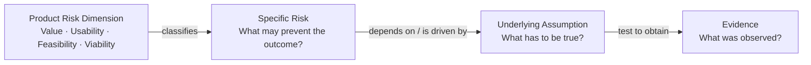

# Naming and Operationalizing SVPG's Four Product Risk Areas


> **Status:** Source research report. See [`risk-areas-model.md`]() for the selected model. This report is retained for its comparisons, sources, and alternative terminology.

## Executive summary


Across product management, design, Lean Startup, and innovation consulting, there is broad agreement on the **substance** behind SVPG's four areas: teams need evidence that a solution creates customer value, can be used successfully, can be built, and makes sense for the organization. There is much less agreement on what those areas should be **called**. SVPG and Marty Cagan explicitly call them a **product risk taxonomy**: value risk, usability risk, feasibility risk, and business viability risk. IDEO, Nielsen Norman Group, and McKinsey generally use **desirability, feasibility, and viability** as lenses or conditions, with usability folded into desirability. Teresa Torres moves one level down and works with **assumptions** in five categories: desirability, viability, feasibility, usability, and ethical. Roman Pichler uses **product success factors** and **strategy risks**: desirability, feasibility, viability, and ethicality. Lean Startup centers on **leap-of-faith assumptions, hypotheses, experiments, and validated learning**, without maintaining a four-part taxonomy. [^svpg-taxonomy][^torres-five][^pichler-success][^ideo-design-thinking][^lean-method]

The recommendation is to call SVPG's four headings **Product Risk Dimensions: Value, Usability, Feasibility, Viability**. This keeps compatibility with SVPG while making the abstraction level explicit. Under each dimension, write **specific risks**, identify the **assumptions** creating those risks, run **tests or experiments**, and record **evidence**. This resolves the linguistic problem with statements such as "Value is a risk": value is better treated as the dimension in which concrete risks exist. This interpretation is also consistent with ISO 31000's more formal definition of risk as the "effect of uncertainty on objectives." [^iso-31000][^svpg-taxonomy]

For a discovery board, use:

> **Product Risk Dimensions**
> Value · Usability · Feasibility · Viability
>
> **Risk:** What uncertain failure could prevent the outcome?
> **Assumption:** What must be true for the solution to succeed?
> **Test:** What is the cheapest credible way to challenge that assumption?
> **Evidence:** What was observed, and what decision follows?

This combines what is strongest in SVPG and Teresa Torres: SVPG provides a compact **coverage taxonomy**, while Torres provides a more precise **unit of testing**. Torres explicitly argues that a broad label such as viability risk does not by itself tell a team what to test; enumerating the underlying assumptions does. [^torres-five][^torres-assumption-testing]

A second recommendation is to consider **Ethics/Safety** as a fifth explicit dimension when potential harm deserves independent attention. Torres uses ethical assumptions, Pichler uses ethicality as one of four success factors, and practitioners have extended Cagan's model to five product risks by adding ethics. SVPG acknowledges ethics but generally places it within business viability, while also recognizing the argument for breaking it out when teams might otherwise neglect it. [^svpg-ethics][^torres-five][^pichler-success][^mindtheproduct-ml]

## How practitioners name and operationalize the areas


The main difference between the frameworks is not whether customer, user, technical, and business questions matter. It is **what object the framework asks the team to manage**: SVPG manages risk categories; Torres manages assumptions; Lean Startup manages hypotheses and learning; IDEO and consultancies use evaluation lenses; Google Design Sprints organize around assumptions and questions; Pragmatic Institute organizes around product-management activities. [^svpg-taxonomy][^torres-five][^lean-method][^ideo-design-thinking][^google-assumptions][^pragmatic-framework]

| Practitioner / organization and source type | Exact terminology | How the four SVPG areas are operationalized |
|---|---|---|
| **SVPG** -- [*Product Risk Taxonomy*](https://www.svpg.com/product-risk-taxonomies/) (practitioner/company blog) | **"four-risk taxonomy"**: **value, usability, feasibility, viability** | **Value:** test whether customers/users choose the solution. **Usability:** test whether users can use it. **Feasibility:** determine whether engineering can deliver it under available technical/time/skill constraints. **Viability:** test business, legal, compliance, go-to-market, monetization and related constraints. SVPG recommends assessing these risks before committing to delivery. [^svpg-taxonomy][^svpg-four] |
| **Marty Cagan** -- [*The Four Big Risks*](https://www.svpg.com/four-big-risks/) and [*Build To Learn FAQ*](https://www.svpg.com/build-to-learn-faq/) (practitioner blog/books) | **value risk, usability risk, feasibility risk, business viability risk** | Cagan's current operational model is to create discovery prototypes and test them against the four risks. Customer/user testing addresses value and usability; engineers resolve feasibility; stakeholder/business work addresses viability. His 2026 formulation explicitly calls discovery "building to learn." [^svpg-four][^svpg-build-to-learn] |
| **Teresa Torres / Product Talk** -- [*The 5 Types of Assumptions that Underlie Our Ideas*](https://www.producttalk.org/five-types-of-assumptions/) (practitioner blog/book methodology) | **desirability assumptions, viability assumptions, feasibility assumptions, usability assumptions, ethical assumptions** | **Value -> desirability:** identify what must be true about willingness to act/use and run demand tests. **Usability:** surface assumptions from the proposed workflow and test whether users can find, understand and complete it. **Feasibility:** surface technical, security, legal, compliance and organizational assumptions. **Viability:** expose economics/business assumptions, including willingness to pay and cost to deliver. Teams prioritize the riskiest assumptions and define success before testing. [^torres-five][^torres-assumption-testing] |
| **Roman Pichler** -- [*Four Product Success Factors*](https://www.romanpichler.com/blog/four-product-success-factors/) and [*Product Strategy Discovery*](https://www.romanpichler.com/blog/product-strategy-discovery/) (practitioner blog/books) | **product success factors** and **strategy risks**: **desirability, feasibility, viability, ethicality** | **Value:** desirability is tested through customer/user research. **Usability:** is not a separate top-level factor; ease/convenience contributes to desirability. **Feasibility:** assess technologies and skills, including with throwaway prototypes. **Viability:** validate business-model assumptions. His process repeatedly selects the biggest strategy risk, gathers evidence, then persists, changes strategy, or stops. [^pichler-success][^pichler-strategy] |
| **Google Design Sprints** -- [*Assumptions Mapping*](https://designsprintkit.withgoogle.com/methodology/phase2-define/assumptions-mapping), [*Validate*](https://designsprintkit.withgoogle.com/methodology/phase6-validate) (official method documentation) | **assumptions**, **sprint questions**, **critical business questions**; not a canonical four-risk taxonomy | Teams deconstruct assumptions into areas for experimentation and turn solution assumptions into sprint questions. **Value/usability:** users interact with the prototype. **Feasibility:** technical review. **Viability:** stakeholder review and business questions. The Sprint is therefore primarily an experimentation process, not a four-category naming system. [^google-assumptions][^google-validate] |
| **IDEO** -- [*Design Thinking*](https://designthinking.ideo.com/) (official design-method site) | **desirability, feasibility, viability**; commonly described as three perspectives/lenses | **Value + usability -> desirability:** begin with people's needs and learn through human-centered research, making and testing. **Feasibility:** assess technological possibilities and capabilities. **Viability:** assess requirements for organizational/business success. SVPG explicitly notes that IDEO's desirability combines what SVPG separates into customer value and usability. [^ideo-design-thinking][^svpg-taxonomy] |
| **Lean Startup / Eric Ries** -- [*Lean Startup Method 101*](https://leanstartup.co/resources/articles/lean-startup-method/) and [*What Is an MVP?*](https://leanstartup.co/resources/articles/what-is-an-mvp/) (official practitioner methodology) | **assumptions, hypotheses, value hypothesis, growth hypothesis, MVP, validated learning** | **Value:** value hypotheses predict measurable customer behavior and are challenged with MVPs/experiments. **Usability and feasibility:** can become assumptions to test, but are not first-class categories in the core taxonomy. **Viability:** value and growth hypotheses test whether customers receive value and how adoption can grow into a sustainable business. The central loop is experiment -> evidence -> learning. [^lean-method][^lean-mvp] |
| **Nielsen Norman Group** -- [*Discovery: Definition*](https://www.nngroup.com/articles/discovery-phase/) and [*The Product Triad: Design's Role*](https://www.nngroup.com/articles/the-product-triad-designs-role/) (UX research/practitioner articles) | **desirable, viable, feasible**; in newer material, the **DVF model** | **Value + usability -> desirability:** NN/g explicitly says a desirable product must be both useful and usable, with user research and usability testing supplying evidence. **Feasibility:** investigate technological unknowns. **Viability:** investigate organizational/business unknowns. NN/g also uses a feasibility-desirability-viability scorecard for prioritization. [^nng-discovery][^nng-triad][^nng-prioritization] |
| **Pragmatic Institute** -- [*Pragmatic Framework*](https://www.pragmaticinstitute.com/product/framework/) (official product-management framework) | Activity names rather than four risk dimensions: **Market Problems, Win/Loss Analysis, Asset Assessment, Business Plan, Pricing, Buy/Build/Partner, Product Profitability, User Personas, Use Scenarios**, etc. | **Value:** interview/observe markets, validate market problems and analyze why prospects buy or reject. **Usability:** User Personas and Use Scenarios provide user context, though there is no standalone usability-risk category. **Feasibility:** Asset Assessment and Buy/Build/Partner. **Viability:** Business Plan, Pricing, Distribution Strategy and Product Profitability; the Business Plan explicitly asks teams to quantify risk and build a financial model. [^pragmatic-framework] |
| **Product-led growth authors / ProductLed, Wes Bush and Ramli John** -- [*Product-Led Onboarding*](https://productled.com/book/onboarding), [*Time to Value*](https://productled.com/blog/time-to-value) (books/practitioner site) | **value perception, value realization, value adoption, time-to-value, friction, value metric** | **Value:** measure when users perceive, experience and adopt meaningful value. **Usability:** reduce friction and shorten the path to value. **Feasibility:** generally outside the PLG framework and left to normal engineering/product work. **Viability:** connect experienced customer value to upgrade/conversion, pricing and value metrics. PLG is principally a value/adoption/growth system rather than a complete product-risk taxonomy. [^productled-onboarding][^productled-time-to-value] |
| **McKinsey** -- [*Accelerating customer-centric innovation in medtech*](https://www.mckinsey.com/industries/life-sciences/our-insights/accelerating-customer-centric-innovation-in-medtech) and [*CX without design only gets you halfway*](https://www.mckinsey.com/capabilities/growth-marketing-and-sales/our-insights/cx-without-design-only-gets-you-halfway) (consultancy articles) | **customer desirability, business viability, technical feasibility** | **Value/usability:** customer research and rapid prototypes establish need/desire and experience. **Feasibility:** examine whether the solution can technically be delivered. **Viability:** consider the business case and economics. McKinsey describes an idea as ready for MVP development when customer desirability, business viability, and technical feasibility converge. [^mckinsey-medtech][^mckinsey-cx] |
| **BCG / BCG X** -- [*Placing Desirability at Center of Innovation*](https://www.bcg.com/x/the-multiplier/placing-desirability-at-center-of-innovation) (consultancy/practitioner article) | **"Four Lenses for Validation"**: **Desirability, Viability, Feasibility, Strategic Fit** | **Value/usability -> desirability:** test attractiveness to customers. **Feasibility:** evaluate technical and operational feasibility. **Viability:** estimate revenue potential, business model, market/pricing and financial outlook. BCG adds **Strategic Fit** to test whether the opportunity fits the corporation's capabilities and advantages. [^bcg-four-lenses] |
| **Productboard** -- [*Guide: Product Discovery Process & Techniques*](https://www.productboard.com/blog/step-by-step-framework-for-better-product-discovery/) (product-company practitioner blog) | Directly adopts Cagan's **value risk, usability risk, feasibility risk, business viability risk** | Productboard uses discovery to reduce these risks, then uses qualitative and quantitative research, ideation, prototypes, and testing through a Double Diamond-style process. Its terminology is a direct adoption of SVPG rather than an independent taxonomy. [^productboard-discovery] |
| **Mind the Product, practitioner example** -- [*Should you really be using machine learning?*](https://www.mindtheproduct.com/should-you-really-be-using-machine-learning/) (PM media/practitioner article) | **five product risks**: **value, usability, feasibility, viability, ethics** | The article extends the Cagan structure with a distinct ethical question, then asks concrete questions in each category to decide whether ML is appropriate. This is an article-level practitioner extension, not evidence of a universal Mind the Product house taxonomy. [^mindtheproduct-ml] |

Two patterns dominate this comparison.

First, **SVPG is one of the few prominent frameworks that deliberately keeps Value and Usability separate**. IDEO, NN/g, McKinsey and similar design-oriented frameworks usually put both under **Desirability**. Cagan says this separation became important to him particularly in B2B products, where the person deciding whether to buy a product and the person required to use it can be different people with different criteria. [^svpg-taxonomy]

Second, several practitioners have shifted attention from naming broad categories to identifying the **specific belief that could be wrong**. Torres is the clearest example: an assumption is a belief that must hold for an idea to succeed, and the team should surface many such assumptions, rank them by risk, and test the important ones. Google Design Sprints similarly decomposes assumptions and converts them into sprint questions, while Lean Startup expresses uncertain beliefs as measurable hypotheses. [^torres-five][^google-assumptions][^lean-method]

## Alternative taxonomies and why they differ

### Desirability, feasibility, viability


The closest widespread alternative to SVPG is:

> **Desirability · Feasibility · Viability**

IDEO explicitly frames design thinking around what is desirable for people, feasible with technology, and viable for organizations. NN/g uses essentially the same DVF model, and McKinsey uses customer desirability, technical feasibility, and business viability in innovation work. [^ideo-design-thinking][^nng-triad][^mckinsey-medtech]

The mapping is approximately:

| SVPG | Three-lens design model |
|---|---|
| Value | **Desirability** |
| Usability | **Desirability** |
| Feasibility | **Feasibility** |
| Business viability | **Viability** |

This consolidation is intentional. NN/g, for example, defines desirability in terms of user value and says a desirable product must be **useful and usable**. SVPG's explanation of the competing taxonomies likewise says IDEO's desirability combines customer value and usability. [^nng-triad][^svpg-taxonomy]

The three-lens model has a clear advantage: it is compact and works well as an innovation or concept-evaluation model. The tradeoff is loss of diagnostic precision. A concept can solve a valuable problem while still having an unusable workflow. That distinction becomes especially useful in B2B, internal tools and other settings where buyers, administrators, approvers and end users are different people. This latter argument is also Cagan's stated rationale for retaining separate Value and Usability categories. [^svpg-taxonomy]

### Five assumption categories


Teresa Torres' taxonomy is structurally close to SVPG but changes both the labels and the object being classified:

> **Desirability assumptions · Viability assumptions · Feasibility assumptions · Usability assumptions · Ethical assumptions**

Here, an item on the team's board is not normally "the viability risk." The team asks what specifically has to be true about economics, behavior, technology, workflow or harm for an idea to work. [^torres-five]

This distinction is operationally important. Torres explicitly argues that describing a solution as having "viability risk" leaves the test ambiguous; enumerating viability assumptions gives the team something concrete to evaluate. Her workflow uses story maps to expose desirability, usability and feasibility assumptions, traces an Opportunity Solution Tree to find viability assumptions, intentionally explores potential harm, and then prioritizes assumptions for testing. [^torres-five][^torres-assumption-testing]

The distinction can be summarized this way:

**SVPG:** "Has every important kind of product risk been covered?"

**Torres:** "What exactly is being assumed, and which assumption should be tested next?"

Those are complementary questions, not competing ones. This is an analytical synthesis of the two methods. [^svpg-taxonomy][^torres-five]

### Desirability, feasibility, viability, ethicality


Roman Pichler's framework is:

> **Desirability · Feasibility · Viability · Ethicality**

He calls them **product success factors**, while in strategy-discovery work he talks about **strategy risks** within the same four areas. His validation loop starts with the most important uncertainty, applies an appropriate research method such as interviews, observation, a throwaway prototype or business-model analysis, uses the resulting evidence to change or retain the strategy, and repeats until the remaining significant risks have been addressed. [^pichler-success][^pichler-strategy]

Its conceptual difference from SVPG is revealing:

| Concern | SVPG | Pichler |
|---|---|---|
| Customer/user value | Value | Desirability |
| Ease/effectiveness of use | Usability as top level | Included within the product/user proposition rather than a separate top-level strategy factor |
| Can it be delivered? | Feasibility | Feasibility |
| Does it work economically/organizationally? | Business viability | Viability |
| Could it harm people/society/environment? | Usually embedded in viability | Ethicality as top level |

The choice reflects the **level at which the framework is being used**. Pichler is often validating product strategy; Cagan's taxonomy is heavily used during solution discovery. At a strategy level, ethics may deserve a separate gate while detailed interaction usability can sit lower in the decomposition. [^pichler-success][^pichler-strategy][^svpg-taxonomy]

### Value and growth hypotheses


Lean Startup takes a different route. Its core categories are not four product properties. It asks teams to identify risky assumptions, express important ones as hypotheses, build the smallest useful experiment or MVP, measure real behavior, and generate **validated learning**. Its named high-level hypotheses are particularly **value hypotheses** and **growth hypotheses**. [^lean-method]

That means there is no clean one-to-one mapping:

- **Value** is directly represented by the value hypothesis.
- **Viability** is partly covered through value, growth, adoption and business-model economics.
- **Usability** can be a hypothesis that affects customer behavior, but it is not a canonical top-level Lean Startup category.
- **Feasibility** can likewise be tested through experiments or prototypes, but core Lean Startup terminology does not elevate it to a named sibling of value and growth. [^lean-mvp][^lean-method]

Lean Startup is therefore better understood as a **learning architecture** than as a completeness checklist.

### Corporate innovation variants


BCG X shows why taxonomies change with context. Its "Four Lenses for Validation" are **Desirability, Viability, Feasibility, and Strategic Fit**. The extra question is whether a venture has synergies or advantages within the sponsoring company. [^bcg-four-lenses]

That suggests a useful general principle: the fourth or fifth category often exposes the failure mode that a particular organization is most prone to overlook. SVPG separated business viability because customer value could crowd it out. Torres and Pichler expose ethics because harm can disappear inside an overly broad business category. BCG exposes strategic fit because corporate venture ideas can look attractive in isolation while making little sense for the parent company. This is an inference from how the respective authors explain their taxonomies. [^svpg-taxonomy][^torres-five][^pichler-success][^bcg-four-lenses]

A compact comparison makes the pattern clearer:

| Framework | Customer value | Usability separate? | Feasibility | Business viability | Additional first-class concern |
|---|---:|---:|---:|---:|---|
| SVPG | **Value** | **Yes** | Feasibility | Business viability | Ethics embedded in viability |
| IDEO / NN/g | **Desirability** | No; under desirability | Feasibility | Viability | -- |
| Teresa Torres | **Desirability assumptions** | **Yes** | Feasibility assumptions | Viability assumptions | **Ethical assumptions** |
| Roman Pichler | **Desirability** | No separate strategy factor | Feasibility | Viability | **Ethicality** |
| Lean Startup | **Value hypothesis** | No named category | No named category | Partly value/growth/business model | **Growth hypothesis** |
| BCG X | **Desirability** | No | Feasibility | Viability | **Strategic fit** |

The practical lesson is that there are **two independent design choices** in any taxonomy:

1. **Coverage:** Which classes of failure deserve an explicit category?
2. **Unit of work:** Are the managed objects lenses, risks, assumptions, hypotheses, questions, or experiments?

Much of the apparent disagreement between practitioners disappears once those two choices are separated. [^svpg-taxonomy][^torres-five][^lean-method][^bcg-four-lenses]

## Recommended naming conventions

### Recommended default: Product Risk Dimensions


The recommended default for most product teams is:

> **Product Risk Dimensions**
> **Value · Usability · Feasibility · Viability**

This is more precise than simply naming a section "Four Risks."

The reason is semantic as well as practical. ISO 31000 defines risk as the **effect of uncertainty on objectives**. Under that meaning, "Value" by itself is a subject or dimension; even "value risk" is still a category label. A concrete risk would say what might happen and why the product objective would suffer. SVPG itself calls its model a **risk taxonomy**, meaning a classification system for types of risk, which supports treating the four labels as categories or dimensions rather than four individual risk records. [^iso-31000][^svpg-taxonomy]

For example:

> **Dimension:** Value
> **Risk:** Target finance teams may see too little improvement over their spreadsheet workflow to switch, preventing adoption.

The second sentence is a risk that can be investigated. "Value" indicates where to look.

**Pros:** faithful to SVPG; preserves the useful Value/Usability distinction; works equally well for B2B and B2C; separates taxonomy from concrete risk statements; gives design, engineering and business teams a shared coverage checklist. [^svpg-taxonomy]

**Cons:** the word *risk* can make discovery sound like defensive risk management; people may still write vague entries such as "high value risk" instead of spelling out what could fail.

### Good alternative for discovery workshops: Product Uncertainties


A softer formulation is:

> **Key Product Uncertainties**
> Value · Usability · Feasibility · Viability

This works particularly well in early discovery, where the goal is to expose what the team does not yet know and gather evidence. SVPG's own current "build to learn" language and Pichler's risk-driven strategy discovery both treat uncertainty as something to resolve before larger commitments are made. [^svpg-build-to-learn][^pichler-strategy]

Its weakness is precision. "Uncertainty" indicates that knowledge is incomplete; it does not state **what objective is threatened or what consequence follows**. That makes it a good workshop heading and a weaker risk-register item. This distinction follows the ISO definition of risk as the effect that uncertainty has on objectives. [^iso-31000]

A useful phrasing is:

> "What are the biggest uncertainties across Value, Usability, Feasibility and Viability?"

Then convert the important answers into specific risk statements.

### Best for an experiment backlog: Assumption Categories


For a team running frequent discovery tests, Torres' terminology is useful:

> **Assumption Categories**
> Desirability/Value · Usability · Feasibility · Viability · Ethics, where applicable

An assumption is naturally testable because it can be written as a proposition that needs to hold. Torres defines assumptions in essentially those terms and recommends identifying, prioritizing and testing them rather than evaluating a whole idea as one indivisible object. [^torres-five][^torres-assumption-testing]

For example:

> **Risk:** Buyers may not switch because the existing process is good enough.
> **Assumption:** The target buyer experiences the problem frequently enough that eliminating it changes purchase behavior.

The risk and assumption are related but are not the same sentence.

The disadvantage of using **Assumptions** as the name for the top level is that Value, Usability, Feasibility and Viability are not themselves assumptions. A product can contain dozens of assumptions in every category; Torres' August 2026 material continues to emphasize generating many underlying assumptions before identifying the risky ones. [^torres-aug-2026]

Avoid:

> ❌ "The four assumptions are Value, Usability, Feasibility and Viability."

and use:

> ✓ "Assumptions are evaluated across four product risk dimensions."

### A terminology stack that works across artifacts


The cleanest vocabulary is:

| Level | Recommended term | Question it answers | Example |
|---|---|---|---|
| **Dimension** | Product Risk Dimension | *Which area is being examined?* | Value |
| **Risk** | Specific Product Risk | *What could fail, and what outcome would that threaten?* | Buyers may not switch from their current process, so adoption stays below the required level. |
| **Assumption** | Underlying Assumption | *What belief has to be true?* | The current process creates enough pain to motivate switching. |
| **Test / experiment** | Test | *How can the assumption be challenged cheaply and credibly?* | Prototype plus a real commitment action. |
| **Evidence** | Evidence | *What did users, systems or the business actually show?* | Observed behavior, benchmark results, commitment, unit economics, stakeholder decision. |
| **Decision** | Decision | *What changes because of the evidence?* | Proceed, modify, investigate further, or stop. |

This combines SVPG's risk coverage, Torres' assumption-testing discipline, Lean Startup's hypothesis/experiment logic, and Google Sprint's progression from assumptions to questions to prototype validation. [^svpg-taxonomy][^torres-five][^lean-method][^google-assumptions]

The hierarchy can be represented as:




The arrows describe a working decomposition rather than a formal causal ontology. In practice, teams may discover an assumption first and then articulate the risk it creates. What matters is maintaining the distinctions among classification, uncertain outcome, belief, and evidence. Torres similarly says that precise categorization is less important than surfacing and evaluating the assumptions that create risk. [^torres-five]

For a one-line team standard, use:

> **Product Risk Dimensions--Value, Usability, Feasibility, and Viability--are assessed by identifying specific risks, surfacing the assumptions behind them, and collecting evidence through targeted tests.**

### When to add Ethics/Safety


SVPG places ethical, compliance and related concerns largely within business viability. Cagan has acknowledged the argument for separating ethical risk when it otherwise receives insufficient attention. Torres makes **Ethical assumptions** a fifth category, while Pichler makes **Ethicality** a first-class product-success factor. [^svpg-taxonomy][^svpg-ethics][^torres-five][^pichler-success]

For a team where potential harm, privacy, fairness, safety or societal effects are material, the recommended form is:

> **Product Risk Dimensions: Value · Usability · Feasibility · Viability · Ethics/Safety**

The advantage of a fifth category is attention: teams are forced to ask the question explicitly. The cost is another category and some overlap with viability, security, compliance and usability. SVPG's 2023 discussion correctly identifies this as a tradeoff between completeness and a taxonomy people can remember and use. [^svpg-taxonomy]

## From dimensions to testable evidence


The critical move is to stop at neither:

> "There is value risk."

nor:

> "Value needs to be validated."

Neither statement identifies what could be false. Torres' assumption-testing approach and Lean Startup's measurable-hypothesis approach both push the team toward propositions that can be challenged by evidence. SVPG similarly says teams should understand the risks and then select techniques for quickly testing ideas against them. [^torres-five][^lean-method][^svpg-taxonomy]

A practical record can use this template:

> **Dimension:** Value / Usability / Feasibility / Viability
> **Objective affected:** What outcome is being pursued?
> **Specific risk:** What might be true that prevents that outcome?
> **Underlying assumption:** What must be true for the proposed solution to work?
> **Current evidence:** What is already known, and how strong is that evidence?
> **Test:** What is the cheapest credible test that distinguishes the competing possibilities?
> **Decision rule:** Before seeing results, what evidence would change the decision?
> **Result:** What happened?
> **Decision:** Continue, modify, investigate further, or stop.

Defining success criteria before a test is consistent with Torres' approach to reducing confirmation bias; Lean Startup likewise favors hypotheses with observable, preferably measurable expected behavior. [^torres-assumption-testing][^lean-method]

Here are four illustrative examples. The product, thresholds and results are hypothetical.

| Dimension | Specific testable risk | Underlying assumption | Suitable experiment / evidence |
|---|---|---|---|
| **Value** | Finance managers may consider automated reconciliation only marginally better than spreadsheets, so they may not switch or pay. | The reconciliation problem is frequent and costly enough that the target buyer will take a meaningful step toward adopting the proposed solution. | Conduct problem research, then show a realistic prototype and ask for a **behavioral commitment** appropriate to the stage: pilot participation, data connection, procurement introduction, deposit/pre-order where appropriate, etc. Define the required signal before testing. This follows the demand-testing logic used by Torres and the behavioral hypothesis approach of Lean Startup. [^torres-five][^lean-method] |
| **Usability** | First-time administrators may fail to connect their accounting system without assistance, preventing activation. | A representative administrator can understand the terminology, locate the integration flow and complete setup with the intended level of assistance. | Run moderated usability sessions with a prototype or test environment. Observe task completion, critical errors, requests for help, path taken and time where relevant. NN/g treats actual user testing as a central way of evaluating interaction quality, while SVPG explicitly assigns prototypes to usability-risk discovery. [^nng-usability][^svpg-four] |
| **Feasibility** | The matching service may fail to meet required latency, accuracy or processing-cost constraints at expected production volume. | The proposed architecture/model can meet explicitly defined technical requirements on representative data and load. | Build an engineering spike or narrow technical prototype and benchmark it using production-like data and traffic. Do only enough implementation to answer the technical question. SVPG explicitly describes feasibility as whether engineering can build what is needed under available constraints; Google Sprints similarly provide for technical reviews during validation. [^svpg-four][^google-validate] |
| **Viability** | The solution may create too much support/compliance cost for the target price, or an internal constraint may prevent selling it. | Required pricing, gross economics, sales/support model, security/compliance conditions and stakeholder constraints can coexist. | Combine a pricing/willingness-to-pay test with a unit-economics sensitivity model and targeted legal, security, sales or stakeholder reviews. Pragmatic Institute's framework explicitly uses Business Plans, financial models, Pricing and Product Profitability for these questions; SVPG includes compliance, monetization and ability to market/sell within viability risk. [^pragmatic-framework][^svpg-four] |

A B2B example shows why keeping **Value** and **Usability** separate is often useful. Suppose an executive buyer sees a clear financial return and willingly purchases a workflow product. The end users may still find the workflow difficult enough that adoption collapses. A three-lens model can describe the whole situation as a desirability problem; SVPG's four-dimensional model produces two clearer hypotheses: the **buyer value hypothesis** passed while the **user usability hypothesis** failed. Cagan explicitly cites buyer/user separation as the reason he considers the four-part taxonomy more useful for many business products. [^svpg-taxonomy]

A discovery process built around these records can be visualized as a repeating matrix rather than a phase gate:

| Discovery question | Value | Usability | Feasibility | Viability |
|---|---|---|---|---|
| **What is believed?** | User/customer will choose it | User can complete the workflow | Team/system can deliver it | Organization can support and sustain it |
| **What evidence is strongest?** | Observed behavior and meaningful commitments | Successful behavior with representative users | Technical benchmark / working spike | Economics, stakeholder, legal/compliance and GTM evidence |
| **Typical early test** | Interview + demand/commitment test | Prototype usability session | Technical spike | Business-model/stakeholder review |
| **Typical later test** | Pilot adoption / retention / purchase behavior | Production task success and support patterns | Load, reliability and operational tests | Pricing, margin, sales, compliance and operational performance |

No framework prescribes that these columns be resolved sequentially. SVPG emphasizes addressing important risks early; Torres prioritizes the riskiest assumptions; Pichler says to select the largest strategy uncertainty and iterate; design thinking itself is explicitly iterative. The practical implication is to order tests by **risk and cost of being wrong**, rather than mechanically doing Value first, then Usability, then Feasibility, then Viability. [^svpg-taxonomy][^torres-assumption-testing][^pichler-strategy][^ideo-design-thinking]

## Overall recommendation


The research supports using **risk** as SVPG uses it, but with one important refinement in team language.

**"The Four Product Risks" is legitimate SVPG terminology.** Marty Cagan deliberately calls the model a product risk taxonomy, and Productboard and other practitioners have adopted those exact labels. [^svpg-taxonomy][^productboard-discovery]

For artifacts, however, **"Product Risk Dimensions" is clearer**:

> ### Product Risk Dimensions
> **Value** -- Will the customer/user choose the solution?
> **Usability** -- Can the intended user successfully use it?
> **Feasibility** -- Can the team deliver it within the relevant technical and operational constraints?
> **Viability** -- Can the business support, sell, operate and sustain it?

Then reserve **risk** for statements such as:

> "Target administrators may abandon setup because connecting their data requires credentials they do not control, preventing activation."

And reserve **assumption** for:

> "The target administrator has access to the credentials required during setup."

That distinction gives every word a clear job:

```text
Dimension
   ↓
Specific risk
   ↓
Underlying assumption(s)
   ↓
Targeted test
   ↓
Evidence
   ↓
Decision
```


The taxonomy answers **where uncertainty may exist**. The risk explains **what might go wrong and what objective is affected**. The assumption identifies **what the team currently believes must be true**. The test generates **evidence**. That combination is more operationally precise than using "risk," "uncertainty," and "assumption" interchangeably, and it is consistent with the strongest parts of SVPG, Torres, Lean Startup, Google Design Sprints, and formal risk terminology. [^svpg-taxonomy][^torres-five][^lean-method][^google-assumptions][^iso-31000]

For most software product teams, the preferred team wording is therefore:

> **"For each solution, identify the significant risks across four Product Risk Dimensions--Value, Usability, Feasibility and Viability. State each risk concretely, expose the assumptions behind it, and gather enough evidence to make the next decision."**

For an experiment board, use **Assumptions** as the individual items. For an executive or design workshop, **Desirability-Feasibility-Viability** can be simpler when the distinction between buyer value and user usability is not important. For B2B products, internal products, or products with distinct buyers and users, keep SVPG's four dimensions. Where potential harm warrants independent scrutiny, add **Ethics/Safety** explicitly instead of trusting it to remain visible inside Viability. [^svpg-taxonomy][^torres-five][^pichler-success]

## References


[^svpg-taxonomy]: [SVPG, "Product Risk Taxonomy."](https://www.svpg.com/product-risk-taxonomies/)

[^torres-five]: [Teresa Torres / Product Talk, "Evaluating Solutions: The 5 Types of Assumptions that Underlie Our Ideas."](https://www.producttalk.org/five-types-of-assumptions/)

[^pichler-success]: [Roman Pichler, "Four Product Success Factors."](https://www.romanpichler.com/blog/four-product-success-factors/)

[^ideo-design-thinking]: [IDEO, "Design Thinking."](https://designthinking.ideo.com/)

[^lean-method]: [Lean Startup, "Lean Startup Method 101."](https://leanstartup.co/resources/articles/lean-startup-method/)

[^iso-31000]: [ISO, "The new ISO 31000 keeps risk management simple."](https://www.iso.org/news/ref2263.html)

[^torres-assumption-testing]: [Teresa Torres / Product Talk, "Assumption Testing: Everything You Need to Know to Get Started."](https://www.producttalk.org/assumption-testing/)

[^svpg-ethics]: [Marty Cagan / SVPG, "Coaching - Ethics."](https://www.svpg.com/coaching-ethics/)

[^mindtheproduct-ml]: [Mind the Product, "Should you really be using machine learning?"](https://www.mindtheproduct.com/should-you-really-be-using-machine-learning/)

[^google-assumptions]: [Google Design Sprint Kit, "Assumptions Mapping."](https://designsprintkit.withgoogle.com/methodology/phase2-define/assumptions-mapping)

[^pragmatic-framework]: [Pragmatic Institute, "Pragmatic Framework."](https://www.pragmaticinstitute.com/product/framework/)

[^svpg-four]: [Marty Cagan / SVPG, "The Four Big Risks."](https://www.svpg.com/four-big-risks/)

[^svpg-build-to-learn]: [SVPG, "Build To Learn FAQ."](https://www.svpg.com/build-to-learn-faq/)

[^pichler-strategy]: [Roman Pichler, "Product Strategy Discovery."](https://www.romanpichler.com/blog/product-strategy-discovery/)

[^google-validate]: [Google Design Sprint Kit, "Validate."](https://designsprintkit.withgoogle.com/methodology/phase6-validate)

[^lean-mvp]: [Lean Startup, "What Is an MVP?"](https://leanstartup.co/resources/articles/what-is-an-mvp/)

[^nng-discovery]: [Nielsen Norman Group, "Discovery: Definition."](https://www.nngroup.com/articles/discovery-phase/)

[^nng-triad]: [Nielsen Norman Group, "The Product Triad: Design's Role."](https://www.nngroup.com/articles/the-product-triad-designs-role/)

[^nng-prioritization]: [Nielsen Norman Group, "5 Prioritization Methods in UX Roadmapping."](https://www.nngroup.com/articles/prioritization-methods/)

[^productled-onboarding]: [ProductLed, "Product-Led Onboarding."](https://productled.com/book/onboarding)

[^productled-time-to-value]: [ProductLed, "Time to Value."](https://productled.com/blog/time-to-value)

[^mckinsey-medtech]: [McKinsey & Company, "Accelerating customer-centric innovation in medtech."](https://www.mckinsey.com/industries/life-sciences/our-insights/accelerating-customer-centric-innovation-in-medtech)

[^mckinsey-cx]: [McKinsey & Company, "CX without design only gets you halfway."](https://www.mckinsey.com/capabilities/growth-marketing-and-sales/our-insights/cx-without-design-only-gets-you-halfway)

[^bcg-four-lenses]: [BCG X, "Placing Desirability at Center of Innovation."](https://www.bcg.com/x/the-multiplier/placing-desirability-at-center-of-innovation)

[^productboard-discovery]: [Productboard, "Guide: Product Discovery Process & Techniques."](https://www.productboard.com/blog/step-by-step-framework-for-better-product-discovery/)

[^torres-aug-2026]: [Teresa Torres / Product Talk, "Ch. 9: Identifying Hidden Assumptions," August 3, 2026.](https://www.producttalk.org/cdh-book-club-august-2026/)

[^nng-usability]: [Nielsen Norman Group, "Usability (User) Testing 101."](https://www.nngroup.com/articles/usability-testing-101/)
