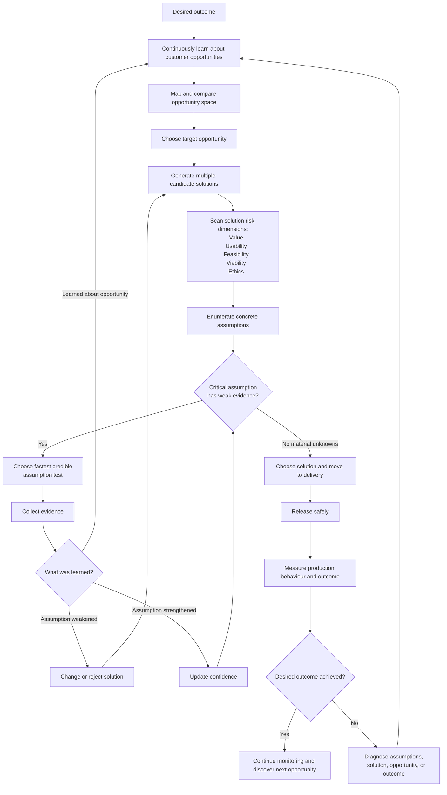

# SVPG's Solution Risk Dimensions and Teresa Torres's Continuous Discovery Model

> **Status:** Research synthesis and supporting material. The canonical guidance is [`risk-areas-model.md`](). This document preserves source comparisons, alternative terms, citations, and the reasoning from which the shorter model was developed.

> **Editorial note:** This document reassembles existing passages around one coherent argument. The source prose remains verbatim. Labeled callouts explain the ordering and the choices made where the source notes contain competing models.

## Executive summary

SVPG's **Value, Usability, Feasibility, and Viability** and Teresa Torres's **Desirability, Usability, Feasibility, and Viability assumptions** are best understood as two views of almost the same solution-level concerns. Torres says this explicitly: conceptually, her assumption types and Marty Cagan's four risks are addressing the same ideas; she prefers assumptions in practice because a concrete assumption tells a team what it can test. [^1][^2]

The more important difference is elsewhere in their models:

**SVPG provides a taxonomy for asking, "How could this proposed solution fail?"**

**Torres provides a structure for asking, "What outcome is being pursued, which customer opportunity should be addressed, which solutions could address it, what must be true for those solutions to work, and what evidence should be collected?"** Her Opportunity Solution Tree connects a desired outcome to an opportunity space, solution space, and assumption tests. [^3][^4]

So these models are mostly **complementary, not competing**.

> **Decision rationale:** This thesis comes before the synthesis because the frameworks work at different levels. SVPG supplies a coverage check for solution failure, while Torres supplies the surrounding discovery and testing structure; treating them as substitutes would create a false choice.

The recommended synthesis is:

> **Outcome -> Opportunities -> Candidate solutions -> Solution risk dimensions -> Concrete assumptions -> Evidence / assumption tests -> Decision -> Production outcome**

> **Decision rationale:** The combined sequence is introduced before the naming decisions so the reader can first see where each concept belongs. It prevents the later terms from looking like one flat taxonomy.

For the solution risk dimensions, use:

> **Value, Usability, Feasibility, Viability, and Ethics**

Keep **Value** rather than Torres's **Desirability** for work that is heavily B2B, because "will the customer buy or the user choose to use this?" is clearer there. Keep **Ethics** explicit because Torres treats it as a fifth assumption category, and Cagan has separately argued that ethics can disappear inside the large viability bucket and therefore deserves explicit attention. [^5][^1][^6]

> **Decision rationale:** The choices of **Value** and explicit **Ethics** are stated early because they govern the vocabulary used throughout the document. Leaving them unresolved until later would make the synthesis appear internally inconsistent.

Most importantly, do **not** make "Value risk: high" the atomic unit in discovery documentation. Make the atomic unit a concrete assumption:

> **Value assumption:** Finance controllers will allow the system to auto-match invoices without reviewing every match.

Then record the **risk associated with being wrong**, the **existing evidence**, and the **next evidence needed**. This combines SVPG's risk/consequence thinking with Torres's assumption-testing practice. SVPG says risk assessment should consider both severity and consequence; Torres prioritizes assumptions that are critical to the idea and weakly supported by evidence. [^7][^8]

> **Decision rationale:** This is the operational center of the argument. The proposed unit of discovery work is a testable assumption with consequences and evidence, not a broad dimension label.

There are four substantive differences to be aware of:

| Area | Main difference | Recommended synthesis |
|---|---|---|
| **Value / Desirability** | Cagan prefers "value"; Torres deliberately uses "desirability." | Use **Value** as the dimension and write concrete **value assumptions**. |
| **Feasibility / Viability boundary** | Torres sometimes places legal, security, compliance, and organizational constraints under feasibility; SVPG generally places them under viability. | Use **Feasibility = technical/capability constraints** and **Viability = business/legal/organizational constraints**. |
| **Ethics** | Torres makes ethics a fifth assumption type; SVPG's main taxonomy embeds it in viability, although Cagan has advocated making it explicit. | Make **Ethics** explicit. |
| **Problem vs. solution discovery** | Torres gives substantial structure to continuous opportunity discovery; current SVPG material places much more discovery effort on solving an already selected problem. | Use Torres for the **outcome/opportunity space** and SVPG + Torres assumptions for the **solution space**. |

[^1][^9][^10][^6][^11]

> **Decision rationale:** The table is a compact decision log: it isolates the points that require a choice from the larger area of agreement. The scope section follows immediately because those choices only make sense once the taxonomy's boundary is explicit.

## Scope differences

The biggest conceptual difference between the two bodies of work is **not the four versus five categories**. It is how much discovery attention the product team gives to the problem/opportunity space.

This became clearer in SVPG's newer writing.

Their current model starts with:

**Problem -> desired outcome -> candidate solution**

Then discovery asks whether the candidate solution is valuable, usable, feasible, and viable **and whether it is likely to achieve the desired outcome**. ([Silicon Valley Product Group](https://www.svpg.com/build-to-learn-faq/ "Build To Learn FAQ - Silicon Valley Product Group : Silicon Valley Product Group"))

Avoid claiming:

> "These are the four risks of building a product."

That's too broad.

Instead:

> **These are four major dimensions of solution risk.**

There are uncertainties outside them.

For example:

**Problem selection risk**

Is the problem worth spending resources on?

**Problem-understanding risk**

Are the problem and affected people understood correctly?

**Outcome risk**

Even if people adopt the solution, does it actually move the target metric or business outcome?

**Delivery/operational risks**

Will the production implementation be reliable, secure, scalable, observable, etc.?

SVPG explicitly separates problem discovery from solution discovery, and its 2026 material says the four risks primarily apply while discovering the solution. ([Silicon Valley Product Group](https://www.svpg.com/product-design-and-ai/?utm_source=chatgpt.com "Product, Design and AI - Silicon Valley Product Group : Silicon Valley Product Group"))

That scope makes the model much stronger.

> **Decision rationale:** This narrower scope turns an overbroad product-risk claim into a precise solution-discovery tool. Problem selection, problem understanding, outcome realization, and routine delivery remain important, but sit outside this taxonomy.

### Where Opportunity Solution Trees fit

There is no one-to-one SVPG risk corresponding to an **opportunity**. Torres defines opportunities as customer needs, pain points, and desires that, if addressed, could drive the product outcome; solutions sit below those opportunities, with assumption tests below solutions. [^3][^4]

For the invoice example:

| Torres layer | Example | Relationship to SVPG |
|---|---|---|
| **Desired outcome** | Increase the percentage of invoices reconciled before month-end close from 75% to 92%. | Sets the success condition against which the discovered solution eventually needs to be judged. SVPG likewise says discovery should produce both a solution that clears the risks and the necessary outcome. [^24][^11] |
| **Opportunity** | "I spend too much time investigating matches that turn out to be obvious." | Customer problem/need; it precedes any particular solution in Torres's model. [^18][^25] |
| **Candidate solutions** | Confidence-based auto-match; batch review; suggested matches with explanations. | This is where SVPG's four dimensions become especially useful. |
| **Assumptions** | "Controllers will trust auto-match above 98% confidence"; "ERP data is sufficient"; "audit rules permit automatic matching." | Concrete propositions across value, usability, feasibility, and viability. |
| **Assumption tests** | Prototype behaviour test, technical spike, compliance review. | Evidence collected before committing to production delivery. |
| **Outcome evidence** | Actual month-end reconciliation rate after launch. | Ultimate evidence that the solution generated the intended result. Both approaches are outcome-oriented. [^11][^26] |

This is why SVPG's four boxes should **not be added as a peer level to Outcome / Opportunity / Solution in an OST**. They are a different axis. An OST describes the **decision structure**; risk dimensions classify the **uncertainties inside candidate solutions**.

> **Decision rationale:** The invoice example makes the two axes concrete. It justifies keeping Outcome, Opportunity, and Solution as the decision structure while using risk dimensions to inspect each candidate solution.

### Torres gives the opportunity space first-class status

Torres describes discovery as:

> **desired outcome -> opportunity space -> solution space**

The opportunity space contains customer needs, pain points, and desires; teams build it continuously from customer stories and use it to decide which customer opportunity to target before comparing candidate solutions. [^3][^26]

She recommends framing opportunities from the customer's point of view and provides a simple check: could a customer plausibly say it? For example, "reduce support tickets" is business language, while "I can't figure out how to do X" expresses the customer problem. [^18]

She also treats the model as **bidirectional and continuous**. Learning about solutions can change the understanding of the opportunity; learning across opportunities can change the understanding of the outcome. Torres explicitly warns against treating outcome -> opportunity -> solution as sequential phases that must be completed once. [^31]

> **Decision rationale:** This passage is retained because the tree can otherwise be mistaken for a waterfall. Its bidirectional character is essential to the later workflow, where solution evidence can revise the understood opportunity or outcome.

### Current SVPG puts more weight on solution discovery

SVPG's April 2026 *Build To Learn FAQ* starts with a **problem to solve and an outcome to achieve**, but says product strategy normally selects the problem and product leaders normally own that choice. It argues that most build-to-learn effort should then go toward finding a solution that actually solves the problem and produces the outcome. [^11]

This is consistent with Cagan's earlier *Discovery - Problem vs. Solution*, where he argues that strong companies spend the majority of discovery effort on finding a valuable, usable, feasible, and viable solution. [^32]

This is a genuine difference in emphasis:

| Question | SVPG tendency | Torres tendency |
|---|---|---|
| Who selects the broad problem/outcome? | Product strategy / product leadership generally supplies the problem; team solves it. [^11] | Outcome is ideally negotiated between leadership and the product team. [^31] |
| Does the team continuously research customer problems? | Necessary enough to understand the assigned problem, but current SVPG material says solution discovery usually deserves most effort. [^11] | Yes. Continuous customer interviewing continuously expands/refines the opportunity space. [^33][^19] |
| Does the team choose among customer opportunities? | Less explicit in the four-risk framework. | Yes. Opportunity prioritization is a central discovery decision. [^34] |
| What gets intensive testing? | Candidate solutions against product risks. [^11] | Candidate solutions by testing their assumptions, after selecting an opportunity. [^8] |

> **Decision rationale:** The side-by-side comparison shows that the genuine difference concerns ownership, emphasis, and allocation of discovery effort, not merely terminology.

Both levels should be preserved.

A product strategy or leader can define a broad strategic problem such as:

> Reduce month-end close time for mid-market finance teams.

The product team can still build an opportunity space underneath it:

> "I can't tell which invoice mismatches actually need investigation."
> "I repeatedly investigate the same supplier-specific differences."
> "I'm afraid to automate matching because I need an audit trail."

This gives leadership control over **where the company plays** while giving the team room to discover **which customer needs inside that space are most promising**.

> **Decision rationale:** This synthesis preserves strategic direction from leadership without removing the team's responsibility to discover which customer need within that direction is worth addressing. Terminology comes next because the two axes are now separated.

## Terminology differences

The terms are related but should not be collapsed.

| Term | Best precise meaning | How SVPG uses it | How Torres uses it | Recommended team usage |
|---|---|---|---|---|
| **Risk** | A decision-relevant consequence arising from uncertainty. ISO 31000 defines risk in terms of the effect of uncertainty on objectives. [^27] | Four broad categories of ways a product solution might fail: value, usability, feasibility, viability. Risk assessment should consider consequence. [^7] | Torres talks about the **risk carried by assumptions**, and the categories help teams uncover that risk. [^2] | Use for **"what happens if the assumption is wrong?"** Example: "If this assumption is false, adoption is likely to fail." |
| **Uncertainty** | Lack of sufficient knowledge/evidence about whether something is true or what will happen. | Present implicitly through the need for evidence and risk reduction, although SVPG normally speaks in terms of risk. [^7] | Operationalized mainly through assumptions with varying evidence strength. [^8] | Use as an umbrella concept: "Confidence is low because evidence is weak." Do not use it as the concrete artifact. |
| **Assumption** | A proposition that must hold for the idea to work. | SVPG discusses identifying assumptions but its canonical taxonomy is expressed as risks. [^28] | Explicitly defined as beliefs that must be true for ideas to succeed. [^29] | Make this the **atomic discovery artifact**. Phrase it specifically and positively enough to test. |
| **Opportunity** | A customer need, pain point, or desire that could be addressed to create customer value. | Closest analogue is the problem the team has been asked to solve; "opportunity" is not one of the four solution risks. | A first-class object between the outcome and solutions on the OST. [^30][^26] | Reserve **opportunity** for customer needs/problems. Do not call feature ideas opportunities. |
| **Outcome** | Measurable result the team seeks to change. | Discovery should find a solution that clears the product risks **and achieves the necessary outcome**. [^24][^11] | Root of the OST; product outcomes typically represent customer behaviour connected to business value. [^3] | Keep a single explicit **desired outcome** above discovery work. |
| **Solution** | Product, feature, service, or approach proposed to address an opportunity/problem. | The primary subject being tested against the four product risks. [^11] | Sits below a target opportunity and should be explored in alternatives. [^4][^2] | Always attach assumptions to a specific candidate solution. |
| **Assumption test** | A small structured activity designed to increase or decrease confidence in one assumption. | SVPG often speaks more broadly about testing prototypes and running discovery experiments. [^24][^16] | Torres explicitly defines an assumption test as an activity for evaluating risk in one assumption. [^23] | Prefer **assumption test** for pre-build discovery work. |
| **Experiment** | In the strict Torres vocabulary, a test of causal impact once something exists in production. | SVPG uses "experimentation" more broadly for rapid discovery learning. [^24] | Torres intentionally distinguishes experiments from assumption tests: assumption tests help decide what to build; experiments measure impact after building. [^23] | Write **assumption test** before delivery and **production experiment / outcome measurement** after launch. |
| **Value / Desirability** | Whether the customer/user will choose the solution and perform the behaviour needed to benefit. | **Value**. [^5] | **Desirability**. [^21] | **Value** is the recommended category, especially in B2B; use concrete value assumptions underneath it. |

> **Decision rationale:** The vocabulary table precedes the worked examples because every later section depends on these terms remaining distinct. It fixes stable meanings for risk, uncertainty, assumption, evidence, test, and experiment before showing how they interact.

### Risk and assumption should remain separate

A useful team model is:

> **Assumption:** what must be true.
> **Uncertainty:** how little is known about whether it is true.
> **Risk:** why being wrong is consequential.
> **Evidence:** what currently supports or contradicts it.

For example:

> **Assumption:** Controllers will trust the system enough to permit automatic matches above 98% confidence.
> **Evidence:** 3 of 8 controllers enabled automation in a prototype pilot.
> **Uncertainty:** High; sample is small and all users came from design-partner accounts.
> **Risk:** High; if controllers continue manually reviewing every match, the solution cannot reduce reconciliation time enough to achieve the outcome.

That decomposition reflects SVPG's emphasis on consequence and sufficient evidence, and Torres's emphasis on critical assumptions with weak evidence. [^7][^8]

> **Decision rationale:** The worked example is retained because each field answers a different decision question. Without one assumption decomposed into evidence, uncertainty, and risk, the distinctions could appear merely semantic.

> **Decision rationale:** The notes contain two operational models. Earlier passages use `Dimension -> Risk -> Assumption -> Test -> Evidence`; the later synthesis makes the assumption the atomic testable proposition and records uncertainty, consequence, evidence, and the next test around it. This assembly chooses the latter because a broad risk label is not directly testable, while an assumption is. The risk-first version remains preserved in the source notes.

## Concept mapping

The examples below assume a **cross-functional digital product team**, using a B2B SaaS product as the concrete case. That makes the value/desirability distinction especially visible. The synthesis also applies to consumer and internal products, but SVPG explicitly notes that the value and usability bars can differ for internal products because users may have less choice and training may be acceptable. [^20]

> **Decision rationale:** A B2B case is used because the separation between buyer and user puts the Value-Usability distinction under the greatest pressure. The internal-product caveat prevents that case from being generalized beyond its limits.

The broader SVPG material presents a coherent model, but the terminology mixes two levels: **properties of a good solution** and **risks that those properties won't hold**.

SVPG itself uses both forms. It says an effective solution is "valuable, usable, feasible and viable," while also calling value/usability/feasibility/viability a risk taxonomy. ([Silicon Valley Product Group](https://www.svpg.com/product-model-concepts/?utm_source=chatgpt.com "Product Model Concepts - Silicon Valley Product Group : Silicon Valley Product Group"))

It can be formalized this way.

### 1. The four are solution dimensions

A candidate solution needs to satisfy four conditions:

|Dimension|Definition|Core question|
|---|---|---|
|**Value**|The solution provides enough value that the relevant customer or user will choose it.|**Will they choose it?**|
|**Usability**|The intended users can successfully accomplish what they need with the solution.|**Can they use it?**|
|**Feasibility**|The team can build and deliver the solution given its technology, skills, time, and important technical constraints.|**Can the team build it?**|
|**Viability**|The organization can sustainably and responsibly offer the solution within its business constraints.|**Can the organization support it?**|

> **Decision rationale:** The dimensions are phrased as conditions a successful solution must satisfy. This keeps each property separate from the uncertainty and consequence associated with its possible failure.

### 2. Value needs the most careful definition

SVPG defines value more narrowly than the word normally implies.

It means roughly:

> **Will the customer buy it, or will the user choose to use it?**

SVPG explicitly distinguishes this from usability: a user may be perfectly capable of using something while having no desire to use it. Their 2025 material calls this the distinction between "could use" and "choose to use." ([Silicon Valley Product Group](https://www.svpg.com/product-design-and-ai/ "Product, Design and AI - Silicon Valley Product Group : Silicon Valley Product Group"))

A slightly stronger definition is:

> **Value:** Will the target customer/user choose this solution given their alternatives, costs of switching/adoption, and the importance of the problem?

For a commercial product, this becomes competitive:

> Is this solution sufficiently better than the customer's current alternative that they will switch, buy, adopt, or continue using it?

That matches SVPG's newer emphasis. In 2026 they explicitly say that a commercial solution often needs to be substantially better than alternatives to cause switching. ([Silicon Valley Product Group](https://www.svpg.com/build-to-learn-vs-build-to-earn/ "Build to Learn vs Build to Earn - Silicon Valley Product Group : Silicon Valley Product Group"))

For an internal product the definition changes slightly because users may have no meaningful choice. SVPG acknowledges this. In that case, value can be defined as:

> Does the solution actually solve the intended problem well enough to produce the required benefit?

SVPG says much the same: for internal products, what counts is successfully completing the job to be done. ([Silicon Valley Product Group](https://www.svpg.com/commercial-vs-internal-products/ "Commercial vs Internal Products - Silicon Valley Product Group : Silicon Valley Product Group"))

So **"value" is probably the weakest label of the four**. "Adoption risk" would be clearer for commercial products, but worse for internal products.

**Value** is worth retaining for compatibility, with an explicit definition.

> **Decision rationale:** Value receives the longest treatment because it is the most ambiguous label. The argument tests it against commercial and internal cases before retaining the familiar term with a stricter definition.

### 3. Usability is comparatively clean

It can be defined as:

> **Usability:** Can the intended users successfully accomplish the required tasks in their expected context, with an acceptable amount of learning, effort, and assistance?

The important separation is:

- "The solution can be used successfully" -> usability.
- "The solution is worth choosing or using" -> value.

A beautiful, intuitive solution to a problem nobody cares about has low usability risk and high value risk.

A highly desirable tool with a confusing workflow has low value risk and high usability risk.

This separation is one reason SVPG prefers four dimensions over IDEO's desirability/feasibility/viability taxonomy, especially for B2B products where buyer and user can be different people. ([Silicon Valley Product Group](https://www.svpg.com/product-risk-taxonomies/ "Article: Product Risk Taxonomy : Silicon Valley Product Group"))

> **Decision rationale:** Usability follows Value so their boundary is fixed immediately. The paired counterexamples show that willingness and ability can fail independently rather than forming one combined concern.

### 4. Feasibility should mean more than "can it compile?"

SVPG's original wording is:

> Can the engineers build what is needed with the time, skills, and technology available? ([Silicon Valley Product Group](https://www.svpg.com/four-big-risks/ "The Four Big Risks - Silicon Valley Product Group : Silicon Valley Product Group"))

Their newer material talks about being able to build and deliver a **product-quality** solution. ([Silicon Valley Product Group](https://www.svpg.com/the-purpose-of-prototypes/?utm_source=chatgpt.com "The Purpose of Prototypes - Silicon Valley Product Group : Silicon Valley Product Group"))

It can therefore be defined as:

> **Feasibility:** Can the team build and deliver the required solution within the relevant technical, capability, and time constraints?

Examples of concrete feasibility risks:

- the model may not achieve required accuracy;
- latency may be too high;
- an external API may not support the required behavior;
- the team may lack a required technical capability;
- the architecture may not handle the necessary scale;
- implementation may take 18 months when the opportunity requires 3.

One boundary needs judgment. SVPG's 2026 material separates discovery risks from ordinary delivery concerns such as reliability, scale, fault tolerance, security, and operations. ([Silicon Valley Product Group](https://www.svpg.com/build-to-learn-vs-build-to-earn/ "Build to Learn vs Build to Earn - Silicon Valley Product Group : Silicon Valley Product Group"))

The following rule is useful:

> If a technical property could invalidate the **solution concept**, it is feasibility risk during discovery. If the means of satisfying it are already known and only correct implementation remains, it is delivery work.

For example, "Can inference finish within 100 ms at all?" is discovery. "Make sure the known implementation meets its 100 ms SLO" is delivery.

> **Decision rationale:** The discovery-versus-delivery rule is retained because the same technical property can belong to either stage. Whether the uncertainty can invalidate the solution concept is the practical boundary; the topic alone does not determine the classification.

### 5. Viability is the broad business constraint

It can be defined as:

> **Business viability:** Can the organization offer, operate, support, and benefit from this solution within its economic, legal, strategic, commercial, and organizational constraints?

This includes things such as:

- monetization and unit economics;
- sales;
- marketing and distribution;
- customer support/service;
- legal;
- compliance;
- privacy/security requirements;
- contracts and partnerships;
- brand;
- financing/funding;
- manufacturing or operations.

SVPG explicitly places sales, marketing, finance, legal, compliance, and similar concerns here. ([Silicon Valley Product Group](https://www.svpg.com/value-and-viability/ "Value and Viability - Silicon Valley Product Group : Silicon Valley Product Group"))

It is deliberately a large bucket. Cagan acknowledges that things like ethics, compliance, and go-to-market could be separate risk categories, but argues that a short taxonomy people actually use is preferable. ([Silicon Valley Product Group](https://www.svpg.com/product-risk-taxonomies/ "Article: Product Risk Taxonomy : Silicon Valley Product Group"))

The clean distinction with value is:

> **Value asks whether the customer wants the transaction.**
> **Viability asks whether the business wants and can support the transaction.**

For example:

Customer will happily pay $10/month -> value looks good.

Serving that customer costs $35/month -> viability problem.

> **Decision rationale:** Viability completes the technical-versus-business boundary. The two-sided transaction example makes the distinction concrete: customer willingness belongs to Value, while organizational sustainability belongs to Viability.

Consider a B2B product team building an **AI-assisted invoice reconciliation system** for finance teams.

| SVPG dimension | Closest Torres concept | Primary-source definition | Concrete example | Practical implication | Recommended language in team docs | Useful evidence / tests |
|---|---|---|---|---|---|---|
| **Value** | **Desirability assumptions** | SVPG: whether customers will buy or users choose to use the solution. Torres: why customers will want the solution and whether they will perform the behaviours needed to obtain value from it. [^5][^21][^22] | "Finance controllers will trust automated matching enough to let the product automatically reconcile at least 70% of invoices." | Knowing that reconciliation is painful doesn't establish that this solution is compelling enough to change behaviour. The team needs evidence of adoption, switching, commitment, or actual use. | **Value assumption:** "Controllers will allow automatic reconciliation for high-confidence matches." | A realistic prototype where controllers choose manual vs automatic matching; a demand/commitment test such as opting into an automated pilot; behavioural data showing current manual overrides and willingness to delegate. Torres specifically suggests demand tests and behavioural prototype tests for desirability. [^21][^23] |
| **Usability** | **Usability assumptions** | SVPG: whether users can figure out how to use the solution. Torres: assumptions that users can find what they need, understand what to do, and successfully do it. [^5][^9] | "A controller can review an uncertain match, understand why it was flagged, and approve or reject it without assistance." | Value and usability need separate evidence: users can strongly want automatic reconciliation while still being unable to understand the exception workflow. | **Usability assumption:** "A first-time controller can identify why a match is uncertain and choose the correct action without help." | Moderated prototype task observation; unmoderated task-completion prototype test; analytics or session evidence from a comparable existing workflow. Torres treats prototype tests as a primary way of observing customer behaviour. [^23] |
| **Feasibility** | **Feasibility assumptions** | SVPG: whether engineers can build what is needed with available time, skills, and technology. Torres: why the team believes it can build the solution; she sometimes extends this to legal, compliance, security, and organizational feasibility. [^5][^9] | "The data available from the ERP can support the required matching quality and latency without a new data pipeline." | "Can the team build AI matching?" is too broad. Decompose feasibility into the few technical facts on which the solution depends. | **Feasibility assumption:** "The fields available through the customer's ERP API contain enough information to produce acceptable matching quality." | Engineering research spike; working technical prototype against representative data; API/data audit or performance benchmark. Torres explicitly identifies research spikes as a feasibility assumption test. [^23] |
| **Business viability** | **Viability assumptions** | SVPG: whether the solution works for the various aspects and constraints of the business, including go-to-market, contracts, compliance, acquisition economics, monetization, and brand. Torres: why the solution will be good for the business, including whether it drives the outcome and whether its economics work. [^5][^22] | "Automatic reconciliation can be sold under existing enterprise contracts while maintaining acceptable cost to serve and meeting audit requirements." | Customer enthusiasm doesn't establish that the company can profitably, legally, operationally, and commercially offer the solution. | **Viability assumption:** "At expected usage, inference and support costs remain below the target cost per reconciled invoice." | Unit-economics model using observed pilot usage; finance/pricing review using real willingness-to-pay evidence; legal/compliance/contract review or stakeholder prototype review. SVPG specifically directs viability testing toward relevant business stakeholders. [^11] |

The mapping is intentionally almost one-to-one. Torres herself says that her assumption categories and Cagan's risk areas are conceptually addressing the same ideas. Her distinction is about **granularity**: "viability risk" does not specify what to investigate; a statement such as "SMS acquisition revenue will exceed SMS delivery cost" can be assessed and tested. [^1][^22]

That suggests a useful distinction:

> **SVPG dimensions classify the failure mode. Torres assumptions describe the proposition whose failure would cause it.**

> **Decision rationale:** The detailed mapping follows the standalone definitions so the example tests the chosen boundaries rather than defining them by anecdote. The raw note supplied the fullest definitions; passages that simply equate risk with uncertainty were excluded because they conflict with the terminology established above.

## Complementarities and conflicts

### Strong complementarity: dimensions versus testable propositions

This is the cleanest synthesis.

SVPG:

> "Remember to examine value, usability, feasibility, viability."

Torres:

> "Turn those concerns into the actual propositions on which the candidate solution depends."

Torres herself says the concepts are essentially the same and that assumption wording makes them easier to test. [^1]

So:

> **Dimension -> assumptions -> evidence**

is stronger than either:

> "Value risk: medium"

or a large unclassified assumption list.

> **Decision rationale:** Complementarity is established before disagreement so the residual conflicts are not overstated. The chosen structure needs both a completeness scan and propositions concrete enough to test.

### Mild terminology conflict: Value versus Desirability

This is the one disagreement Torres describes directly.

Cagan argued that **desirability** could blur customer value and usability and is particularly awkward in B2B, where users may need a product to do their jobs without "desiring" it. Torres retained **desirability**, arguing that wanting something and being able to use it are separate, and that B2B adoption and renewal can still depend on willingness to use. [^1]

Both positions are internally coherent.

For team language, prefer:

> **Value: Will the relevant customer or user choose the required behaviour given their alternatives and costs?**

This covers purchase, adoption, switching, continued use, and required behaviour without requiring users to emotionally "desire" a mandatory enterprise system.

Under it, use **value assumptions**, not "desirability assumptions."

> **Decision rationale:** This is a team-language decision, not a claim that Torres's term is conceptually wrong. **Value** is chosen because it describes choice and adoption without implying emotional desire, while preserving Usability as a separate dimension.

### Real taxonomy conflict: Feasibility versus Viability

Torres deliberately allows feasibility to include technical, legal, compliance, security, and even organizational constraints. She says the exact classification matters less than ensuring the assumptions are surfaced and assessed. [^9]

SVPG draws the boundary differently. Its 2026 material puts compliance, security, legality, marketing/selling economics, and monetization under **viability**, while feasibility focuses on whether the solution can technically be built. [^11]

For organizational clarity, adopt the SVPG boundary:

> **Feasibility:** Can the team technically create and deliver the intended behaviour with available technology, data, skills, dependencies, and relevant time constraints?

> **Viability:** Can the organization legally, commercially, financially, operationally, and organizationally support the solution?

The classification itself is secondary to surfacing the assumption. Torres explicitly makes that point. [^9][^2]

One useful caveat comes from SVPG's 2026 distinction between discovery and delivery: ordinary production concerns such as scale, fault tolerance, reliability, privacy, security, and operations become delivery concerns when the solution is already known and those properties are implementation work. They remain discovery concerns when uncertainty about them could invalidate the proposed solution. [^16]

So:

> "Can this model ever achieve the accuracy required for regulated approval?" -> **discovery feasibility/viability assumption**.

> "Implement the known authorization pattern correctly" -> **delivery requirement**.

> **Decision rationale:** The SVPG boundary is adopted for clarity of ownership and action, not because every constraint has one intrinsic category. The stage-dependent caveat preserves cases where legal, security, or technical uncertainty can invalidate the solution itself.

### Ethics should be explicit

Torres has five categories because **ethical assumptions** sit alongside desirability, viability, feasibility, and usability. The guiding question is whether building the solution might cause harm. [^2]

SVPG's main four-risk taxonomy says ethics can be embedded in viability, but Cagan has separately argued that this makes ethics too easy to lose among sales, finance, legal, compliance, privacy, and other viability concerns. He therefore proposed explicitly asking a fifth question: whether the team **should** build the solution. [^10][^6]

There is therefore less disagreement than the "four versus five" labels imply.

The recommendation is:

> **Ethics / Harm: Could this solution create material harm for customers, non-customers, employees, society, or the environment, even if it is valuable, usable, feasible, and commercially viable?**

For an AI reconciliation product, an assumption might be:

> "Automatically prioritizing invoices will not systematically disadvantage small suppliers due to poorer historical data quality."

Evidence could include subgroup analysis, failure-mode review, stakeholder/user interviews, and a controlled pilot.

> **Decision rationale:** Ethics is explicit because visibility is itself a safeguard. Harm can exist even when a solution is valuable, usable, feasible, and commercially viable, and it is easier to omit when buried inside the broad Viability category.

### Genuine emphasis difference: opportunity discovery

Torres gives the product team an explicit mechanism for **continuously discovering and prioritizing customer opportunities**. SVPG's current formulation assumes that product strategy has already identified a worthwhile problem and argues that the difficult work is usually finding a winning solution. [^31][^11]

This should not be resolved by choosing one philosophy universally.

The appropriate allocation depends on uncertainty:

> When the strategic problem is clear but the answer is unclear, spend most effort on solution discovery.

> When the customer, need, segment, or causal connection to the outcome is weakly understood, invest more heavily in opportunity discovery.

That preserves SVPG's warning against endless problem research while retaining Torres's protection against solving the wrong customer need.

> **Decision rationale:** The emphasis conflict is resolved according to where uncertainty is concentrated rather than by declaring one universal winner. These disagreements precede the unified model because that model depends on the choices made here.

## Unified taxonomy and workflow

The following taxonomy keeps each term at one conceptual level.

| Level | Term | Recommended definition | Example |
|---|---|---|---|
| **Success** | **Outcome** | Measurable result the team intends to affect. | Increase invoices reconciled before close from 75% to 92%. |
| **Customer space** | **Opportunity** | A customer need, pain point, or desire that could contribute to the outcome if addressed. | "I waste time investigating obvious mismatches." |
| **Intervention** | **Candidate solution** | A possible way to address the target opportunity. | Automatic confidence-based invoice matching. |
| **Classification** | **Solution risk dimension** | A category used to ensure the team looks for important ways the candidate solution might fail. | Value / Usability / Feasibility / Viability / Ethics. |
| **Atomic proposition** | **Assumption** | A specific fact or behaviour that must be true for the candidate solution to succeed. | Controllers will allow auto-match above a defined confidence threshold. |
| **Decision exposure** | **Risk** | The consequence associated with uncertainty about an assumption. | Without adoption, the solution cannot materially change close time. |
| **Knowledge** | **Evidence** | Observations or data that increase or decrease confidence in the assumption. | 7/10 target controllers enabled auto-match in a realistic pilot. |
| **Learning activity** | **Assumption test** | A focused activity designed to obtain decision-relevant evidence cheaply and quickly. | Give controllers a realistic prototype and observe whether they enable auto-match. |
| **Choice** | **Decision** | Continue, modify, combine, pause, or reject a candidate solution based on the evidence. | Continue with auto-match but add explicit audit explanations. |
| **Reality check** | **Production outcome** | Observed effect after the solution reaches production use. | Month-end reconciliation improves to 89%, below the 92% target. |

The first three levels come directly from Torres's discovery structure; the risk dimensions come from SVPG, with explicit ethics supported by both Torres's taxonomy and Cagan's ethics guidance; the assumption/evidence mechanism follows Torres; the risk/consequence discipline follows SVPG. [^26][^10][^2][^6][^7]

> **Decision rationale:** The "Level" column shows that each term answers a different kind of question. The unified taxonomy appears only after the conflicts because it is the result of those choices, not a neutral restatement of either source framework.

### Recommended team document

Instead of a document with headings such as:

> Value risk
> Usability risk
> Feasibility risk
> Viability risk

Keep one evidence table per target opportunity or solution set:

| Candidate | Dimension | Assumption | Consequence if false | Current evidence | Confidence | Next test | Success criterion | Decision |
|---|---|---|---|---|---|---|---|---|
| Auto-match | Value | Controllers will enable automatic matching for high-confidence cases. | High: no behavioural change means little outcome impact. | 3 design-partner interviews; no behavioural evidence. | Low | Realistic prototype opt-in test. | Majority of representative participants enable it without prompting. | Pending |
| Auto-match | Usability | Controllers understand why the model chose a match. | Medium: users may fall back to manual review. | None. | Low | Task-based prototype test. | Users explain the reason and correctly resolve exceptions. | Pending |
| Auto-match | Feasibility | Existing ERP data supports required matching quality. | High: architecture/solution may need to change. | Initial sample looks promising. | Medium | Engineering spike on representative datasets. | Meets predefined quality and latency threshold. | Pending |
| Auto-match | Viability | Cost per reconciled invoice is acceptable at expected volume. | High: economics could invalidate the product. | Rough estimate only. | Low | Pilot usage + cost model. | Falls inside agreed unit-economics target. | Pending |
| Auto-match | Ethics | Error rates do not disproportionately affect specific supplier groups. | High: customer and third-party harm. | Unknown. | Low | Segmented error analysis. | No unacceptable disparity under agreed criteria. | Pending |

Torres recommends being specific because specific assumptions enable smaller, faster tests, and she recommends agreeing on success criteria before running the test. [^2][^8]

> **Decision rationale:** The evidence table translates the ontology into a usable team artifact. Making the assumption the row's atomic proposition keeps consequence, confidence, evidence, test, success criterion, and decision visible without collapsing them into one risk score.

### Decision flow

This flow deliberately has loops. Torres describes continuous discovery as weekly customer touchpoints and small research activities in pursuit of a product outcome, and describes the opportunity/solution relationship as bidirectional. SVPG likewise cautions against treating discovery and delivery as rigid sequential phases and says learning continues after release, with actual outcome impact as the ultimate evidence. [^19][^31][^16][^11]

> **Decision rationale:** The diagram converts the static record into a learning process. Its loops prevent the taxonomy from being read as a stage gate and allow evidence to revise the assumption, candidate solution, opportunity, or outcome.

### Recommended vocabulary

For team communication, standardize on this wording:

> **Desired outcome** -- what result is the work intended to change?

> **Opportunity** -- which customer need, pain point, or desire is being targeted?

> **Candidate solution** -- how might it be addressed?

> **Solution risk dimensions** -- Value, Usability, Feasibility, Viability, Ethics.

> **Assumption** -- what specifically must be true for this candidate to work?

> **Risk** -- what is the consequence if that assumption is false?

> **Evidence** -- what is currently known?

> **Assumption test** -- what is the cheapest credible way to learn enough to make the next decision?

> **Production outcome** -- after release, did actual behaviour and the target outcome change?

This keeps **"risk"** at the decision/consequence level and **"assumption"** at the testable-proposition level. It also keeps **"opportunity"** out of the solution taxonomy: an opportunity is something in the customer's problem space, while Value/Usability/Feasibility/Viability/Ethics classify uncertainties about a proposed intervention. That separation is consistent with Torres's OST structure and with SVPG's description of the four risks as things to assess when discovering a solution worth building. [^4][^10]

The resulting model can be summarized as:

> **Torres tells the team where it is in the discovery decision structure.
> SVPG tells the team which classes of solution failure to remember.
> Concrete assumptions tell the team what to learn next.
> Evidence tells the team when it is reasonable to make a decision.**

That is the recommended terminology for product-team documentation.

> **Decision rationale:** This compact vocabulary is the team-facing version of the fuller model. It comes after the ontology and workflow so the prescribed words have already been defined, bounded, and demonstrated.

## Discovery practice differences

The two approaches become especially complementary when comparing how they surface, prioritize, and test uncertainty.

| Discovery activity | SVPG | Torres | Recommended combined practice |
|---|---|---|---|
| **Surface the customer problem** | Understand the problem supplied through strategy sufficiently to solve it. Current SVPG material argues this is generally less difficult than finding the solution. [^11] | Conduct continuous story-based interviews and extract customer needs, pain points, and desires. [^35][^31] | Maintain an opportunity map under the assigned outcome/problem. |
| **Frame opportunities** | No equivalent artifact in the four-risk taxonomy. | Express opportunities from the customer's point of view and separate them from solutions and business metrics. [^18][^13] | Use Torres terminology here. |
| **Prioritize opportunities** | Outside the four-risk taxonomy; generally connected to strategy and problem selection. [^11] | Assess opportunity size, market factors, company factors, customer importance, and current satisfaction; prioritize in the opportunity space before solution effort. [^34] | Choose a target opportunity before investing deeply in one solution. |
| **Generate solutions** | Collaborative product/design/engineering solution discovery. [^5][^32] | Generate multiple solutions for the target opportunity and compare them. [^8][^31] | Keep at least a few plausible candidates long enough to avoid premature commitment. |
| **Surface solution uncertainty** | Assess value, usability, feasibility, and viability risk. Different ideas have different risk profiles. [^7] | Enumerate desirability, viability, feasibility, usability, and ethical assumptions using story maps, tree-line reasoning, data audits, and pre-mortems. [^2] | First scan dimensions; then convert meaningful risks into explicit assumptions. |
| **Prioritize what to learn** | Consider severity/consequence and select the necessary evidence standard. [^7] | Prioritize assumptions based on how critical they are to the idea and how little evidence exists. [^8] | Ask: **If false, how damaging? How weak is the current evidence?** |
| **Choose evidence** | Match test/evidence to risk: customers for value/usability, engineers for feasibility, stakeholders for viability. Evidence can range from qualitative feedback to quantitative testing. [^11][^7] | Prototype tests, one-question surveys, data mining, and research spikes; set success criteria before testing. [^23][^8] | Choose the cheapest credible test that meaningfully changes the decision. |
| **Interpret evidence** | Use judgement proportional to consequence; don't demand maximum proof for every uncertainty. [^7] | Compare and contrast candidate solutions and avoid deciding from a single test. [^8] | Accumulate evidence until the decision is sufficiently safe, then move. |
| **After release** | Actual business impact is the ultimate test of whether the team made the right choices. [^11] | Production experiments/outcome evidence show what impact the built solution produced. [^23] | Keep the outcome feedback loop open and revisit opportunity/solution assumptions when impact misses expectations. |

> **Decision rationale:** This crosswalk appears after the unified model because it is an execution check, not part of the conceptual hierarchy. The combined-practice column turns the source comparison into a concrete operating approach.

### Surfacing assumptions

Torres is more prescriptive here, and her techniques fit naturally under SVPG's categories.

**Story mapping** can expose what users must want, understand, do, and what the technology must support. **Walking the lines of the OST** exposes assumptions in the causal chain "solution addresses opportunity -> addressing opportunity moves outcome." **Pre-mortems** expose failure modes the team has overlooked. [^2]

A useful workshop sequence is therefore:

> Candidate solution -> scan Value / Usability / Feasibility / Viability / Ethics -> enumerate specific assumptions -> ask what failure would invalidate the solution.

> **Decision rationale:** Dimensions are used first as a completeness scan, then assumptions become the testable units. Starting and stopping at dimensions would remain vague; starting with an unstructured assumption list could miss an important class of failure.

### Prioritizing assumptions

SVPG and Torres use slightly different language but combine cleanly.

SVPG asks teams to consider the **severity and consequence** of being wrong and then choose the amount of evidence warranted. [^7]

Torres's assumption mapping asks whether an assumption is **critical to success** and how much **evidence** already supports it. The assumptions that are both critical and weakly supported are the riskiest. [^8]

Record three fields:

| Field | Question |
|---|---|
| **Criticality** | If false, does the candidate solution still work? |
| **Consequence** | What does being wrong cost customers or the company? |
| **Evidence strength** | How convincing is the existing evidence? |

Test assumptions with **high criticality, high consequence, and weak evidence** first.

Do not turn those fields into a pseudo-precise score unless ranking actually helps the decision. Both Cagan and Torres emphasize judgement and context over blindly applying a formula. Cagan explicitly argues discovery requires judgement, while Torres treats opportunity and assumption decisions as revisable as new evidence arrives. [^7][^36]

> **Decision rationale:** Prioritization follows surfacing because ranking only makes sense once assumptions exist. Criticality, consequence, and evidence strength remain separate to guide judgement without introducing false precision.

> **Editorial note:** The long practitioner inventory and alternative naming schemes are kept in `risk-areas-comparisons.md`. They support this argument, but placing them in the main path would interrupt the dependency from definitions to operating practice.

## Citation references

> **Reference note:** These numeric `turn...` entries are preserved from the source report. They are internal research references rather than usable publication citations. Rearrangement can retain them, but cannot repair them without changing the underlying text and sourcing.

[^1]: Source reference: `turn8view0`

[^2]: Source reference: `turn4view5`

[^3]: Source reference: `turn3view2`

[^4]: Source reference: `turn6search0`

[^5]: Source reference: `turn4view0`

[^6]: Source reference: `turn9view0`

[^7]: Source reference: `turn9view3`

[^8]: Source reference: `turn3view1`

[^9]: Source reference: `turn4view4`

[^10]: Source reference: `turn3view6`

[^11]: Source reference: `turn9view1`

[^12]: Source reference: `turn0search12`

[^13]: Source reference: `turn11view2`

[^14]: Source reference: `turn2search3`

[^15]: Source reference: `turn8view1`

[^16]: Source reference: `turn3view9`

[^17]: Source reference: `turn1search4`

[^18]: Source reference: `turn11view0`

[^19]: Source reference: `turn8view4`

[^20]: Source reference: `turn0search17`

[^21]: Source reference: `turn4view2`

[^22]: Source reference: `turn4view3`

[^23]: Source reference: `turn4view6`

[^24]: Source reference: `turn2search2`

[^25]: Source reference: `turn5search15`

[^26]: Source reference: `turn8view3`

[^27]: Source reference: `turn10search1`

[^28]: Source reference: `turn2search13`

[^29]: Source reference: `turn4view1`

[^30]: Source reference: `turn3view3`

[^31]: Source reference: `turn8view5`

[^32]: Source reference: `turn3view7`

[^33]: Source reference: `turn11view1`

[^34]: Source reference: `turn8view2`

[^35]: Source reference: `turn5search26`

[^36]: Source reference: `turn6search5`
